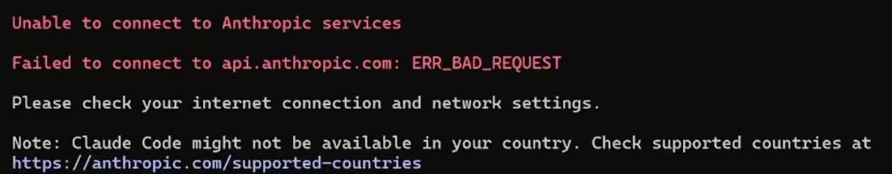

# Claude Code 安装 + CC-Switch 接入 DeepSeek 完整指南｜国内用户首选方案

> 本期关键词：Claude Code · CC-Switch · DeepSeek V4 · 国产大模型 · 配置教程
> 阅读时长：约 12 分钟
> 适用平台：Windows / macOS / Linux

---

## 前言

Claude Code 是 Anthropic 出品的终端 AI 编程助手，但官方服务在国内无法直接使用。即使通过 API 接入，手动编辑 JSON 配置也容易写错字段、搞混认证类型，排查起来极其痛苦。

**CC-Switch** 是一个开源的桌面 GUI 工具（GitHub 50K+ Star），专为国内用户设计，用可视化界面一键切换 Claude Code 的底层模型供应商，内置 DeepSeek、智谱、Kimi、通义千问等 40+ 家预设。

本教程以 CC-Switch 为主方案，手把手完成从零到可用的全流程。

---

## 前置条件一览

| 项目 | 要求 | 检查命令 |
|------|------|----------|
| 操作系统 | Windows 10+ / macOS 10.15+ / Linux | — |
| Node.js | 18+（Claude Code 依赖） | `node --version` |
| Git | 建议 2.39+ | `git --version` |
| DeepSeek 账号 | 已实名 + 余额 ≥ ¥5 | [platform.deepseek.com](https://platform.deepseek.com) |
| 网络 | 可访问 github.com | — |

---

## 第一步：安装 Node.js（如未安装）

Claude Code 依赖 Node.js 运行，先确认是否已装：

```bash
node --version   # 应显示 v18.0.0 或更高
npm --version
```

未安装则执行：

**Windows：** 去 [nodejs.org](https://nodejs.org) 下载 LTS 版本，双击安装。

**macOS：**
```bash
brew install node
```

**Linux：**
```bash
curl -o- https://raw.githubusercontent.com/nvm-sh/nvm/v0.39.0/install.sh | bash
nvm install --lts
```

---

## 第二步：安装 Claude Code

npm 方式仍可用且最通用：

```bash
npm install -g @anthropic-ai/claude-code
```

> ⚠️ 不要用 `sudo npm install -g`，会导致权限问题。

验证安装：
```bash
claude --version
# 例：v2.5.0
```

> 备选：原生安装器 `curl -fsSL https://claude.ai/install.sh | bash`（无需 Node.js，但国内下载可能不稳定）。

运行：

```bash
claude
```

第一次运行会出现错误提示如下：



修改配置文件：C:\Users\Administrator找到  **claude.json**  文件，文件中添加以下代码

```
"hasCompletedOnboarding": true,
```

⚠️ 注：要使用英文的标点符号，且要在上一个参数最后面加一个英文的逗号。

## 第三步：获取 DeepSeek API Key

### 3.1 注册 & 实名

打开 [platform.deepseek.com](https://platform.deepseek.com/)，用手机号或微信扫码注册。

**必须完成实名认证**（个人中心 → 实名认证），否则无法创建 API Key。

### 3.2 充值

左侧菜单 →「用量信息」→「去充值」。

**最低充 ¥5**，V4 系列模型需要付费余额，免费额度不可用。

### 3.3 创建 API Key

左侧菜单 →「API Keys」→「创建 API Key」→ 填写名称（如 `cc-switch`）。

> 🔴 **Key 只显示一次！** 立刻复制保存到安全位置。

---

## 第四步：安装 CC-Switch（核心步骤）

### 4.1 下载

打开 [CC-Switch GitHub Releases](https://github.com/farion1231/cc-switch/releases)，选择对应系统的安装包：

| 系统 | 推荐下载 | 说明 |
|------|----------|------|
| **Windows** | `CC-Switch-vX.X.X-Windows.msi` | 支持自动更新 |
| **macOS** | `CC-Switch-vX.X.X-macOS.zip` | 解压拖入 Applications |
| **Linux (deb)** | `.deb` 包 | `sudo apt install ./CC-Switch-*.deb` |
| **Linux (rpm)** | `.rpm` 包 | `sudo dnf install ./CC-Switch-*.rpm` |

### 4.2 安装

**Windows：** 双击 `.msi`，如遇 SmartScreen 警告 → 点击「更多信息」→「仍要运行」。

**macOS：** 解压后拖入 Applications。首次打开如提示"无法验证开发者"，前往「系统设置 → 隐私与安全性 → 仍要打开」。

**macOS Homebrew 备选：**
```bash
brew tap farion1231/ccswitch
brew install --cask cc-switch
```

---

## 第五步：在 CC-Switch 中配置 DeepSeek

这是最容易出错的环节，每一步请严格对照。

### 5.1 打开 CC-Switch 并选择 Agent

启动 CC-Switch → 顶部标签栏选择 **「Claude Code」**。

### 5.2 添加供应商

点击右上角 **「+」** 按钮 → 在预设列表中选择 **「DeepSeek」**（如找不到，选手动自定义）。

### 5.3 填写配置（关键！逐项核对）

| 配置项 | 填写内容 | ⚠️ 避坑说明 |
|--------|----------|-------------|
| **名称** | `DeepSeek V4` | 自定义即可 |
| **Base URL** | `https://api.deepseek.com/anthropic` | 必须是 `/anthropic` 结尾！写成 `/v1` 或只写域名都会 404 |
| **认证类型** | `ANTHROPIC_AUTH_TOKEN` | 🔴 **最容易错的一项！** 不要选 `API_KEY`！ |
| **API Key** | `sk-你的DeepSeek密钥` | 从 DeepSeek 平台复制，不含空格和换行 |
| **API 格式** | `Anthropic Message（原生）` | 不是 OpenAI Chat Completions |

### 5.4 配置模型映射

| 模型槽位 | 推荐填写 | 说明 |
|----------|----------|------|
| **主模型 / ANTHROPIC_MODEL** | `deepseek-v4-pro[1m]` | `[1m]` 开启 100 万 Token 上下文 |
| **Opus（复杂推理）** | `deepseek-v4-pro` | 不加 `[1m]`，避免重复后缀 |
| **Sonnet（日常任务）** | `deepseek-v4-pro` | 不加 `[1m]` |
| **Haiku（快速响应）** | `deepseek-v4-flash` | 极速低成本 |
| **子代理模型** | `deepseek-v4-flash` | 轻量任务专用 |

> 🔴 **关于 `[1m]` 后缀的重要提醒**：如果你开启了 CC-Switch 的「本地路由/代理」功能，所有模型名都必须去掉 `[1m]`，否则 DeepSeek 不识别该名称，会自动降级为 `v4-flash`。本地路由关闭时，仅在主模型字段加 `[1m]`。
>
> 🔴**关于模型填写重要提醒：**桌面版Claude填写deepseek-v4-pro[1m]不成功，在前面添加claude-。如：claude-deepseek-v4-pro[1m]

### 5.5 保存并启用

1. 点击 **「保存」**
2. 在供应商列表中确认 DeepSeek 显示 **绿色「已启用」** 状态
3. 点击 **「健康检查」** 测试连通性，看到绿色对勾即为成功

---

## 第六步：启动 Claude Code 并验证

配置完成后，新开一个终端：

```bash
claude
```

进入对话界面后，输入 `/status` 查看当前模型：

```
> /status

Model: deepseek-v4-pro[1m]
```

如果显示 `deepseek-v4-pro[1m]`，配置成功。再发一句验证：

```
> 请用中文回复，告诉我你是什么模型

我是 DeepSeek V4-Pro，由深度求索公司开发的大语言模型...
```

看到 DeepSeek 的自我介绍，确认接入无误。

---

## 第七步：模型选择与切换

在 Claude Code 对话中随时切换模型：

```
/model sonnet    # 切换到 v4-pro（日常主力）
/model opus      # 切换到 v4-pro（复杂推理）
/model haiku     # 切换到 v4-flash（快速任务）
```

| 切换命令 | 实际模型 | 速度 | 适用场景 |
|----------|----------|:----:|----------|
| `/model sonnet` | deepseek-v4-pro | 中 | 🏆 日常编码、重构、调试 |
| `/model opus` | deepseek-v4-pro | 慢 | 🔬 复杂架构设计、深度推理 |
| `/model haiku` | deepseek-v4-flash | ⚡ 极快 | 📝 注释、格式化、简单问答 |

---

## CC-Switch vs 手动配置 对比

| 对比维度 | CC-Switch（本文方案） | 手动编辑 settings.json |
|----------|:---------------------:|:-----------------------:|
| 上手难度 | ⭐ 零门槛，GUI 填表 | ⭐⭐⭐ 需了解 JSON 和字段含义 |
| 出错概率 | 低（预设模板防呆） | 高（认证类型、Base URL 易写错） |
| 切换供应商 | 点击切换，即时生效 | 改 JSON → 重启终端 |
| 多供应商管理 | 内置 40+ 预设 | 需手动查每家文档 |
| 用量追踪 | 内置余额和 Token 统计 | 需另开网页查 |
| 故障转移 | 支持自动切换备用供应商 | 不支持 |
| 团队共享 | 导出配置分享 | 手动复制 JSON |

---

## 备选方案：手动环境变量配置

适合不想装 GUI 工具的用户，或服务器/CI 环境。

编辑 `~/.claude/settings.json`（Windows 路径：`C:\Users\你的用户名\.claude\settings.json`）：

```json
{
  "env": {
    "ANTHROPIC_BASE_URL": "https://api.deepseek.com/anthropic",
    "ANTHROPIC_AUTH_TOKEN": "sk-你的API_Key",
    "ANTHROPIC_MODEL": "deepseek-v4-pro[1m]",
    "ANTHROPIC_DEFAULT_SONNET_MODEL": "deepseek-v4-pro",
    "ANTHROPIC_DEFAULT_HAIKU_MODEL": "deepseek-v4-flash",
    "ANTHROPIC_DEFAULT_OPUS_MODEL": "deepseek-v4-pro",
    "CLAUDE_CODE_SUBAGENT_MODEL": "deepseek-v4-flash",
    "API_TIMEOUT_MS": "3000000"
  },
  "hasCompletedOnboarding": true
}
```

> 如果之前用 CC-Switch 配置过，手动改 settings.json 可能被覆盖，建议只选一种方式。

---

## 常见问题排查

### ❌ CC-Switch 健康检查红色 / 401 Unauthorized

**排查清单（按顺序）：**
1. 认证类型是不是 `ANTHROPIC_AUTH_TOKEN`？（不是 API_KEY！）
2. Base URL 末尾是不是 `/anthropic`？（不是 `/v1`！）
3. API Key 复制完整吗？有没有多余空格？
4. DeepSeek 余额 ≥ ¥5 吗？

### ❌ 终端 `claude` 后仍显示 Anthropic 官方模型

**原因**：供应商未启用，或 Claude Code 使用了 OAuth 登录的 Token。

**解决**：
1. 确认 CC-Switch 中 DeepSeek 显示绿色「已启用」
2. 执行 `claude logout` 清除登录态
3. 重新启动终端，再运行 `claude`

### ❌ CC-Switch 用量统计显示模型降级（pro → flash）

**原因**：开启了本地路由/代理，但模型名带了 `[1m]` 后缀。CC-Switch 代理不会自动处理这个后缀，DeepSeek 不识别就把请求降级到了 Flash。

**解决**：在 CC-Switch 配置中，所有模型字段去掉 `[1m]`，全部写 `deepseek-v4-pro` 或 `deepseek-v4-flash`。

### ❌ 发送截图后模型没反应

**原因**：DeepSeek V4 系列是纯文本模型，不支持图像输入，截图会被替换为 `[Image #1]` 占位符。

**解决**：用文字描述替代截图内容。如需处理图像，可在 CC-Switch 中临时切换到支持多模态的供应商（如智谱 GLM）。

### ❌ 模型回复太慢 / 超时

**原因**：V4-Pro 在复杂任务下推理耗时长。

**解决**：
1. 确认 `API_TIMEOUT_MS` 设为 `3000000`（50 分钟）
2. 或用 `/model haiku` 切到 Flash 加速
3. 复杂长任务可适当拆分提问

### ❌ macOS 打不开 CC-Switch，提示"无法验证开发者"

前往「系统设置 → 隐私与安全性」，在底部找到被拦截的 CC-Switch，点击「仍要打开」。

---

## 完整流程速查

| 步骤 | 操作 | 预计耗时 |
|:----:|------|:--------:|
| 1 | 安装 Node.js | 5 分钟 |
| 2 | `npm install -g @anthropic-ai/claude-code` | 3 分钟 |
| 3 | 注册 DeepSeek → 实名 → 充值 ¥5 → 创建 Key | 5 分钟 |
| 4 | 下载安装 CC-Switch | 3 分钟 |
| 5 | 添加 DeepSeek 供应商 → 填配置 → 健康检查 | 3 分钟 |
| 6 | 终端 `claude` → `/status` 验证 | 1 分钟 |

**总计约 20 分钟，一次性配好，之后用 CC-Switch 随意切模型。**

---

## 参考来源

- [CC-Switch GitHub 仓库](https://github.com/farion1231/cc-switch)
- [CC-Switch 快速入门文档](https://github.com/farion1231/cc-switch/blob/main/docs/user-manual/zh/1-getting-started/1.4-quickstart.md)
- [手把手教程：Claude Code + CC-Switch 接入国产大模型（CSDN）](https://blog.csdn.net/lxx309707872/article/details/160280985)
- [CC Switch：一键切换 6 大 Agent 模型的开源神器（Toolin AI）](https://toolin.ai/blog/cc-switch-tutorial)
- [DeepSeek V4 对接 Claude Code（阿里云开发者社区）](https://developer.aliyun.com/article/1730869)
- [Claude Code 官方安装指南（Anthropic Help Center）](https://support.claude.com/zh-CN/articles/14552382)
- [DeepSeek 开放平台](https://platform.deepseek.com/)

---

> 📌 本文发布于「每日工具分享」专栏。
> 价格与版本信息为 2026 年 5 月数据，以各平台最新公告为准。

