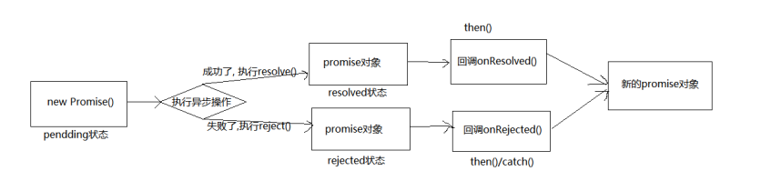

## Promise基本使用

### **Promise 是什么?**

> 抽象表达: 
>> Promise 是一门新的技术(ES6 规范)
>> Promise 是 JS 中进行异步编程的新解决方案
>>>备注：旧方案是单纯使用回调函数

> 具体表达:
>> 从语法上来说: Promise 是一个构造函数
>>> 从功能上来说: promise 对象用来封装一个异步操作并可以获取其成功/失败的结果值

### promise 的状态改变

+ pending 变为 resolved
+  pending 变为 rejected

>说明: 只有这 2 种, 且一个 promise 对象只能改变一次
>>无论变为成功还是失败, 都会有一个结果数据
>>成功的结果数据一般称为 value, 失败的结果数据一般称为 reason

### promise 的基本流程


### Promise 初体验


```html
<!doctype html>
<html lang="en">
<head>
    <meta charset="UTF-8">
    <title>基本使用</title>
    <link crossorigin='anonymous' href="https://cdn.bootcss.com/twitter-bootstrap/3.3.7/css/bootstrap.min.css" rel="stylesheet">
</head>
<body>
    <div class="container">
        <h2 class="page-header">Promise 初体验</h2>
        <button class="btn btn-primary" id="btn">点击抽奖</button>
    </div>
    <script>
        //生成随机数
        function rand(m,n){
            return Math.ceil(Math.random() * (n-m+1)) + m-1;
        }
        /**
            点击按钮,  1s 后显示是否中奖(30%概率中奖)
                若中奖弹出    恭喜恭喜, 奖品为 10万 RMB 劳斯莱斯优惠券
                若未中奖弹出  再接再厉
        */
        //获取元素对象
        const btn = document.querySelector('#btn');
        //绑定单击事件
        btn.addEventListener('click', function(){
            //定时器
            // setTimeout(() => {
            //     //30%  1-100  1 2 30
            //     //获取从1 - 100的一个随机数
            //     let n = rand(1, 100);
            //     //判断
            //     if(n <= 30){
            //         alert('恭喜恭喜, 奖品为 10万 RMB 劳斯莱斯优惠券');
            //     }else{
            //         alert('再接再厉');
            //     }
            // }, 1000);

            //Promise 形式实现
            // resolve 解决  函数类型的数据
            // reject  拒绝  函数类型的数据
            const p = new Promise((resolve, reject) => {
                setTimeout(() => {
                    //30%  1-100  1 2 30
                    //获取从1 - 100的一个随机数
                    let n = rand(1, 100);
                    //判断
                    if(n <= 30){
                        resolve(n); // 将 promise 对象的状态设置为 『成功』
                    }else{
                        reject(n); // 将 promise 对象的状态设置为 『失败』
                    }
                }, 1000);
            });

            console.log(p);
            //调用 then 方法
            // value 值
            // reason 理由
            p.then((value) => {
                alert('恭喜恭喜, 奖品为 10万 RMB 劳斯莱斯优惠券, 您的中奖数字为 ' + value);
            }, (reason) => {
                alert('再接再厉, 您的号码为 ' + reason);
            });

        });

    </script>
</body>

</html>
```

### Promise实践练习-fs模块

```js
const fs = require('fs');

//回调函数 形式
// fs.readFile('./resource/content.txt', (err, data) => {
    // 如果出错 则抛出错误
//     if(err)  throw err;
    //输出文件内容
//     console.log(data.toString());
// });

//Promise 形式
let p = new Promise((resolve , reject) => {
    fs.readFile('./resource/content.tx', (err, data) => {
        //如果出错
        if(err) reject(err);
        //如果成功
        resolve(data);
    });
});

//调用 then 
p.then(value=>{
    console.log(value.toString());
}, reason=>{
    console.log(reason);
});
```

### Promise实践练习-AJAX请求

```html
<!DOCTYPE html>
<html lang="en">
<head>
    <meta charset="UTF-8">
    <meta name="viewport" content="width=device-width, initial-scale=1.0">
    <title>Promise 封装 AJAX</title>
    <link crossorigin='anonymous' href="https://cdn.bootcss.com/twitter-bootstrap/3.3.7/css/bootstrap.min.css" rel="stylesheet">
</head>
<body>
    <div class="container">
        <h2 class="page-header">Promise 封装 AJAX 操作</h2>
        <button class="btn btn-primary" id="btn">点击发送 AJAX</button>
    </div>
    <script>
        //接口地址 https://api.apiopen.top/getJoke
        //获取元素对象
        const btn = document.querySelector('#btn');

        btn.addEventListener('click', function(){
            //创建 Promise
            const p = new Promise((resolve, reject) => {
                //1.创建对象
                const xhr = new XMLHttpRequest();
                //2. 初始化
                xhr.open('GET', 'https://api.apiopen.top/getJoke');
                //3. 发送
                xhr.send();
                //4. 处理响应结果
                xhr.onreadystatechange = function(){
                    if(xhr.readyState === 4){
                        //判断响应状态码 2xx   
                        if(xhr.status >= 200 && xhr.status < 300){
                            //控制台输出响应体
                            resolve(xhr.response);
                        }else{
                            //控制台输出响应状态码
                            reject(xhr.status);
                        }
                    }
                }
            });
            //调用then方法
            p.then(value=>{
                console.log(value);
            }, reason=>{
                console.warn(reason);
            });
        });
    </script>
</body>
</html>
```

### Promise封装练习-fs模块

```js
/**
 * 封装一个函数 mineReadFile 读取文件内容
 * 参数:  path  文件路径
 * 返回:  promise 对象
 */
function mineReadFile(path){
    return new Promise((resolve, reject) => {
        //读取文件
        require('fs').readFile(path, (err, data) =>{
            //判断
            if(err) reject(err);
            //成功
            resolve(data);
        });
    });
}

mineReadFile('./resource/content.txt')
.then(value=>{
    //输出文件内容
    console.log(value.toString());
}, reason=>{
    console.log(reason);
});
```

### util.promisify方法

```js
/**
 * util.promisify 方法
 */
//引入 util 模块
const util = require('util');
//引入 fs 模块
const fs = require('fs');
//返回一个新的函数
let mineReadFile = util.promisify(fs.readFile);

mineReadFile('./resource/content.txt').then(value=>{
    console.log(value.toString());
});
```

### Promise封装AJAX操作

```html
<!DOCTYPE html>
<html lang="en">
<head>
    <meta charset="UTF-8">
    <meta name="viewport" content="width=device-width, initial-scale=1.0">
    <title>Promise封装AJAX操作</title>
</head>
<body>
    <script>
        /**
         * 封装一个函数 sendAJAX 发送 GET AJAX 请求
         * 参数   URL
         * 返回结果 Promise 对象
         */
        function sendAJAX(url){
            return new Promise((resolve, reject) => {
                const xhr = new XMLHttpRequest();
                xhr.responseType = 'json';
                xhr.open("GET", url);
                xhr.send();
                //处理结果
                xhr.onreadystatechange = function(){
                    if(xhr.readyState === 4){
                        //判断成功
                        if(xhr.status >= 200 && xhr.status < 300){
                            //成功的结果
                            resolve(xhr.response);
                        }else{
                            reject(xhr.status);
                        }
                    }
                }
            });
        }
    
        sendAJAX('https://api.apiopen.top/getJok')
        .then(value => {
            console.log(value);
        }, reason => {
            console.warn(reason);
        });
    </script>
</body>
</html>
```

## Promise-API

### Promise 构造函数: Promise (excutor) {}

+ executor 函数: 执行器 (resolve, reject) => {} 
+ resolve 函数: 内部定义成功时我们调用的函数 value => {}
+ reject 函数: 内部定义失败时我们调用的函数 reason => {}

>说明: executor 会在 Promise 内部立即同步调用,异步操作在执行器中执行

### Promise.prototype.then 方法: (onResolved, onRejected) => {}

+ onResolved 函数: 成功的回调函数 (value) => {}
+ onRejected 函数: 失败的回调函数 (reason) => {}

>说明: 指定用于得到成功 value 的成功回调和用于得到失败 reason 的失败回调返回一个新的 promise 对象

### Promise.prototype.catch 方法: (onRejected) => {}

+ onRejected 函数: 失败的回调函数 (reason) => {}

>说明: then()的语法糖, 相当于: then(undefined, onRejected)

### Promise.resolve 方法: (value) => {}

+ value: 成功的数据或 promise 对象

>说明: 返回一个成功/失败的 promise 对象

### Promise.reject 方法: (reason) => {}

+ reason: 失败的原因

>说明: 返回一个失败的 promise 对象

### Promise.all 方法: (promises) => {}

+ promises: 包含 n 个 promise 的数组

>说明: 返回一个新的 promise, 只有所有的 promise 都成功才成功, 只要有一个失败了就直接失败

### Promise.race 方法: (promises) => {}

+ promises: 包含 n 个 promise 的数组

>说明: 返回一个新的 promise, 第一个完成的 promise 的结果状态就是最终的结果状态

### Promise的API-then和catch

```HTML
<!DOCTYPE html>
<html lang="en">
<head>
    <meta charset="UTF-8">
    <meta name="viewport" content="width=device-width, initial-scale=1.0">
    <title>Promise API</title>
</head>
<body>
    <script>
        //
        let p = new Promise((resolve, reject) => {
            // ** 同步调用
            // console.log(111);
            //修改 promise 对象的状态
            reject('error');
        });

        // console.log(222);

        //执行 catch 方法
        p.catch(reason => {
            console.log(reason);
        });
    </script>
</body>
</html>
```

### Promise的API-resolve

```HTML
<!DOCTYPE html>
<html lang="en">
<head>
    <meta charset="UTF-8">
    <meta name="viewport" content="width=device-width, initial-scale=1.0">
    <title>Promise API - resolve</title>
</head>
<body>
    <script>
        //
        let p1 = Promise.resolve(521);
        //如果传入的参数为 非Promise类型的对象, 则返回的结果为成功promise对象
        //如果传入的参数为 Promise 对象, 则参数的结果决定了 resolve 的结果
        let p2 = Promise.resolve(new Promise((resolve, reject) => {
            // resolve('OK');
            reject('Error');
        }));
        // console.log(p2);
        p2.catch(reason => {
            console.log(reason);
        })
    </script>
</body>
</html>
```

### Promise的API-reject

```HTML
<!DOCTYPE html>
<html lang="en">
<head>
    <meta charset="UTF-8">
    <meta name="viewport" content="width=device-width, initial-scale=1.0">
    <title>Promise API - reject</title>
</head>
<body>
    <script>
        // let p = Promise.reject(521);
        // let p2 = Promise.reject('iloveyou');
        let p3 = Promise.reject(new Promise((resolve, reject) => {
            resolve('OK');
        }));
        
        console.log(p3);
    </script>
</body>
</html>
```

### Promise的API-all

```HTML
<!DOCTYPE html>
<html lang="en">
<head>
    <meta charset="UTF-8">
    <meta name="viewport" content="width=device-width, initial-scale=1.0">
    <title>Promise API - all</title>
</head>
<body>
    <script>
        let p1 = new Promise((resolve, reject) => {
            resolve('OK');
        })
        // let p2 = Promise.resolve('Success');
        let p2 = Promise.reject('Error');
        let p3 = Promise.resolve('Oh Yeah');
        
        //
        const result = Promise.all([p1, p2, p3]);

        console.log(result);
    </script>
</body>
</html>
```

### Promise的API-race

```HTML
<!DOCTYPE html>
<html lang="en">

<head>
    <meta charset="UTF-8">
    <meta name="viewport" content="width=device-width, initial-scale=1.0">
    <title>Promise API - race</title>
</head>
<body>
    <script>
        let p1 = new Promise((resolve, reject) => {
            setTimeout(() => {
                resolve('OK');
            }, 1000);
        })
        let p2 = Promise.resolve('Success');
        let p3 = Promise.resolve('Oh Yeah');

        //调用
        const result = Promise.race([p1, p2, p3]);

        console.log(result);
    </script>
</body>

</html><!DOCTYPE html>
<html lang="en">

<head>
    <meta charset="UTF-8">
    <meta name="viewport" content="width=device-width, initial-scale=1.0">
    <title>Promise API - race</title>
</head>
<body>
    <script>
        let p1 = new Promise((resolve, reject) => {
            setTimeout(() => {
                resolve('OK');
            }, 1000);
        })
        let p2 = Promise.resolve('Success');
        let p3 = Promise.resolve('Oh Yeah');

        //调用
        const result = Promise.race([p1, p2, p3]);

        console.log(result);
    </script>
</body>

</html>
```

##  Promise的关键性问题

### 如何改变 promise 的状态?

### resolve(value): 如果当前是 pending 就会变为 resolved
+ reject(reason): 如果当前是 pending 就会变为 rejected
+ 抛出异常: 如果当前是 pending 就会变为 rejected

### 一个 promise 指定多个成功/失败回调函数, 都会调用吗?

+ 当 promise 改变为对应状态时都会调用

### 改变 promise 状态和指定回调函数谁先谁后?

+ 都有可能, 正常情况下是先指定回调再改变状态, 但也可以先改状态再指定回调
+ 如何先改状态再指定回调?
> 在执行器中直接调用 resolve()/reject()
> 延迟更长时间才调用 then()

+ 什么时候才能得到数据?
> 如果先指定的回调, 那当状态发生改变时, 回调函数就会调用, 得到数据
> 如果先改变的状态, 那当指定回调时, 回调函数就会调用, 得到数据

### promise.then()返回的新 promise 的结果状态由什么决定?

+ 简单表达: 由 then()指定的回调函数执行的结果决定
+ **详细表达:**
> 如果抛出异常, 新 promise 变为 rejected, reason 为抛出的异常
> 如果返回的是非 promise 的任意值, 新 promise 变为 resolved, value 为返回的值
> 如果返回的是另一个新 promise, 此 promise 的结果就会成为新 promise 的结果

### promise 如何串连多个操作任务?

+ promise 的 then()返回一个新的 promise, 可以开成 then()的链式调用
+ 通过 then 的链式调用串连多个同步/异步任务

### promise 异常传透?

+ 当使用 promise 的 then 链式调用时, 可以在最后指定失败的回调, 
+ 前面任何操作出了异常, 都会传到最后失败的回调中处理

### 中断 promise 链?

+ 当使用 promise 的 then 链式调用时, 在中间中断, 不再调用后面的回调函数
+ 办法: 在回调函数中返回一个 pendding 状态的 promise 对象

### Promise 对象状态改变的方式

```html
<!DOCTYPE html>
<html lang="en">
<head>
    <meta charset="UTF-8">
    <meta name="viewport" content="width=device-width, initial-scale=1.0">
    <title>Promise关键问题 - Promise 对象状态改变的方式</title>
</head>
<body>
    <script>
        let p = new Promise((resolve, reject) => {
            //1. resolve 函数
            // resolve('ok'); // pending   => fulfilled (resolved)
            //2. reject 函数
            // reject("error");// pending  =>  rejected 
            //3. 抛出错误
            // throw '出问题了';
        });

        console.log(p);
    </script>
</body>
</html>
```

### Promise 指定多个回调 

```html
<!DOCTYPE html>
<html lang="en">
<head>
    <meta charset="UTF-8">
    <meta name="viewport" content="width=device-width, initial-scale=1.0">
    <title>Promise关键问题 - Promise 指定多个回调</title>
</head>
<body>
    <script>
        let p = new Promise((resolve, reject) => {
            // resolve('OK');
        });

        ///指定回调 - 1
        p.then(value => {
            console.log(value);
        });

        //指定回调 - 2
        p.then(value => {
            alert(value);
        });
    </script>
</body>
</html>
```

### Promise 改变状态与指定回调的顺序问题

```html
<!DOCTYPE html>
<html lang="en">
<head>
    <meta charset="UTF-8">
    <meta name="viewport" content="width=device-width, initial-scale=1.0">
    <title>Promise关键问题 - Promise 改变状态与指定回调的顺序问题</title>
</head>
<body>
    <script>

        let p = new Promise((resolve, reject) => {
            setTimeout(() => {
                resolve('OK');
            }, 1000);
        });

        p.then(value => {
            console.log(value);
        },reason=>{
            
        })
    </script>
</body>
</html>
```

### Promise then方法的返回结果特点

```html
<!DOCTYPE html>
<html lang="en">
<head>
    <meta charset="UTF-8">
    <meta name="viewport" content="width=device-width, initial-scale=1.0">
    <title>Promise关键问题 - Promise then方法的返回结果特点</title>
</head>
<body>
    <script>
        let p = new Promise((resolve, reject) => {
            resolve('ok');
        });
        //执行 then 方法
        let result = p.then(value => {
            // console.log(value);
            //1. 抛出错误
            // throw '出了问题';
            //2. 返回结果是非 Promise 类型的对象
            // return 521;
            //3. 返回结果是 Promise 对象
            // return new Promise((resolve, reject) => {
            //     // resolve('success');
            //     reject('error');
            // });
        }, reason => {
            console.warn(reason);
        });

        console.log(result);
    </script>
</body>
</html>
```

### Promise如何串联多个任务

```html
<!DOCTYPE html>
<html lang="en">
<head>
    <meta charset="UTF-8">
    <meta name="viewport" content="width=device-width, initial-scale=1.0">
    <title>Promise关键问题 - 如何串联多个任务</title>
</head>
<body>
    <script>
        let p = new Promise((resolve, reject) => {
            setTimeout(() => {
                resolve('OK');
            }, 1000);
        });

        p.then(value => {
            return new Promise((resolve, reject) => {
                resolve("success");
            });
        }).then(value => {
            console.log(value);
        }).then(value => {
            console.log(value);
        })
    </script>
</body>
</html>
```

### Promise异常穿透

```html
<!DOCTYPE html>
<html lang="en">
<head>
    <meta charset="UTF-8">
    <meta name="viewport" content="width=device-width, initial-scale=1.0">
    <title>Promise关键问题 - 异常穿透</title>
</head>
<body>
    <script>
        let p = new Promise((resolve, reject) => {
            setTimeout(() => {
                resolve('OK');
                // reject('Err');
            }, 1000);
        });

        p.then(value => {
            // console.log(111);
            throw '失败啦!';
        }).then(value => {
            console.log(222);
        }).then(value => {
            console.log(333);
        }).catch(reason => {
            console.warn(reason);
        });
    </script>
</body>
</html>
```

### Promise中断 Promise 链条

```html
<!DOCTYPE html>
<html lang="en">
<head>
    <meta charset="UTF-8">
    <meta name="viewport" content="width=device-width, initial-scale=1.0">
    <title>Promise关键问题 - 中断 Promise 链条</title>
</head>
<body>
    <script>
        let p = new Promise((resolve, reject) => {
            setTimeout(() => {
                resolve('OK');
            }, 1000);
        });

        p.then(value => {
            console.log(111);
            //有且只有一个方式
            return new Promise(() => {});
        }).then(value => {
            console.log(222);
        }).then(value => {
            console.log(333);
        }).catch(reason => {
            console.warn(reason);
        });
    </script>
</body>
</html>
```

## Promise自定义封装

 
### 1-初始结构搭建 
 
```html 
<!DOCTYPE html>
<html lang="en">
<head>
    <meta charset="UTF-8">
    <meta name="viewport" content="width=device-width, initial-scale=1.0">
    <title>Promise-封装 | 1 - 初始结构搭建</title>
    <script src="./promise.js"></script>
</head>
<body>
    <script>
        let p = new Promise((resolve, reject) => {
            resolve('OK');
        });

        p.then(value => {
            console.log(value);
        }, reason=>{
            console.warn(reason);
        })
    </script>
</body>
</html>
```

```js 

function Promise(executor){

}

//添加 then 方法
Promise.prototype.then = function(onResolved, onRejected){

}
``` 

### 2-resolve与reject结构搭建 
 
```html 
<!DOCTYPE html>
<html lang="en">
<head>
    <meta charset="UTF-8">
    <meta name="viewport" content="width=device-width, initial-scale=1.0">
    <title>Promise-封装 | 2 - resolve 与 reject </title>
    <script src="./promise.js"></script>
</head>
<body>
    <script>
        let p = new Promise((resolve, reject) => {
            resolve('OK');
        });

        p.then(value => {
            console.log(value);
        }, reason=>{
            console.warn(reason);
        })
    </script>
</body>
</html>
```


```js 
//声明构造函数
function Promise(executor){
    //resolve 函数
    function resolve(data){

    }
    //reject 函数
    function reject(data){

    }

    //同步调用『执行器函数』
    executor(resolve, reject);
}

//添加 then 方法
Promise.prototype.then = function(onResolved, onRejected){

}
``` 
 
 
### 3-resolve与reject函数实现 
 
```html 
<!DOCTYPE html>
<html lang="en">
<head>
    <meta charset="UTF-8">
    <meta name="viewport" content="width=device-width, initial-scale=1.0">
    <title>Promise-封装 | 2 - resolve 与 reject </title>
    <script src="./promise.js"></script>
</head>
<body>
    <script>
        let p = new Promise((resolve, reject) => {
            // resolve('OK');
            reject("error");
        });

        console.log(p);

        // p.then(value => {
        //     console.log(value);
        // }, reason=>{
        //     console.warn(reason);
        // })
    </script>
</body>
</html>
``` 
 
 
```js 
//声明构造函数
function Promise(executor){
    //添加属性
    this.PromiseState = 'pending';
    this.PromiseResult = null;
    //保存实例对象的 this 的值
    const self = this;// self _this that
    //resolve 函数
    function resolve(data){
        //1. 修改对象的状态 (promiseState)
        self.PromiseState = 'fulfilled';// resolved
        //2. 设置对象结果值 (promiseResult)
        self.PromiseResult = data;
    }
    //reject 函数
    function reject(data){
        //1. 修改对象的状态 (promiseState)
        self.PromiseState = 'rejected';// 
        //2. 设置对象结果值 (promiseResult)
        self.PromiseResult = data;
    }

    //同步调用『执行器函数』
    executor(resolve, reject);
}

//添加 then 方法
Promise.prototype.then = function(onResolved, onRejected){

}
``` 
 
 
### 4-throw抛出错误改变状态 
 
```html 
<!DOCTYPE html>
<html lang="en">
<head>
    <meta charset="UTF-8">
    <meta name="viewport" content="width=device-width, initial-scale=1.0">
    <title>Promise-封装 | 4 - throw 抛出异常改变状态 </title>
    <!-- <script src="./promise.js"></script> -->
</head>
<body>
    <script>
        let p = new Promise((resolve, reject) => {
            // resolve('OK');
            // reject("error");
            //抛出异常
            throw "error";
        });

        console.log(p);

        // p.then(value => {
        //     console.log(value);
        // }, reason=>{
        //     console.warn(reason);
        // })
    </script>
</body>
</html>
``` 
 
 
```js 
//声明构造函数
function Promise(executor){
    //添加属性
    this.PromiseState = 'pending';
    this.PromiseResult = null;
    //保存实例对象的 this 的值
    const self = this;// self _this that
    //resolve 函数
    function resolve(data){
        //1. 修改对象的状态 (promiseState)
        self.PromiseState = 'fulfilled';// resolved
        //2. 设置对象结果值 (promiseResult)
        self.PromiseResult = data;
    }
    //reject 函数
    function reject(data){
        //1. 修改对象的状态 (promiseState)
        self.PromiseState = 'rejected';// 
        //2. 设置对象结果值 (promiseResult)
        self.PromiseResult = data;
    }
    try{
        //同步调用『执行器函数』
        executor(resolve, reject);
    }catch(e){
        //修改 promise 对象状态为『失败』
        reject(e);
    }
}

//添加 then 方法
Promise.prototype.then = function(onResolved, onRejected){

}
``` 
 
 
### 5-状态只能修改一次 
 
```html 
<!DOCTYPE html>
<html lang="en">
<head>
    <meta charset="UTF-8">
    <meta name="viewport" content="width=device-width, initial-scale=1.0">
    <title>Promise-封装 | 5 - 状态只能修改一次 </title>
    <script src="./promise.js"></script>
</head>
<body>
    <script>
        let p = new Promise((resolve, reject) => {
            reject("error");
            resolve('OK');
            //抛出异常
            // throw "error";
        });

        console.log(p);
    </script>
</body>
</html>
``` 
 
 
```js 
//声明构造函数
function Promise(executor){
    //添加属性
    this.PromiseState = 'pending';
    this.PromiseResult = null;
    //保存实例对象的 this 的值
    const self = this;// self _this that
    //resolve 函数
    function resolve(data){
        //判断状态
        if(self.PromiseState !== 'pending') return;
        //1. 修改对象的状态 (promiseState)
        self.PromiseState = 'fulfilled';// resolved
        //2. 设置对象结果值 (promiseResult)
        self.PromiseResult = data;
    }
    //reject 函数
    function reject(data){
        //判断状态
        if(self.PromiseState !== 'pending') return;
        //1. 修改对象的状态 (promiseState)
        self.PromiseState = 'rejected';// 
        //2. 设置对象结果值 (promiseResult)
        self.PromiseResult = data;
    }
    try{
        //同步调用『执行器函数』
        executor(resolve, reject);
    }catch(e){
        //修改 promise 对象状态为『失败』
        reject(e);
    }
}

//添加 then 方法
Promise.prototype.then = function(onResolved, onRejected){

}
``` 
 
 
### 6-then方法执行回调 
 
```html 
<!DOCTYPE html>
<html lang="en">
<head>
    <meta charset="UTF-8">
    <meta name="viewport" content="width=device-width, initial-scale=1.0">
    <title>Promise-封装 | 6 - then 方法执行回调 </title>
    <script src="./promise.js"></script>
</head>
<body>
    <script>
        //实例化对象
        let p = new Promise((resolve, reject) => {
            // resolve('OK');
            // reject("Error");
            throw "ERROR";
        });

        p.then(value => {
            console.log(value);
        }, reason=>{
            console.warn(reason);
        })
    </script>
</body>
</html>
``` 
 
 
```js 
//声明构造函数
function Promise(executor){
    //添加属性
    this.PromiseState = 'pending';
    this.PromiseResult = null;
    //保存实例对象的 this 的值
    const self = this;// self _this that
    //resolve 函数
    function resolve(data){
        //判断状态
        if(self.PromiseState !== 'pending') return;
        //1. 修改对象的状态 (promiseState)
        self.PromiseState = 'fulfilled';// resolved
        //2. 设置对象结果值 (promiseResult)
        self.PromiseResult = data;
    }
    //reject 函数
    function reject(data){
        //判断状态
        if(self.PromiseState !== 'pending') return;
        //1. 修改对象的状态 (promiseState)
        self.PromiseState = 'rejected';// 
        //2. 设置对象结果值 (promiseResult)
        self.PromiseResult = data;
    }
    try{
        //同步调用『执行器函数』
        executor(resolve, reject);
    }catch(e){
        //修改 promise 对象状态为『失败』
        reject(e);
    }
}

//添加 then 方法
Promise.prototype.then = function(onResolved, onRejected){
    //调用回调函数  PromiseState
    if(this.PromiseState === 'fulfilled'){
        onResolved(this.PromiseResult);
    }
    if(this.PromiseState === 'rejected'){
        onRejected(this.PromiseResult);
    }
}
``` 
 
 
### 7-异步任务then方法执行回调 
 
```html 
<!DOCTYPE html>
<html lang="en">
<head>
    <meta charset="UTF-8">
    <meta name="viewport" content="width=device-width, initial-scale=1.0">
    <title>Promise-封装 | 7 - 异步任务 then 方法实现 </title>
    <script src="./promise.js"></script>
</head>
<body>
    <script>
        //实例化对象
        let p = new Promise((resolve, reject) => {
            setTimeout(() => {
                // resolve('OK');
                reject("error");
            }, 1000);
        });

        p.then(value => {
            console.log(value);
        }, reason=>{
            console.warn(reason);
        });

        console.log(p);
    </script>
</body>
</html>
``` 
 
 
```js 
//声明构造函数
function Promise(executor){
    //添加属性
    this.PromiseState = 'pending';
    this.PromiseResult = null;
    //声明属性
    this.callback = {};
    //保存实例对象的 this 的值
    const self = this;// self _this that
    //resolve 函数
    function resolve(data){
        //判断状态
        if(self.PromiseState !== 'pending') return;
        //1. 修改对象的状态 (promiseState)
        self.PromiseState = 'fulfilled';// resolved
        //2. 设置对象结果值 (promiseResult)
        self.PromiseResult = data;
        //调用成功的回调函数
        if(self.callback.onResolved){
            self.callback.onResolved(data);
        }
    }
    //reject 函数
    function reject(data){
        //判断状态
        if(self.PromiseState !== 'pending') return;
        //1. 修改对象的状态 (promiseState)
        self.PromiseState = 'rejected';// 
        //2. 设置对象结果值 (promiseResult)
        self.PromiseResult = data;
        //执行回调
        if(self.callback.onResolved){
            self.callback.onResolved(data);
        }
    }
    try{
        //同步调用『执行器函数』
        executor(resolve, reject);
    }catch(e){
        //修改 promise 对象状态为『失败』
        reject(e);
    }
}

//添加 then 方法
Promise.prototype.then = function(onResolved, onRejected){
    //调用回调函数  PromiseState
    if(this.PromiseState === 'fulfilled'){
        onResolved(this.PromiseResult);
    }
    if(this.PromiseState === 'rejected'){
        onRejected(this.PromiseResult);
    }
    //判断 pending 状态
    if(this.PromiseState === 'pending'){
        //保存回调函数
        this.callback = {
            onResolved: onResolved,
            onRejected: onRejected
        }
    }
}
``` 
 
 
### 8-指定多个回调 
 
```html 
<!DOCTYPE html>
<html lang="en">
<head>
    <meta charset="UTF-8">
    <meta name="viewport" content="width=device-width, initial-scale=1.0">
    <title>Promise-封装 | 8 - 指定多个回调 </title>
    <script src="./promise.js"></script>
</head>
<body>
    <script>
        //实例化对象
        let p = new Promise((resolve, reject) => {
            setTimeout(() => {
                // resolve('OK');
                reject('No');
            }, 1000);
        });

        p.then(value => {
            console.log(value);
        }, reason=>{
            console.warn(reason);
        });

        p.then(value => {
            alert(value);
        }, reason=>{
            alert(reason);
        });

        console.log(p);


    </script>
</body>
</html>
``` 
 
 
```js 
//声明构造函数
function Promise(executor){
    //添加属性
    this.PromiseState = 'pending';
    this.PromiseResult = null;
    //声明属性
    this.callbacks = [];
    //保存实例对象的 this 的值
    const self = this;// self _this that
    //resolve 函数
    function resolve(data){
        //判断状态
        if(self.PromiseState !== 'pending') return;
        //1. 修改对象的状态 (promiseState)
        self.PromiseState = 'fulfilled';// resolved
        //2. 设置对象结果值 (promiseResult)
        self.PromiseResult = data;
        //调用成功的回调函数
        self.callbacks.forEach(item => {
            item.onResolved(data);
        });
    }
    //reject 函数
    function reject(data){
        //判断状态
        if(self.PromiseState !== 'pending') return;
        //1. 修改对象的状态 (promiseState)
        self.PromiseState = 'rejected';// 
        //2. 设置对象结果值 (promiseResult)
        self.PromiseResult = data;
        //执行失败的回调
        self.callbacks.forEach(item => {
            item.onRejected(data);
        });
    }
    try{
        //同步调用『执行器函数』
        executor(resolve, reject);
    }catch(e){
        //修改 promise 对象状态为『失败』
        reject(e);
    }
}
//添加 then 方法
Promise.prototype.then = function(onResolved, onRejected){
    //调用回调函数  PromiseState
    if(this.PromiseState === 'fulfilled'){
        onResolved(this.PromiseResult);
    }
    if(this.PromiseState === 'rejected'){
        onRejected(this.PromiseResult);
    }
    //判断 pending 状态
    if(this.PromiseState === 'pending'){
        //保存回调函数
        this.callbacks.push({
            onResolved: onResolved,
            onRejected: onRejected
        });
    }
}
``` 
 
 
### 9-同步修改状态then方法返回结果 
 
```html 
<!DOCTYPE html>
<html lang="en">
<head>
    <meta charset="UTF-8">
    <meta name="viewport" content="width=device-width, initial-scale=1.0">
    <title>Promise-封装 | 9 - 同步任务 then 返回结果</title>
    <script src="./promise.js"></script>
</head>
<body>
    <script>
        //实例化对象
        let p = new Promise((resolve, reject) => {
            resolve('OK');
        });
        //执行 then 方法
        const res = p.then(value => {
            //抛出异常
            throw "FAIL";
        }, reason=>{
            console.warn(reason);
        });
        console.log(res);
    </script>
</body>
</html>
``` 
 
 
```js 
//声明构造函数
function Promise(executor){
    //添加属性
    this.PromiseState = 'pending';
    this.PromiseResult = null;
    //声明属性
    this.callbacks = [];
    //保存实例对象的 this 的值
    const self = this;// self _this that
    //resolve 函数
    function resolve(data){
        //判断状态
        if(self.PromiseState !== 'pending') return;
        //1. 修改对象的状态 (promiseState)
        self.PromiseState = 'fulfilled';// resolved
        //2. 设置对象结果值 (promiseResult)
        self.PromiseResult = data;
        //调用成功的回调函数
        self.callbacks.forEach(item => {
            item.onResolved(data);
        });
    }
    //reject 函数
    function reject(data){
        //判断状态
        if(self.PromiseState !== 'pending') return;
        //1. 修改对象的状态 (promiseState)
        self.PromiseState = 'rejected';// 
        //2. 设置对象结果值 (promiseResult)
        self.PromiseResult = data;
        //执行失败的回调
        self.callbacks.forEach(item => {
            item.onRejected(data);
        });
    }
    try{
        //同步调用『执行器函数』
        executor(resolve, reject);
    }catch(e){
        //修改 promise 对象状态为『失败』
        reject(e);
    }
}

//添加 then 方法
Promise.prototype.then = function(onResolved, onRejected){
    return new Promise((resolve, reject) => {
        //调用回调函数  PromiseState
        if(this.PromiseState === 'fulfilled'){
            try{
                //获取回调函数的执行结果
                let result = onResolved(this.PromiseResult);
                //判断
                if(result instanceof Promise){
                    //如果是 Promise 类型的对象
                    result.then(v => {
                        resolve(v);
                    }, r=>{
                        reject(r);
                    })
                }else{
                    //结果的对象状态为『成功』
                    resolve(result);
                }
            }catch(e){
                reject(e);
            }
        }
        if(this.PromiseState === 'rejected'){
            onRejected(this.PromiseResult);
        }
        //判断 pending 状态
        if(this.PromiseState === 'pending'){
            //保存回调函数
            this.callbacks.push({
                onResolved: onResolved,
                onRejected: onRejected
            });
        }
    })
}
```

 
### 10-1异步修改状态then方法返回结果 
 
```html 
<!DOCTYPE html>
<html lang="en">
<head>
    <meta charset="UTF-8">
    <meta name="viewport" content="width=device-width, initial-scale=1.0">
    <title>Promise-封装 | 10 - 异步任务 then 返回结果</title>
    <script src="./promise.js"></script>
</head>
<body>
    <script>
        //实例化对象
        let p = new Promise((resolve, reject) => {
            setTimeout(() => {
                // resolve('OK');
                reject("Error");
            }, 1000)
        });

        //执行 then 方法
        const res = p.then(value => {
            // return 'oh Yeah';
            throw 'error';
        }, reason=>{
            // console.warn(reason);
            throw 'error';
        });

        console.log(res);
    </script>
</body>
</html>
``` 
 
 
```js 
//声明构造函数
function Promise(executor){
    //添加属性
    this.PromiseState = 'pending';
    this.PromiseResult = null;
    //声明属性
    this.callbacks = [];
    //保存实例对象的 this 的值
    const self = this;// self _this that
    //resolve 函数
    function resolve(data){
        //判断状态
        if(self.PromiseState !== 'pending') return;
        //1. 修改对象的状态 (promiseState)
        self.PromiseState = 'fulfilled';// resolved
        //2. 设置对象结果值 (promiseResult)
        self.PromiseResult = data;
        //调用成功的回调函数
        self.callbacks.forEach(item => {
            item.onResolved(data);
        });
    }
    //reject 函数
    function reject(data){
        //判断状态
        if(self.PromiseState !== 'pending') return;
        //1. 修改对象的状态 (promiseState)
        self.PromiseState = 'rejected';// 
        //2. 设置对象结果值 (promiseResult)
        self.PromiseResult = data;
        //执行失败的回调
        self.callbacks.forEach(item => {
            item.onRejected(data);
        });
    }
    try{
        //同步调用『执行器函数』
        executor(resolve, reject);
    }catch(e){
        //修改 promise 对象状态为『失败』
        reject(e);
    }
}

//添加 then 方法
Promise.prototype.then = function(onResolved, onRejected){
    const self = this;
    return new Promise((resolve, reject) => {
        //调用回调函数  PromiseState
        if(this.PromiseState === 'fulfilled'){
            try{
                //获取回调函数的执行结果
                let result = onResolved(this.PromiseResult);
                //判断
                if(result instanceof Promise){
                    //如果是 Promise 类型的对象
                    result.then(v => {
                        resolve(v);
                    }, r=>{
                        reject(r);
                    })
                }else{
                    //结果的对象状态为『成功』
                    resolve(result);
                }
            }catch(e){
                reject(e);
            }
        }
        if(this.PromiseState === 'rejected'){
            onRejected(this.PromiseResult);
        }
        //判断 pending 状态
        if(this.PromiseState === 'pending'){
            //保存回调函数
            this.callbacks.push({
                onResolved: function(){
                    try{
                        //执行成功回调函数
                        let result = onResolved(self.PromiseResult);
                        //判断
                        if(result instanceof Promise){
                            result.then(v => {
                                resolve(v);
                            }, r=>{
                                reject(r);
                            })
                        }else{
                            resolve(result);
                        }
                    }catch(e){
                        reject(e);
                    }
                },
                onRejected: function(){
                    try{
                        //执行成功回调函数
                        let result = onRejected(self.PromiseResult);
                        //判断
                        if(result instanceof Promise){
                            result.then(v => {
                                resolve(v);
                            }, r=>{
                                reject(r);
                            })
                        }else{
                            resolve(result);
                        }
                    }catch(e){
                        reject(e);
                    }
                }
            });
        }
    })
}
``` 
 
 
### 10-2-then方法代码优化 
 
```html 
<!DOCTYPE html>
<html lang="en">
<head>
    <meta charset="UTF-8">
    <meta name="viewport" content="width=device-width, initial-scale=1.0">
    <title>Promise-封装 | 10 - 异步任务 then 返回结果</title>
    <script src="./promise.js"></script>
</head>
<body>
    <script>
        //实例化对象
        let p = new Promise((resolve, reject) => {
            setTimeout(() => {
                resolve('ok');
                // reject('Error');
            }, 100);
        });

        //执行 then 方法
        const res = p.then(value => {
            console.log(value);
        }, reason=>{
            console.warn(reason);
        });

        console.log(res);
    </script>
</body>
</html>
``` 
 
 
```js 
//声明构造函数
function Promise(executor){
    //添加属性
    this.PromiseState = 'pending';
    this.PromiseResult = null;
    //声明属性
    this.callbacks = [];
    //保存实例对象的 this 的值
    const self = this;// self _this that
    //resolve 函数
    function resolve(data){
        //判断状态
        if(self.PromiseState !== 'pending') return;
        //1. 修改对象的状态 (promiseState)
        self.PromiseState = 'fulfilled';// resolved
        //2. 设置对象结果值 (promiseResult)
        self.PromiseResult = data;
        //调用成功的回调函数
        self.callbacks.forEach(item => {
            item.onResolved(data);
        });
    }
    //reject 函数
    function reject(data){
        //判断状态
        if(self.PromiseState !== 'pending') return;
        //1. 修改对象的状态 (promiseState)
        self.PromiseState = 'rejected';// 
        //2. 设置对象结果值 (promiseResult)
        self.PromiseResult = data;
        //执行失败的回调
        self.callbacks.forEach(item => {
            item.onRejected(data);
        });
    }
    try{
        //同步调用『执行器函数』
        executor(resolve, reject);
    }catch(e){
        //修改 promise 对象状态为『失败』
        reject(e);
    }
}

//添加 then 方法
Promise.prototype.then = function(onResolved, onRejected){
    const self = this;
    return new Promise((resolve, reject) => {
        //封装函数
        function callback(type){
            try{
                //获取回调函数的执行结果
                let result = type(self.PromiseResult);
                //判断
                if(result instanceof Promise){
                    //如果是 Promise 类型的对象
                    result.then(v => {
                        resolve(v);
                    }, r=>{
                        reject(r);
                    })
                }else{
                    //结果的对象状态为『成功』
                    resolve(result);
                }
            }catch(e){
                reject(e);
            }
        }
        //调用回调函数  PromiseState
        if(this.PromiseState === 'fulfilled'){
            callback(onResolved);
        }
        if(this.PromiseState === 'rejected'){
            callback(onRejected);
        }
        //判断 pending 状态
        if(this.PromiseState === 'pending'){
            //保存回调函数
            this.callbacks.push({
                onResolved: function(){
                    callback(onResolved);
                },
                onRejected: function(){
                    callback(onRejected);
                }
            });
        }
    })
}
``` 
 
 
### 11-catch方法与异常穿透 
 
```html 
<!DOCTYPE html>
<html lang="en">
<head>
    <meta charset="UTF-8">
    <meta name="viewport" content="width=device-width, initial-scale=1.0">
    <title>Promise-封装 | 11 - catch 方法与异常穿透</title>
    <script src="./promise.js"></script>
</head>
<body>
    <script>
        //实例化对象
        let p = new Promise((resolve, reject) => {
            setTimeout(() => {
                // reject('OK');
                resolve('OK');
            }, 1000);
        });

        //值传递
        p.then()
        .then(value=>{
            console.log(222);
        }).then(value => {
            console.log(333);
        }).catch(reason => {
            console.warn(reason);
        });


    </script>
</body>
</html>
``` 
 
 
```js 
//声明构造函数
function Promise(executor){
    //添加属性
    this.PromiseState = 'pending';
    this.PromiseResult = null;
    //声明属性
    this.callbacks = [];
    //保存实例对象的 this 的值
    const self = this;// self _this that
    //resolve 函数
    function resolve(data){
        //判断状态
        if(self.PromiseState !== 'pending') return;
        //1. 修改对象的状态 (promiseState)
        self.PromiseState = 'fulfilled';// resolved
        //2. 设置对象结果值 (promiseResult)
        self.PromiseResult = data;
        //调用成功的回调函数
        self.callbacks.forEach(item => {
            item.onResolved(data);
        });
    }
    //reject 函数
    function reject(data){
        //判断状态
        if(self.PromiseState !== 'pending') return;
        //1. 修改对象的状态 (promiseState)
        self.PromiseState = 'rejected';// 
        //2. 设置对象结果值 (promiseResult)
        self.PromiseResult = data;
        //执行失败的回调
        self.callbacks.forEach(item => {
            item.onRejected(data);
        });
    }
    try{
        //同步调用『执行器函数』
        executor(resolve, reject);
    }catch(e){
        //修改 promise 对象状态为『失败』
        reject(e);
    }
}

//添加 then 方法
Promise.prototype.then = function(onResolved, onRejected){
    const self = this;
    //判断回调函数参数
    if(typeof onRejected !== 'function'){
        onRejected = reason => {
            throw reason;
        }
    }
    if(typeof onResolved !== 'function'){
        onResolved = value => value;
        //value => { return value};
    }
    return new Promise((resolve, reject) => {
        //封装函数
        function callback(type){
            try{
                //获取回调函数的执行结果
                let result = type(self.PromiseResult);
                //判断
                if(result instanceof Promise){
                    //如果是 Promise 类型的对象
                    result.then(v => {
                        resolve(v);
                    }, r=>{
                        reject(r);
                    })
                }else{
                    //结果的对象状态为『成功』
                    resolve(result);
                }
            }catch(e){
                reject(e);
            }
        }
        //调用回调函数  PromiseState
        if(this.PromiseState === 'fulfilled'){
            callback(onResolved);
        }
        if(this.PromiseState === 'rejected'){
            callback(onRejected);
        }
        //判断 pending 状态
        if(this.PromiseState === 'pending'){
            //保存回调函数
            this.callbacks.push({
                onResolved: function(){
                    callback(onResolved);
                },
                onRejected: function(){
                    callback(onRejected);
                }
            });
        }
    })
}

//添加 catch 方法
Promise.prototype.catch = function(onRejected){
    return this.then(undefined, onRejected);
}
``` 
 
 
### 12-Promise.resolve 
 
```html 
<!DOCTYPE html>
<html lang="en">
<head>
    <meta charset="UTF-8">
    <meta name="viewport" content="width=device-width, initial-scale=1.0">
    <title>Promise-封装 | 12 - Promise.resolve 封装</title>
    <script src="./promise.js"></script>
</head>
<body>
    <script>
        const p = Promise.resolve('OK');
        const p2 = Promise.resolve(new Promise((resolve, reject) => {
            // resolve('Success');
            reject("error");
        }));
        const p3 = Promise.resolve(Promise.resolve('Oh Yeah'));

        console.log(p3);
    </script>
</body>
</html>
``` 
 
 
```js 
//声明构造函数
function Promise(executor){
    //添加属性
    this.PromiseState = 'pending';
    this.PromiseResult = null;
    //声明属性
    this.callbacks = [];
    //保存实例对象的 this 的值
    const self = this;// self _this that
    //resolve 函数
    function resolve(data){
        //判断状态
        if(self.PromiseState !== 'pending') return;
        //1. 修改对象的状态 (promiseState)
        self.PromiseState = 'fulfilled';// resolved
        //2. 设置对象结果值 (promiseResult)
        self.PromiseResult = data;
        //调用成功的回调函数
        self.callbacks.forEach(item => {
            item.onResolved(data);
        });
    }
    //reject 函数
    function reject(data){
        //判断状态
        if(self.PromiseState !== 'pending') return;
        //1. 修改对象的状态 (promiseState)
        self.PromiseState = 'rejected';// 
        //2. 设置对象结果值 (promiseResult)
        self.PromiseResult = data;
        //执行失败的回调
        self.callbacks.forEach(item => {
            item.onRejected(data);
        });
    }
    try{
        //同步调用『执行器函数』
        executor(resolve, reject);
    }catch(e){
        //修改 promise 对象状态为『失败』
        reject(e);
    }
}

//添加 then 方法
Promise.prototype.then = function(onResolved, onRejected){
    const self = this;
    //判断回调函数参数
    if(typeof onRejected !== 'function'){
        onRejected = reason => {
            throw reason;
        }
    }
    if(typeof onResolved !== 'function'){
        onResolved = value => value;
        //value => { return value};
    }
    return new Promise((resolve, reject) => {
        //封装函数
        function callback(type){
            try{
                //获取回调函数的执行结果
                let result = type(self.PromiseResult);
                //判断
                if(result instanceof Promise){
                    //如果是 Promise 类型的对象
                    result.then(v => {
                        resolve(v);
                    }, r=>{
                        reject(r);
                    })
                }else{
                    //结果的对象状态为『成功』
                    resolve(result);
                }
            }catch(e){
                reject(e);
            }
        }
        //调用回调函数  PromiseState
        if(this.PromiseState === 'fulfilled'){
            callback(onResolved);
        }
        if(this.PromiseState === 'rejected'){
            callback(onRejected);
        }
        //判断 pending 状态
        if(this.PromiseState === 'pending'){
            //保存回调函数
            this.callbacks.push({
                onResolved: function(){
                    callback(onResolved);
                },
                onRejected: function(){
                    callback(onRejected);
                }
            });
        }
    })
}

//添加 catch 方法
Promise.prototype.catch = function(onRejected){
    return this.then(undefined, onRejected);
}

//添加 resolve 方法
Promise.resolve = function(value){
    //返回promise对象
    return new Promise((resolve, reject) => {
        if(value instanceof Promise){
            value.then(v=>{
                resolve(v);
            }, r=>{
                reject(r);
            })
        }else{
            //状态设置为成功
            resolve(value);
        }
    });
}
``` 
 
 
### 13-Promise.reject 
 
```html 
<!DOCTYPE html>
<html lang="en">
<head>
    <meta charset="UTF-8">
    <meta name="viewport" content="width=device-width, initial-scale=1.0">
    <title>Promise-封装 | 13 - Promise.reject 封装</title>
    <script src="./promise.js"></script>
</head>
<body>
    <script>
        //Promise.reject
        const p = Promise.reject('Error');
        const p2 = Promise.reject(new Promise((resolve, reject) => {
            resolve('OK');
        }));

        console.log(p);
        console.log(p2);

    </script>
</body>
</html>
``` 
 
 
```js 
//声明构造函数
function Promise(executor){
    //添加属性
    this.PromiseState = 'pending';
    this.PromiseResult = null;
    //声明属性
    this.callbacks = [];
    //保存实例对象的 this 的值
    const self = this;// self _this that
    //resolve 函数
    function resolve(data){
        //判断状态
        if(self.PromiseState !== 'pending') return;
        //1. 修改对象的状态 (promiseState)
        self.PromiseState = 'fulfilled';// resolved
        //2. 设置对象结果值 (promiseResult)
        self.PromiseResult = data;
        //调用成功的回调函数
        self.callbacks.forEach(item => {
            item.onResolved(data);
        });
    }
    //reject 函数
    function reject(data){
        //判断状态
        if(self.PromiseState !== 'pending') return;
        //1. 修改对象的状态 (promiseState)
        self.PromiseState = 'rejected';// 
        //2. 设置对象结果值 (promiseResult)
        self.PromiseResult = data;
        //执行失败的回调
        self.callbacks.forEach(item => {
            item.onRejected(data);
        });
    }
    try{
        //同步调用『执行器函数』
        executor(resolve, reject);
    }catch(e){
        //修改 promise 对象状态为『失败』
        reject(e);
    }
}

//添加 then 方法
Promise.prototype.then = function(onResolved, onRejected){
    const self = this;
    //判断回调函数参数
    if(typeof onRejected !== 'function'){
        onRejected = reason => {
            throw reason;
        }
    }
    if(typeof onResolved !== 'function'){
        onResolved = value => value;
        //value => { return value};
    }
    return new Promise((resolve, reject) => {
        //封装函数
        function callback(type){
            try{
                //获取回调函数的执行结果
                let result = type(self.PromiseResult);
                //判断
                if(result instanceof Promise){
                    //如果是 Promise 类型的对象
                    result.then(v => {
                        resolve(v);
                    }, r=>{
                        reject(r);
                    })
                }else{
                    //结果的对象状态为『成功』
                    resolve(result);
                }
            }catch(e){
                reject(e);
            }
        }
        //调用回调函数  PromiseState
        if(this.PromiseState === 'fulfilled'){
            callback(onResolved);
        }
        if(this.PromiseState === 'rejected'){
            callback(onRejected);
        }
        //判断 pending 状态
        if(this.PromiseState === 'pending'){
            //保存回调函数
            this.callbacks.push({
                onResolved: function(){
                    callback(onResolved);
                },
                onRejected: function(){
                    callback(onRejected);
                }
            });
        }
    })
}

//添加 catch 方法
Promise.prototype.catch = function(onRejected){
    return this.then(undefined, onRejected);
}

//添加 resolve 方法
Promise.resolve = function(value){
    //返回promise对象
    return new Promise((resolve, reject) => {
        if(value instanceof Promise){
            value.then(v=>{
                resolve(v);
            }, r=>{
                reject(r);
            })
        }else{
            //状态设置为成功
            resolve(value);
        }
    });
}

//添加 reject 方法
Promise.reject = function(reason){
    return new Promise((resolve, reject)=>{
        reject(reason);
    });
}
``` 
 
 
### 14-Promise.all方法实现 
 
```html 
<!DOCTYPE html>
<html lang="en">
<head>
    <meta charset="UTF-8">
    <meta name="viewport" content="width=device-width, initial-scale=1.0">
    <title>Promise-封装 | 14 - Promise.all 封装</title>
    <script src="./promise.js"></script>
</head>
<body>
    <script>
        let p1 = new Promise((resolve, reject) => {
            setTimeout(() => {
                resolve('OK');
            }, 1000)
        })
        let p2 = Promise.reject('Success');
        let p3 = Promise.resolve('Oh Yeah');

        //调用 all 方法
        let result = Promise.all([p1, p2, p3]);

        console.log(result);
    </script>
</body>
</html>
``` 
 
 
```js 
//声明构造函数
function Promise(executor){
    //添加属性
    this.PromiseState = 'pending';
    this.PromiseResult = null;
    //声明属性
    this.callbacks = [];
    //保存实例对象的 this 的值
    const self = this;// self _this that
    //resolve 函数
    function resolve(data){
        //判断状态
        if(self.PromiseState !== 'pending') return;
        //1. 修改对象的状态 (promiseState)
        self.PromiseState = 'fulfilled';// resolved
        //2. 设置对象结果值 (promiseResult)
        self.PromiseResult = data;
        //调用成功的回调函数
        self.callbacks.forEach(item => {
            item.onResolved(data);
        });
    }
    //reject 函数
    function reject(data){
        //判断状态
        if(self.PromiseState !== 'pending') return;
        //1. 修改对象的状态 (promiseState)
        self.PromiseState = 'rejected';// 
        //2. 设置对象结果值 (promiseResult)
        self.PromiseResult = data;
        //执行失败的回调
        self.callbacks.forEach(item => {
            item.onRejected(data);
        });
    }
    try{
        //同步调用『执行器函数』
        executor(resolve, reject);
    }catch(e){
        //修改 promise 对象状态为『失败』
        reject(e);
    }
}

//添加 then 方法
Promise.prototype.then = function(onResolved, onRejected){
    const self = this;
    //判断回调函数参数
    if(typeof onRejected !== 'function'){
        onRejected = reason => {
            throw reason;
        }
    }
    if(typeof onResolved !== 'function'){
        onResolved = value => value;
        //value => { return value};
    }
    return new Promise((resolve, reject) => {
        //封装函数
        function callback(type){
            try{
                //获取回调函数的执行结果
                let result = type(self.PromiseResult);
                //判断
                if(result instanceof Promise){
                    //如果是 Promise 类型的对象
                    result.then(v => {
                        resolve(v);
                    }, r=>{
                        reject(r);
                    })
                }else{
                    //结果的对象状态为『成功』
                    resolve(result);
                }
            }catch(e){
                reject(e);
            }
        }
        //调用回调函数  PromiseState
        if(this.PromiseState === 'fulfilled'){
            callback(onResolved);
        }
        if(this.PromiseState === 'rejected'){
            callback(onRejected);
        }
        //判断 pending 状态
        if(this.PromiseState === 'pending'){
            //保存回调函数
            this.callbacks.push({
                onResolved: function(){
                    callback(onResolved);
                },
                onRejected: function(){
                    callback(onRejected);
                }
            });
        }
    })
}

//添加 catch 方法
Promise.prototype.catch = function(onRejected){
    return this.then(undefined, onRejected);
}

//添加 resolve 方法
Promise.resolve = function(value){
    //返回promise对象
    return new Promise((resolve, reject) => {
        if(value instanceof Promise){
            value.then(v=>{
                resolve(v);
            }, r=>{
                reject(r);
            })
        }else{
            //状态设置为成功
            resolve(value);
        }
    });
}

//添加 reject 方法
Promise.reject = function(reason){
    return new Promise((resolve, reject)=>{
        reject(reason);
    });
}

//添加 all 方法
Promise.all = function(promises){
    //返回结果为promise对象
    return new Promise((resolve, reject) => {
        //声明变量
        let count = 0;
        let arr = [];
        //遍历
        for(let i=0;i<promises.length;i++){
            //
            promises[i].then(v => {
                //得知对象的状态是成功
                //每个promise对象 都成功
                count++;
                //将当前promise对象成功的结果 存入到数组中
                arr[i] = v;
                //判断
                if(count === promises.length){
                    //修改状态
                    resolve(arr);
                }
            }, r => {
                reject(r);
            });
        }
    });
}
``` 
 
 
### 15-Promise.race方法实现 
 
```html 
<!DOCTYPE html>
<html lang="en">
<head>
    <meta charset="UTF-8">
    <meta name="viewport" content="width=device-width, initial-scale=1.0">
    <title>Promise-封装 | 15 - Promise.race 封装</title>
    <script src="./promise.js"></script>
</head>
<body>
    <script>
        let p1 = new Promise((resolve, reject) => {
            setTimeout(() => {
                resolve('OK');
            });
        });
        let p2 = Promise.reject('Success');
        let p3 = Promise.resolve('Oh Yeah');

        //调用 race 方法
        let result = Promise.race([p1, p2, p3]);

        console.log(result);
    </script>
</body>
</html>
``` 
 
 
```js 
//声明构造函数
function Promise(executor){
    //添加属性
    this.PromiseState = 'pending';
    this.PromiseResult = null;
    //声明属性
    this.callbacks = [];
    //保存实例对象的 this 的值
    const self = this;// self _this that
    //resolve 函数
    function resolve(data){
        //判断状态
        if(self.PromiseState !== 'pending') return;
        //1. 修改对象的状态 (promiseState)
        self.PromiseState = 'fulfilled';// resolved
        //2. 设置对象结果值 (promiseResult)
        self.PromiseResult = data;
        //调用成功的回调函数
        self.callbacks.forEach(item => {
            item.onResolved(data);
        });
    }
    //reject 函数
    function reject(data){
        //判断状态
        if(self.PromiseState !== 'pending') return;
        //1. 修改对象的状态 (promiseState)
        self.PromiseState = 'rejected';// 
        //2. 设置对象结果值 (promiseResult)
        self.PromiseResult = data;
        //执行失败的回调
        self.callbacks.forEach(item => {
            item.onRejected(data);
        });
    }
    try{
        //同步调用『执行器函数』
        executor(resolve, reject);
    }catch(e){
        //修改 promise 对象状态为『失败』
        reject(e);
    }
}

//添加 then 方法
Promise.prototype.then = function(onResolved, onRejected){
    const self = this;
    //判断回调函数参数
    if(typeof onRejected !== 'function'){
        onRejected = reason => {
            throw reason;
        }
    }
    if(typeof onResolved !== 'function'){
        onResolved = value => value;
        //value => { return value};
    }
    return new Promise((resolve, reject) => {
        //封装函数
        function callback(type){
            try{
                //获取回调函数的执行结果
                let result = type(self.PromiseResult);
                //判断
                if(result instanceof Promise){
                    //如果是 Promise 类型的对象
                    result.then(v => {
                        resolve(v);
                    }, r=>{
                        reject(r);
                    })
                }else{
                    //结果的对象状态为『成功』
                    resolve(result);
                }
            }catch(e){
                reject(e);
            }
        }
        //调用回调函数  PromiseState
        if(this.PromiseState === 'fulfilled'){
            callback(onResolved);
        }
        if(this.PromiseState === 'rejected'){
            callback(onRejected);
        }
        //判断 pending 状态
        if(this.PromiseState === 'pending'){
            //保存回调函数
            this.callbacks.push({
                onResolved: function(){
                    callback(onResolved);
                },
                onRejected: function(){
                    callback(onRejected);
                }
            });
        }
    })
}

//添加 catch 方法
Promise.prototype.catch = function(onRejected){
    return this.then(undefined, onRejected);
}

//添加 resolve 方法
Promise.resolve = function(value){
    //返回promise对象
    return new Promise((resolve, reject) => {
        if(value instanceof Promise){
            value.then(v=>{
                resolve(v);
            }, r=>{
                reject(r);
            })
        }else{
            //状态设置为成功
            resolve(value);
        }
    });
}

//添加 reject 方法
Promise.reject = function(reason){
    return new Promise((resolve, reject)=>{
        reject(reason);
    });
}

//添加 all 方法
Promise.all = function(promises){
    //返回结果为promise对象
    return new Promise((resolve, reject) => {
        //声明变量
        let count = 0;
        let arr = [];
        //遍历
        for(let i=0;i<promises.length;i++){
            //
            promises[i].then(v => {
                //得知对象的状态是成功
                //每个promise对象 都成功
                count++;
                //将当前promise对象成功的结果 存入到数组中
                arr[i] = v;
                //判断
                if(count === promises.length){
                    //修改状态
                    resolve(arr);
                }
            }, r => {
                reject(r);
            });
        }
    });
}

//添加 race 方法
Promise.race = function(promises){
    return new Promise((resolve, reject) => {
        for(let i=0;i<promises.length;i++){
            promises[i].then(v => {
                //修改返回对象的状态为 『成功』
                resolve(v);
            },r=>{
                //修改返回对象的状态为 『失败』
                reject(r);
            })
        }
    });
}
``` 
 
 
### 16-then回调函数异步执行的实现 
 
```html 
<!DOCTYPE html>
<html lang="en">
<head>
    <meta charset="UTF-8">
    <meta name="viewport" content="width=device-width, initial-scale=1.0">
    <title>Promise-封装 | 16 - 回调函数『异步执行』</title>
    <script src="./promise.js"></script>
</head>
<body>
    <script>
        let p1 = new Promise((resolve, reject) => {
            reject('OK');
            console.log(111);
        });

        p1.then(value => {
            console.log(222);
        }, reason => {
            console.log(444);
        });

        console.log(333);
    </script>
</body>
</html>
``` 
 
 
```js 
//声明构造函数
function Promise(executor){
    //添加属性
    this.PromiseState = 'pending';
    this.PromiseResult = null;
    //声明属性
    this.callbacks = [];
    //保存实例对象的 this 的值
    const self = this;// self _this that
    //resolve 函数
    function resolve(data){
        //判断状态
        if(self.PromiseState !== 'pending') return;
        //1. 修改对象的状态 (promiseState)
        self.PromiseState = 'fulfilled';// resolved
        //2. 设置对象结果值 (promiseResult)
        self.PromiseResult = data;
        //调用成功的回调函数
        setTimeout(() => {
            self.callbacks.forEach(item => {
                item.onResolved(data);
            });
        });
    }
    //reject 函数
    function reject(data){
        //判断状态
        if(self.PromiseState !== 'pending') return;
        //1. 修改对象的状态 (promiseState)
        self.PromiseState = 'rejected';// 
        //2. 设置对象结果值 (promiseResult)
        self.PromiseResult = data;
        //执行失败的回调
        setTimeout(() => {
            self.callbacks.forEach(item => {
                item.onRejected(data);
            });
        });
    }
    try{
        //同步调用『执行器函数』
        executor(resolve, reject);
    }catch(e){
        //修改 promise 对象状态为『失败』
        reject(e);
    }
}
//添加 then 方法
Promise.prototype.then = function(onResolved, onRejected){
    const self = this;
    //判断回调函数参数
    if(typeof onRejected !== 'function'){
        onRejected = reason => {
            throw reason;
        }
    }
    if(typeof onResolved !== 'function'){
        onResolved = value => value;
        //value => { return value};
    }
    return new Promise((resolve, reject) => {
        //封装函数
        function callback(type){
            try{
                //获取回调函数的执行结果
                let result = type(self.PromiseResult);
                //判断
                if(result instanceof Promise){
                    //如果是 Promise 类型的对象
                    result.then(v => {
                        resolve(v);
                    }, r=>{
                        reject(r);
                    })
                }else{
                    //结果的对象状态为『成功』
                    resolve(result);
                }
            }catch(e){
                reject(e);
            }
        }
        //调用回调函数  PromiseState
        if(this.PromiseState === 'fulfilled'){
            setTimeout(() => {
                callback(onResolved);
            });
        }
        if(this.PromiseState === 'rejected'){
            setTimeout(() => {
                callback(onRejected);
            });
        }
        //判断 pending 状态
        if(this.PromiseState === 'pending'){
            //保存回调函数
            this.callbacks.push({
                onResolved: function(){
                    callback(onResolved);
                },
                onRejected: function(){
                    callback(onRejected);
                }
            });
        }
    })
}

//添加 catch 方法
Promise.prototype.catch = function(onRejected){
    return this.then(undefined, onRejected);
}

//添加 resolve 方法
Promise.resolve = function(value){
    //返回promise对象
    return new Promise((resolve, reject) => {
        if(value instanceof Promise){
            value.then(v=>{
                resolve(v);
            }, r=>{
                reject(r);
            })
        }else{
            //状态设置为成功
            resolve(value);
        }
    });
}

//添加 reject 方法
Promise.reject = function(reason){
    return new Promise((resolve, reject)=>{
        reject(reason);
    });
}

//添加 all 方法
Promise.all = function(promises){
    //返回结果为promise对象
    return new Promise((resolve, reject) => {
        //声明变量
        let count = 0;
        let arr = [];
        //遍历
        for(let i=0;i<promises.length;i++){
            //
            promises[i].then(v => {
                //得知对象的状态是成功
                //每个promise对象 都成功
                count++;
                //将当前promise对象成功的结果 存入到数组中
                arr[i] = v;
                //判断
                if(count === promises.length){
                    //修改状态
                    resolve(arr);
                }
            }, r => {
                reject(r);
            });
        }
    });
}

//添加 race 方法
Promise.race = function(promises){
    return new Promise((resolve, reject) => {
        for(let i=0;i<promises.length;i++){
            promises[i].then(v => {
                //修改返回对象的状态为 『成功』
                resolve(v);
            },r=>{
                //修改返回对象的状态为 『失败』
                reject(r);
            })
        }
    });
}
``` 
 
 
### 17-class版本封装 
 
```html 
<!DOCTYPE html>
<html lang="en">
<head>
    <meta charset="UTF-8">
    <meta name="viewport" content="width=device-width, initial-scale=1.0">
    <title>Promise-封装 | 17 - class版本封装</title>
    <script src="./promise.js"></script>
</head>
<body>
    <script>
        // let p1 = new Promise((resolve, reject) => {
        //     setTimeout(() => {
        //         // resolve("OK");
        //         reject("Eror");
        //     })
        // });

        // p1.then(value => {
        //     console.log(value);
        // }, reason => {
        //     console.warn(reason);
        // });

        console.log(Promise.resolve('OK'));
    </script>
</body>
</html>
``` 
 
 
```js 


class Promise{
    //构造方法
    constructor(executor){
        //添加属性
        this.PromiseState = 'pending';
        this.PromiseResult = null;
        //声明属性
        this.callbacks = [];
        //保存实例对象的 this 的值
        const self = this;// self _this that
        //resolve 函数
        function resolve(data){
            //判断状态
            if(self.PromiseState !== 'pending') return;
            //1. 修改对象的状态 (promiseState)
            self.PromiseState = 'fulfilled';// resolved
            //2. 设置对象结果值 (promiseResult)
            self.PromiseResult = data;
            //调用成功的回调函数
            setTimeout(() => {
                self.callbacks.forEach(item => {
                    item.onResolved(data);
                });
            });
        }
        //reject 函数
        function reject(data){
            //判断状态
            if(self.PromiseState !== 'pending') return;
            //1. 修改对象的状态 (promiseState)
            self.PromiseState = 'rejected';// 
            //2. 设置对象结果值 (promiseResult)
            self.PromiseResult = data;
            //执行失败的回调
            setTimeout(() => {
                self.callbacks.forEach(item => {
                    item.onRejected(data);
                });
            });
        }
        try{
            //同步调用『执行器函数』
            executor(resolve, reject);
        }catch(e){
            //修改 promise 对象状态为『失败』
            reject(e);
        }
    }

    //then 方法封装
    then(onResolved,onRejected){
        const self = this;
        //判断回调函数参数
        if(typeof onRejected !== 'function'){
            onRejected = reason => {
                throw reason;
            }
        }
        if(typeof onResolved !== 'function'){
            onResolved = value => value;
            //value => { return value};
        }
        return new Promise((resolve, reject) => {
            //封装函数
            function callback(type){
                try{
                    //获取回调函数的执行结果
                    let result = type(self.PromiseResult);
                    //判断
                    if(result instanceof Promise){
                        //如果是 Promise 类型的对象
                        result.then(v => {
                            resolve(v);
                        }, r=>{
                            reject(r);
                        })
                    }else{
                        //结果的对象状态为『成功』
                        resolve(result);
                    }
                }catch(e){
                    reject(e);
                }
            }
            //调用回调函数  PromiseState
            if(this.PromiseState === 'fulfilled'){
                setTimeout(() => {
                    callback(onResolved);
                });
            }
            if(this.PromiseState === 'rejected'){
                setTimeout(() => {
                    callback(onRejected);
                });
            }
            //判断 pending 状态
            if(this.PromiseState === 'pending'){
                //保存回调函数
                this.callbacks.push({
                    onResolved: function(){
                        callback(onResolved);
                    },
                    onRejected: function(){
                        callback(onRejected);
                    }
                });
            }
        })
    }

    //catch 方法
    catch(onRejected){
        return this.then(undefined, onRejected);
    }

    //添加 resolve 方法
    static resolve(value){
        //返回promise对象
        return new Promise((resolve, reject) => {
            if(value instanceof Promise){
                value.then(v=>{
                    resolve(v);
                }, r=>{
                    reject(r);
                })
            }else{
                //状态设置为成功
                resolve(value);
            }
        });
    }

    //添加 reject 方法
    static reject(reason){
        return new Promise((resolve, reject)=>{
            reject(reason);
        });
    }

    //添加 all 方法
    static all(promises){
        //返回结果为promise对象
        return new Promise((resolve, reject) => {
            //声明变量
            let count = 0;
            let arr = [];
            //遍历
            for(let i=0;i<promises.length;i++){
                //
                promises[i].then(v => {
                    //得知对象的状态是成功
                    //每个promise对象 都成功
                    count++;
                    //将当前promise对象成功的结果 存入到数组中
                    arr[i] = v;
                    //判断
                    if(count === promises.length){
                        //修改状态
                        resolve(arr);
                    }
                }, r => {
                    reject(r);
                });
            }
        });
    }

    //添加 race 方法
    static race (promises){
        return new Promise((resolve, reject) => {
            for(let i=0;i<promises.length;i++){
                promises[i].then(v => {
                    //修改返回对象的状态为 『成功』
                    resolve(v);
                },r=>{
                    //修改返回对象的状态为 『失败』
                    reject(r);
                })
            }
        });
    }
}
```

## async和await

### async函数

1. 函数的返回值为 promise 对象

2. promise 对象的结果由 async 函数执行的返回值决定

```html
<!DOCTYPE html>
<html lang="en">
<head>
    <meta charset="UTF-8">
    <meta name="viewport" content="width=device-width, initial-scale=1.0">
    <title>async函数</title>
</head>
<body>
    <script>
        //then
        async function main(){
            //1. 如果返回值是一个非Promise类型的数据
            // return 521;
            //2. 如果返回的是一个Promise对象
            // return new Promise((resolve, reject) => {
            //     // resolve('OK');
            //     reject('Error');
            // });
            //3. 抛出异常
            throw "Oh NO";
        }

        let result = main();

        console.log(result);
    </script>
</body>
</html>
```

### await表达式

1. await 右侧的表达式一般为 promise 对象, 但也可以是其它的值

2. 如果表达式是 promise 对象, await 返回的是 promise 成功的值

3. 如果表达式是其它值, 直接将此值作为 await 的返回值

```html
<!DOCTYPE html>
<html lang="en">
<head>
    <meta charset="UTF-8">
    <meta name="viewport" content="width=device-width, initial-scale=1.0">
    <title>await</title>
</head>
<body>
    <script>
        async function main(){
            let p = new Promise((resolve, reject) => {
                // resolve('OK');
                reject('Error');
            })
            //1. 右侧为promise的情况
            // let res = await p;
            //2. 右侧为其他类型的数据
            // let res2 = await 20;
            //3. 如果promise是失败的状态
            try{
                let res3 = await p;
            }catch(e){
                console.log(e);
            }
        }

        main();
    </script>
</body>
</html>
```

### async与await结合

**注意：**

1. await 必须写在 async 函数中, 但 async 函数中可以没有 await

2. 如果 await 的 promise 失败了, 就会抛出异常, 需要通过 try...catch 捕获处理

```js
/**
 * resource  1.html  2.html 3.html 文件内容
 */

const fs = require('fs');
const util = require('util');
const mineReadFile = util.promisify(fs.readFile);

//回调函数的方式
// fs.readFile('./resource/1.html', (err, data1) => {
//     if(err) throw err;
//     fs.readFile('./resource/2.html', (err, data2) => {
//         if(err) throw err;
//         fs.readFile('./resource/3.html', (err, data3) => {
//             if(err) throw err;
//             console.log(data1 + data2 + data3);
//         });
//     });
// });

//async 与 await
async function main(){
    try{
        //读取第一个文件的内容
        let data1 = await mineReadFile('./resource/1x.html');
        let data2 = await mineReadFile('./resource/2.html');
        let data3 = await mineReadFile('./resource/3.html');
        console.log(data1 + data2 + data3);
    }catch(e){
        console.log(e.code);
    }
}

main();
```

### async与await结合发送AJAX

```html
<!DOCTYPE html>
<html lang="en">
<head>
    <meta charset="UTF-8">
    <meta name="viewport" content="width=device-width, initial-scale=1.0">
    <title>async与await结合发送AJAX</title>
</head>
<body>
    <button id="btn">点击获取段子</button>
    <script>
        //axios
        function sendAJAX(url){
            return new Promise((resolve, reject) => {
                const xhr = new XMLHttpRequest();
                xhr.responseType = 'json';
                xhr.open("GET", url);
                xhr.send();
                //处理结果
                xhr.onreadystatechange = function(){
                    if(xhr.readyState === 4){
                        //判断成功
                        if(xhr.status >= 200 && xhr.status < 300){
                            //成功的结果
                            resolve(xhr.response);
                        }else{
                            reject(xhr.status);
                        }
                    }
                }
            });
        }

        //段子接口地址 https://api.apiopen.top/getJoke
        let btn = document.querySelector('#btn');

        btn.addEventListener('click',async function(){
            //获取段子信息
            let duanzi = await sendAJAX('https://api.apiopen.top/getJoke');
            console.log(duanzi);
        });
    </script>
</body>
</html>
```