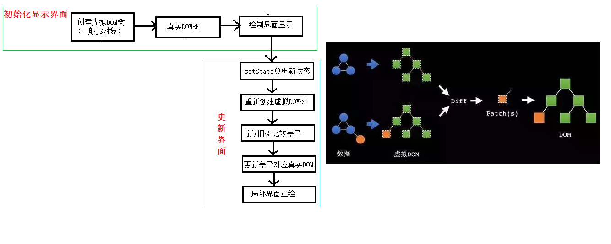

## 01_hello_react

### React简介

#### 官网

- **英文官网**: [React Official](https://reactjs.org/)
- **中文官网**: [React 中文文档](https://react.docschina.org/)

#### 介绍描述

React 是一个用于动态构建用户界面的 JavaScript 库。主要的特点有：
1. 只关注于视图部分
2. 由 Facebook 开源

#### React的特点

- 声明式编码
- 组件化编码
- 使用 React Native 编写原生应用
- 优秀的Diffing算法，使得React非常高效

#### 为什么React高效

React 之所以高效，主要归功于以下两点：
1. 使用虚拟(virtual)DOM，而不是直接操作真实的页面DOM
2. 采用DOM Diffing算法，可以最小化页面的重绘

#### 相关JS库

以下是与 React 相关的一些主要的JavaScript库：
- **react.js**: 这是 React 的核心库
- **react-dom.js**: 提供操作DOM的React扩展库
- **babel.min.js**: 可以解析JSX语法代码并转为常规的JS代码

### hello_react.html

**概括：**

- 基本React设置。
- 使用JSX创建一个简单的虚拟DOM，并渲染到页面。

**要点：**

- 在HTML中创建一个元素作为React应用的“容器”。
- 引入React，ReactDOM和Babel库。
- 使用JSX创建虚拟DOM。
- 使用`ReactDOM.render()`渲染虚拟DOM。

```html
<!DOCTYPE html>
<html lang="en">
<head>
 <meta charset="UTF-8">
 <title>hello_react</title>
</head>
<body>
 <!-- 准备好一个“容器” -->
 <div id="test"></div>

 <!-- 引入react核心库 -->
 <script type="text/javascript" src="../js/react.development.js"></script>
 <!-- 引入react-dom，用于支持react操作DOM -->
 <script type="text/javascript" src="../js/react-dom.development.js"></script>
 <!-- 引入babel，用于将jsx转为js -->
 <script type="text/javascript" src="../js/babel.min.js"></script>

 <script type="text/babel" > /* 此处一定要写babel */
  //1.创建虚拟DOM
  const VDOM = <h1>Hello,React</h1> /* 此处一定不要写引号，因为不是字符串 */
  //2.渲染虚拟DOM到页面
  ReactDOM.render(VDOM,document.getElementById('test'))
 </script>
</body>
</html>
```

## 02_虚拟DOM的两种创建方式

**概括：**

- 展示如何使用JSX和纯JS创建虚拟DOM。

**要点：**

1. **使用JSX创建虚拟DOM：**
   - 使用JSX（XML-like语法）直接在JavaScript中编写HTML标签。

2. **使用JS创建虚拟DOM：**
   - 使用`React.createElement()`方法。

### 1_使用jsx创建虚拟DOM.html

```html
<!DOCTYPE html>
<html lang="en">
<head>
 <meta charset="UTF-8">
 <title>1_使用jsx创建虚拟DOM</title>
</head>
<body>
 <!-- 准备好一个“容器” -->
 <div id="test"></div>

 <!-- 引入react核心库 -->
 <script type="text/javascript" src="../js/react.development.js"></script>
 <!-- 引入react-dom，用于支持react操作DOM -->
 <script type="text/javascript" src="../js/react-dom.development.js"></script>
 <!-- 引入babel，用于将jsx转为js -->
 <script type="text/javascript" src="../js/babel.min.js"></script>

 <script type="text/babel" > /* 此处一定要写babel */
  //1.创建虚拟DOM
  const VDOM = (  /* 此处一定不要写引号，因为不是字符串 */
   <h1 id="title">
    <span>Hello,React</span>
   </h1>
  )
  //2.渲染虚拟DOM到页面
  ReactDOM.render(VDOM,document.getElementById('test'))
 </script>
</body>
</html>
```

### 2_使用js创建虚拟DOM.html

```html
<!DOCTYPE html>
<html lang="en">
<head>
 <meta charset="UTF-8">
 <title>2_使用js创建虚拟DOM</title>
</head>
<body>
 <!-- 准备好一个“容器” -->
 <div id="test"></div>

 <!-- 引入react核心库 -->
 <script type="text/javascript" src="../js/react.development.js"></script>
 <!-- 引入react-dom，用于支持react操作DOM -->
 <script type="text/javascript" src="../js/react-dom.development.js"></script>

 <script type="text/javascript" > 
  //1.创建虚拟DOM
  const VDOM = React.createElement('h1',{id:'title'},React.createElement('span',{},'Hello,React'))
  //2.渲染虚拟DOM到页面
  ReactDOM.render(VDOM,document.getElementById('test'))
 </script>
</body>
</html>
```

### 3_虚拟DOM与真实DOM.html

**概括：**

- 对比虚拟DOM和真实DOM。

**要点：**

- 虚拟DOM是React用于描述真实DOM的对象。它不是真实的DOM元素，而是对其的轻量级表示。
- 真实DOM是浏览器中的实际元素。

关于虚拟DOM：

1. 本质是Object类型的对象（一般对象）
2. 虚拟DOM比较“轻”，真实DOM比较“重”，因为虚拟DOM是React内部在用，无需真实DOM上那么多的属性。
3. 虚拟DOM最终会被React转化为真实DOM，呈现在页面上。

```html
<!DOCTYPE html>
<html lang="en">
<head>
 <meta charset="UTF-8">
 <title>3_虚拟DOM与真实DOM</title>
</head>
<body>
 <!-- 准备好一个“容器” -->
 <div id="test"></div>
 <div id="demo"></div>

 <!-- 引入react核心库 -->
 <script type="text/javascript" src="../js/react.development.js"></script>
 <!-- 引入react-dom，用于支持react操作DOM -->
 <script type="text/javascript" src="../js/react-dom.development.js"></script>
 <!-- 引入babel，用于将jsx转为js -->
 <script type="text/javascript" src="../js/babel.min.js"></script>

 <script type="text/babel" > /* 此处一定要写babel */
  //1.创建虚拟DOM
  const VDOM = (  /* 此处一定不要写引号，因为不是字符串 */
   <h1 id="title">
    <span>Hello,React</span>
   </h1>
  )
  //2.渲染虚拟DOM到页面
  ReactDOM.render(VDOM,document.getElementById('test'))

  const TDOM = document.getElementById('demo')
  console.log('虚拟DOM',VDOM);
  console.log('真实DOM',TDOM);
  debugger;
  // console.log(typeof VDOM);
  // console.log(VDOM instanceof Object);
 </script>
</body>
</html>
```

## 03_jsx语法规则

### jsx语法规则.html

**jsx语法规则：**

1. 定义虚拟DOM时，不要写引号。
2. 标签中混入JS表达式时要用{}。
3. 样式的类名指定不要用 `class`，要用 `className`。
4. 内联样式，要用`style={{key:value}}`的形式去写。
5. 只有一个根标签
6. 标签必须闭合
7. 标签首字母
>+ 若小写字母开头，则将该标签转为`html`中同名元素，若`html`中无该标签对应的同名元素，则报错。
>+ 若大写字母开头，``react`就去渲染对应的组件，若组件没有定义，则报错。

```html
<!DOCTYPE html>
<html lang="en">
<head>
 <meta charset="UTF-8">
 <title>jsx语法规则</title>
 <style>
  .title{
   background-color: orange;
   width: 200px;
  }
 </style>
</head>
<body>
 <!-- 准备好一个“容器” -->
 <div id="test"></div>
 <!-- 引入react核心库 -->
 <script type="text/javascript" src="../js/react.development.js"></script>
 <!-- 引入react-dom，用于支持react操作DOM -->
 <script type="text/javascript" src="../js/react-dom.development.js"></script>
 <!-- 引入babel，用于将jsx转为js -->
 <script type="text/javascript" src="../js/babel.min.js"></script>
 <script type="text/babel">
  const myId = 'aTgUiGu'
  const myData = 'HeLlo,rEaCt'

  //1.创建虚拟DOM
  const VDOM = (
   <div>
    <h2 className="title" id={myId.toLowerCase()}>
     <span style={{color:'white',fontSize:'29px'}}>{myData.toLowerCase()}</span>
    </h2>
    <h2 className="title" id={myId.toUpperCase()}>
     <span style={{color:'white',fontSize:'29px'}}>{myData.toLowerCase()}</span>
    </h2>
    <input type="text"/>
   </div>
  )
  //2.渲染虚拟DOM到页面
  ReactDOM.render(VDOM,document.getElementById('test'))

 </script>
</body>
</html>
```

## 04_jsx的小练习

## jsx小练习.html

**注意：**  
> 请确保你能够区分**JS语句(代码)**与**JS表达式**。
>
> - **表达式**：表达式会产生一个值，可以放在任何需要值的地方。例如：
>   1. `a`
>   2. `a+b`
>   3. `demo(1)`
>   4. `arr.map()` 
>   5. `function test () {}`
>
> - **语句(代码)**：语句或代码是执行某种操作但不 necessarily 返回值的指令。例如：
>   1. `if(){}`
>   2. `for(){}`
>   3. `switch(){ case: xxxx }`


```html
<!DOCTYPE html>
<html lang="en">
<head>
 <meta charset="UTF-8">
 <title>jsx小练习</title>
</head>
<body>
 <!-- 准备好一个“容器” -->
 <div id="test"></div>
 
 <!-- 引入react核心库 -->
 <script type="text/javascript" src="../js/react.development.js"></script>
 <!-- 引入react-dom，用于支持react操作DOM -->
 <script type="text/javascript" src="../js/react-dom.development.js"></script>
 <!-- 引入babel，用于将jsx转为js -->
 <script type="text/javascript" src="../js/babel.min.js"></script>

 <script type="text/babel" >
  //模拟一些数据
  const data = ['Angular','React','Vue']
  //1.创建虚拟DOM
  const VDOM = (
   <div>
    <h1>前端js框架列表</h1>
    <ul>
     {
      data.map((item,index)=>{
       return <li key={index}>{item}</li>
      })
     }
    </ul>
   </div>
  )
  //2.渲染虚拟DOM到页面
  ReactDOM.render(VDOM,document.getElementById('test'))
 </script>
</body>
</html>
```

## 05_react中定义组件

### 1_函数式组件.html

```html
<!DOCTYPE html>
<html lang="en">
<head>
 <meta charset="UTF-8">
 <title>1_函数式组件</title>
</head>
<body>
 <!-- 准备好一个“容器” -->
 <div id="test"></div>
 
 <!-- 引入react核心库 -->
 <script type="text/javascript" src="../js/react.development.js"></script>
 <!-- 引入react-dom，用于支持react操作DOM -->
 <script type="text/javascript" src="../js/react-dom.development.js"></script>
 <!-- 引入babel，用于将jsx转为js -->
 <script type="text/javascript" src="../js/babel.min.js"></script>

 <script type="text/babel">
  //1.创建函数式组件
  function MyComponent(){
   console.log(this); //此处的this是undefined，因为babel编译后开启了严格模式
   return <h2>我是用函数定义的组件(适用于【简单组件】的定义)</h2>
  }
  //2.渲染组件到页面
  ReactDOM.render(<MyComponent/>,document.getElementById('test'))
  /* 
   执行了ReactDOM.render(<MyComponent/>.......之后，发生了什么？
     1.React解析组件标签，找到了MyComponent组件。
     2.发现组件是使用函数定义的，随后调用该函数，将返回的虚拟DOM转为真实DOM，随后呈现在页面中。
  */
 </script>
</body>
</html>
```

### 2_类式组件.html

```html
<!DOCTYPE html>
<html lang="en">
<head>
 <meta charset="UTF-8">
 <title>2_类式组件</title>
</head>
<body>
 <!-- 准备好一个“容器” -->
 <div id="test"></div>
 
 <!-- 引入react核心库 -->
 <script type="text/javascript" src="../js/react.development.js"></script>
 <!-- 引入react-dom，用于支持react操作DOM -->
 <script type="text/javascript" src="../js/react-dom.development.js"></script>
 <!-- 引入babel，用于将jsx转为js -->
 <script type="text/javascript" src="../js/babel.min.js"></script>

 <script type="text/babel">
  //1.创建类式组件
  class MyComponent extends React.Component {
   render(){
    //render是放在哪里的？—— MyComponent的原型对象上，供实例使用。
    //render中的this是谁？—— MyComponent的实例对象 <=> MyComponent组件实例对象。
    console.log('render中的this:',this);
    return <h2>我是用类定义的组件(适用于【复杂组件】的定义)</h2>
   }
  }
  //2.渲染组件到页面
  ReactDOM.render(<MyComponent/>,document.getElementById('test'))
  /* 
   执行了ReactDOM.render(<MyComponent/>.......之后，发生了什么？
     1.React解析组件标签，找到了MyComponent组件。
     2.发现组件是使用类定义的，随后new出来该类的实例，并通过该实例调用到原型上的render方法。
     3.将render返回的虚拟DOM转为真实DOM，随后呈现在页面中。
  */
 </script>
</body>
</html>
```

## 06_组件实例三大属性1_state

**理解：**
- state是组件对象最重要的属性, 值是对象(可以包含多个key-value的组合)。
- 组件被称为"状态机", 通过更新组件的state来更新对应的页面显示(重新渲染组件)。

**建议：**
1. 组件中render方法中的this为组件实例对象。
2. 组件自定义的方法中this为undefined，如何解决？
   - 强制绑定this: 通过函数对象的`bind()`。
   - 使用箭头函数。
3. 状态数据，不能直接修改或更新。


### 1_state.html

```html
<!DOCTYPE html>
<html lang="en">
<head>
 <meta charset="UTF-8">
 <title>state</title>
</head>
<body>
 <!-- 准备好一个“容器” -->
 <div id="test"></div>
 
 <!-- 引入react核心库 -->
 <script type="text/javascript" src="../js/react.development.js"></script>
 <!-- 引入react-dom，用于支持react操作DOM -->
 <script type="text/javascript" src="../js/react-dom.development.js"></script>
 <!-- 引入babel，用于将jsx转为js -->
 <script type="text/javascript" src="../js/babel.min.js"></script>

 <script type="text/babel">
  //1.创建组件
  class Weather extends React.Component{
   
   //构造器调用几次？ ———— 1次
   constructor(props){
    console.log('constructor');
    super(props)
    //初始化状态
    this.state = {isHot:false,wind:'微风'}
    //解决changeWeather中this指向问题
    this.changeWeather = this.changeWeather.bind(this)
   }

   //render调用几次？ ———— 1+n次 1是初始化的那次 n是状态更新的次数
   render(){
    console.log('render');
    //读取状态
    const {isHot,wind} = this.state
    return <h1 onClick={this.changeWeather}>今天天气很{isHot ? '炎热' : '凉爽'}，{wind}</h1>
   }

   //changeWeather调用几次？ ———— 点几次调几次
   changeWeather(){
    //changeWeather放在哪里？ ———— Weather的原型对象上，供实例使用
    //由于changeWeather是作为onClick的回调，所以不是通过实例调用的，是直接调用
    //类中的方法默认开启了局部的严格模式，所以changeWeather中的this为undefined
    
    console.log('changeWeather');
    //获取原来的isHot值
    const isHot = this.state.isHot
    //严重注意：状态必须通过setState进行更新,且更新是一种合并，不是替换。
    this.setState({isHot:!isHot})
    console.log(this);

    //严重注意：状态(state)不可直接更改，下面这行就是直接更改！！！
    //this.state.isHot = !isHot //这是错误的写法
   }
  }
  //2.渲染组件到页面
  ReactDOM.render(<Weather/>,document.getElementById('test'))
    
 </script>
</body>
</html>
```

### 2_state的简写方式.html

```html
<!DOCTYPE html>
<html lang="en">
<head>
 <meta charset="UTF-8">
 <title>state简写方式</title>
</head>
<body>
 <!-- 准备好一个“容器” -->
 <div id="test"></div>
 
 <!-- 引入react核心库 -->
 <script type="text/javascript" src="../js/react.development.js"></script>
 <!-- 引入react-dom，用于支持react操作DOM -->
 <script type="text/javascript" src="../js/react-dom.development.js"></script>
 <!-- 引入babel，用于将jsx转为js -->
 <script type="text/javascript" src="../js/babel.min.js"></script>

 <script type="text/babel">
  //1.创建组件
  class Weather extends React.Component{
   //初始化状态
   state = {isHot:false,wind:'微风'}

   render(){
    const {isHot,wind} = this.state
    return <h1 onClick={this.changeWeather}>今天天气很{isHot ? '炎热' : '凉爽'}，{wind}</h1>
   }

   //自定义方法————要用赋值语句的形式+箭头函数
   changeWeather = ()=>{
    const isHot = this.state.isHot
    this.setState({isHot:!isHot})
   }
  }
  //2.渲染组件到页面
  ReactDOM.render(<Weather/>,document.getElementById('test'))
    
 </script>
</body>
</html>
```

## 07_组件实例三大属性2_props

**理解：**
1. 每个组件对象都会有 `props` (properties的简写)属性。
2. 组件标签的所有属性都保存在props中。

**作用:**
1. 通过标签属性从组件外向组件内传递变化的数据。
2. 注意: 组件内部不要修改props数据。


### 1_props基本使用.html

```html
<!DOCTYPE html>
<html lang="en">
<head>
 <meta charset="UTF-8">
 <title>props基本使用</title>
</head>
<body>
 <!-- 准备好一个“容器” -->
 <div id="test1"></div>
 <div id="test2"></div>
 <div id="test3"></div>
 
 <!-- 引入react核心库 -->
 <script type="text/javascript" src="../js/react.development.js"></script>
 <!-- 引入react-dom，用于支持react操作DOM -->
 <script type="text/javascript" src="../js/react-dom.development.js"></script>
 <!-- 引入babel，用于将jsx转为js -->
 <script type="text/javascript" src="../js/babel.min.js"></script>

 <script type="text/babel">
  //创建组件
  class Person extends React.Component{
   render(){
    // console.log(this);
    const {name,age,sex} = this.props
    return (
     <ul>
      <li>姓名：{name}</li>
      <li>性别：{sex}</li>
      <li>年龄：{age+1}</li>
     </ul>
    )
   }
  }
  //渲染组件到页面
  ReactDOM.render(<Person name="jerry" age={19}  sex="男"/>,document.getElementById('test1'))
  ReactDOM.render(<Person name="tom" age={18} sex="女"/>,document.getElementById('test2'))

  const p = {name:'老刘',age:18,sex:'女'}
  // console.log('@',...p);
  // ReactDOM.render(<Person name={p.name} age={p.age} sex={p.sex}/>,document.getElementById('test3'))
  ReactDOM.render(<Person {...p}/>,document.getElementById('test3'))
 </script>
</body>
</html>
```

### 2_对props进行限制.html

```html
<!DOCTYPE html>
<html lang="en">
<head>
 <meta charset="UTF-8">
 <title>对props进行限制</title>
</head>
<body>
 <!-- 准备好一个“容器” -->
 <div id="test1"></div>
 <div id="test2"></div>
 <div id="test3"></div>
 
 <!-- 引入react核心库 -->
 <script type="text/javascript" src="../js/react.development.js"></script>
 <!-- 引入react-dom，用于支持react操作DOM -->
 <script type="text/javascript" src="../js/react-dom.development.js"></script>
 <!-- 引入babel，用于将jsx转为js -->
 <script type="text/javascript" src="../js/babel.min.js"></script>
 <!-- 引入prop-types，用于对组件标签属性进行限制 -->
 <script type="text/javascript" src="../js/prop-types.js"></script>

 <script type="text/babel">
  //创建组件
  class Person extends React.Component{
   render(){
    // console.log(this);
    const {name,age,sex} = this.props
    //props是只读的
    //this.props.name = 'jack' //此行代码会报错，因为props是只读的
    return (
     <ul>
      <li>姓名：{name}</li>
      <li>性别：{sex}</li>
      <li>年龄：{age+1}</li>
     </ul>
    )
   }
  }
  //对标签属性进行类型、必要性的限制
  Person.propTypes = {
   name:PropTypes.string.isRequired, //限制name必传，且为字符串
   sex:PropTypes.string,//限制sex为字符串
   age:PropTypes.number,//限制age为数值
   speak:PropTypes.func,//限制speak为函数
  }
  //指定默认标签属性值
  Person.defaultProps = {
   sex:'男',//sex默认值为男
   age:18 //age默认值为18
  }
  //渲染组件到页面
  ReactDOM.render(<Person name={100} speak={speak}/>,document.getElementById('test1'))
  ReactDOM.render(<Person name="tom" age={18} sex="女"/>,document.getElementById('test2'))

  const p = {name:'老刘',age:18,sex:'女'}
  // console.log('@',...p);
  // ReactDOM.render(<Person name={p.name} age={p.age} sex={p.sex}/>,document.getElementById('test3'))
  ReactDOM.render(<Person {...p}/>,document.getElementById('test3'))

  function speak(){
   console.log('我说话了');
  }
 </script>
</body>
</html>
```

### 3_props的简写方式.html

```html
<!DOCTYPE html>
<html lang="en">
<head>
 <meta charset="UTF-8">
 <title>对props进行限制</title>
</head>
<body>
 <!-- 准备好一个“容器” -->
 <div id="test1"></div>
 <div id="test2"></div>
 <div id="test3"></div>
 
 <!-- 引入react核心库 -->
 <script type="text/javascript" src="../js/react.development.js"></script>
 <!-- 引入react-dom，用于支持react操作DOM -->
 <script type="text/javascript" src="../js/react-dom.development.js"></script>
 <!-- 引入babel，用于将jsx转为js -->
 <script type="text/javascript" src="../js/babel.min.js"></script>
 <!-- 引入prop-types，用于对组件标签属性进行限制 -->
 <script type="text/javascript" src="../js/prop-types.js"></script>

 <script type="text/babel">
  //创建组件
  class Person extends React.Component{

   constructor(props){
    //构造器是否接收props，是否传递给super，取决于：是否希望在构造器中通过this访问props
    // console.log(props);
    super(props)
    console.log('constructor',this.props);
   }

   //对标签属性进行类型、必要性的限制
   static propTypes = {
    name:PropTypes.string.isRequired, //限制name必传，且为字符串
    sex:PropTypes.string,//限制sex为字符串
    age:PropTypes.number,//限制age为数值
   }

   //指定默认标签属性值
   static defaultProps = {
    sex:'男',//sex默认值为男
    age:18 //age默认值为18
   }
   
   render(){
    // console.log(this);
    const {name,age,sex} = this.props
    //props是只读的
    //this.props.name = 'jack' //此行代码会报错，因为props是只读的
    return (
     <ul>
      <li>姓名：{name}</li>
      <li>性别：{sex}</li>
      <li>年龄：{age+1}</li>
     </ul>
    )
   }
  }

  //渲染组件到页面
  ReactDOM.render(<Person name="jerry"/>,document.getElementById('test1'))
 </script>
</body>
</html>
```

### 4_函数组件使用props.html

```html
<!DOCTYPE html>
<html lang="en">
<head>
 <meta charset="UTF-8">
 <title>对props进行限制</title>
</head>
<body>
 <!-- 准备好一个“容器” -->
 <div id="test1"></div>
 <div id="test2"></div>
 <div id="test3"></div>
 
 <!-- 引入react核心库 -->
 <script type="text/javascript" src="../js/react.development.js"></script>
 <!-- 引入react-dom，用于支持react操作DOM -->
 <script type="text/javascript" src="../js/react-dom.development.js"></script>
 <!-- 引入babel，用于将jsx转为js -->
 <script type="text/javascript" src="../js/babel.min.js"></script>
 <!-- 引入prop-types，用于对组件标签属性进行限制 -->
 <script type="text/javascript" src="../js/prop-types.js"></script>

 <script type="text/babel">
  //创建组件
  function Person (props){
   const {name,age,sex} = props
   return (
     <ul>
      <li>姓名：{name}</li>
      <li>性别：{sex}</li>
      <li>年龄：{age}</li>
     </ul>
    )
  }
  Person.propTypes = {
   name:PropTypes.string.isRequired, //限制name必传，且为字符串
   sex:PropTypes.string,//限制sex为字符串
   age:PropTypes.number,//限制age为数值
  }

  //指定默认标签属性值
  Person.defaultProps = {
   sex:'男',//sex默认值为男
   age:18 //age默认值为18
  }
  //渲染组件到页面
  ReactDOM.render(<Person name="jerry"/>,document.getElementById('test1'))
 </script>
</body>
</html>
```

## 08_组件实例三大属性3_refs

**理解:**
- 组件内的标签可以定义ref属性来标识自己。

**ref编码的三种形式：**
1. 字符串形式的ref:
   ```jsx
   <input ref="input1"/>
   ```
2. 回调形式的ref:
   ```jsx
   <input ref={(c)=>{this.input1 = c}}/>
   ```
3. 使用createRef创建ref容器:
   ```jsx
   myRef = React.createRef()
   <input ref={this.myRef}/>
   ```

**事件处理:**
1. 通过`onXxx`属性指定事件处理函数(注意大小写)：
   - React使用的是自定义(合成)事件, 而不是原生DOM事件。
   - React中的事件是通过事件委托方式处理的(委托给组件最外层的元素)。
2. 通过`event.target`得到发生事件的DOM元素对象。


### 1_字符串形式的ref.html

```html
<!DOCTYPE html>
<html lang="en">
<head>
 <meta charset="UTF-8">
 <title>1_字符串形式的ref</title>
</head>
<body>
 <!-- 准备好一个“容器” -->
 <div id="test"></div>
 
 <!-- 引入react核心库 -->
 <script type="text/javascript" src="../js/react.development.js"></script>
 <!-- 引入react-dom，用于支持react操作DOM -->
 <script type="text/javascript" src="../js/react-dom.development.js"></script>
 <!-- 引入babel，用于将jsx转为js -->
 <script type="text/javascript" src="../js/babel.min.js"></script>

 <script type="text/babel">
  //创建组件
  class Demo extends React.Component{
   //展示左侧输入框的数据
   showData = ()=>{
    const {input1} = this.refs
    alert(input1.value)
   }
   //展示右侧输入框的数据
   showData2 = ()=>{
    const {input2} = this.refs
    alert(input2.value)
   }
   render(){
    return(
     <div>
      <input ref="input1" type="text" placeholder="点击按钮提示数据"/>&nbsp;
      <button onClick={this.showData}>点我提示左侧的数据</button>&nbsp;
      <input ref="input2" onBlur={this.showData2} type="text" placeholder="失去焦点提示数据"/>
     </div>
    )
   }
  }
  //渲染组件到页面
  ReactDOM.render(<Demo a="1" b="2"/>,document.getElementById('test'))
 </script>
</body>
</html>
```

### 2_回调函数形式的ref.html

```html
<!DOCTYPE html>
<html lang="en">
<head>
 <meta charset="UTF-8">
 <title>1_字符串形式的ref</title>
</head>
<body>
 <!-- 准备好一个“容器” -->
 <div id="test"></div>
 
 <!-- 引入react核心库 -->
 <script type="text/javascript" src="../js/react.development.js"></script>
 <!-- 引入react-dom，用于支持react操作DOM -->
 <script type="text/javascript" src="../js/react-dom.development.js"></script>
 <!-- 引入babel，用于将jsx转为js -->
 <script type="text/javascript" src="../js/babel.min.js"></script>

 <script type="text/babel">
  //创建组件
  class Demo extends React.Component{
   //展示左侧输入框的数据
   showData = ()=>{
    const {input1} = this
    alert(input1.value)
   }
   //展示右侧输入框的数据
   showData2 = ()=>{
    const {input2} = this
    alert(input2.value)
   }
   render(){
    return(
     <div>
      <input ref={c => this.input1 = c } type="text" placeholder="点击按钮提示数据"/>&nbsp;
      <button onClick={this.showData}>点我提示左侧的数据</button>&nbsp;
      <input onBlur={this.showData2} ref={c => this.input2 = c } type="text" placeholder="失去焦点提示数据"/>&nbsp;
     </div>
    )
   }
  }
  //渲染组件到页面
  ReactDOM.render(<Demo a="1" b="2"/>,document.getElementById('test'))
 </script>
</body>
</html>
```

### 3_回调ref中回调执行次数的问题.html

```html
<!DOCTYPE html>
<html lang="en">
<head>
 <meta charset="UTF-8">
 <title>3_回调ref中回调执行次数的问题</title>
</head>
<body>
 <!-- 准备好一个“容器” -->
 <div id="test"></div>
 
 <!-- 引入react核心库 -->
 <script type="text/javascript" src="../js/react.development.js"></script>
 <!-- 引入react-dom，用于支持react操作DOM -->
 <script type="text/javascript" src="../js/react-dom.development.js"></script>
 <!-- 引入babel，用于将jsx转为js -->
 <script type="text/javascript" src="../js/babel.min.js"></script>

 <script type="text/babel">
  //创建组件
  class Demo extends React.Component{

   state = {isHot:false}

   showInfo = ()=>{
    const {input1} = this
    alert(input1.value)
   }

   changeWeather = ()=>{
    //获取原来的状态
    const {isHot} = this.state
    //更新状态
    this.setState({isHot:!isHot})
   }

   saveInput = (c)=>{
    this.input1 = c;
    console.log('@',c);
   }

   render(){
    const {isHot} = this.state
    return(
     <div>
      <h2>今天天气很{isHot ? '炎热':'凉爽'}</h2>
      {/*<input ref={(c)=>{this.input1 = c;console.log('@',c);}} type="text"/><br/><br/>*/}
      <input ref={this.saveInput} type="text"/><br/><br/>
      <button onClick={this.showInfo}>点我提示输入的数据</button>
      <button onClick={this.changeWeather}>点我切换天气</button>
     </div>
    )
   }
  }
  //渲染组件到页面
  ReactDOM.render(<Demo/>,document.getElementById('test'))
 </script>
</body>
</html>
```

### 4_createRef的使用.html

```html
<!DOCTYPE html>
<html lang="en">
<head>
 <meta charset="UTF-8">
 <title>4_createRef</title>
</head>
<body>
 <!-- 准备好一个“容器” -->
 <div id="test"></div>
 
 <!-- 引入react核心库 -->
 <script type="text/javascript" src="../js/react.development.js"></script>
 <!-- 引入react-dom，用于支持react操作DOM -->
 <script type="text/javascript" src="../js/react-dom.development.js"></script>
 <!-- 引入babel，用于将jsx转为js -->
 <script type="text/javascript" src="../js/babel.min.js"></script>

 <script type="text/babel">
  //创建组件
  class Demo extends React.Component{
   /* 
    React.createRef调用后可以返回一个容器，该容器可以存储被ref所标识的节点,该容器是“专人专用”的
    */
   myRef = React.createRef()
   myRef2 = React.createRef()
   //展示左侧输入框的数据
   showData = ()=>{
    alert(this.myRef.current.value);
   }
   //展示右侧输入框的数据
   showData2 = ()=>{
    alert(this.myRef2.current.value);
   }
   render(){
    return(
     <div>
      <input ref={this.myRef} type="text" placeholder="点击按钮提示数据"/>&nbsp;
      <button onClick={this.showData}>点我提示左侧的数据</button>&nbsp;
      <input onBlur={this.showData2} ref={this.myRef2} type="text" placeholder="失去焦点提示数据"/>&nbsp;
     </div>
    )
   }
  }
  //渲染组件到页面
  ReactDOM.render(<Demo a="1" b="2"/>,document.getElementById('test'))
 </script>
</body>
</html>
```

## 09_react中的事件处理

### 事件处理.html

```html
<!DOCTYPE html>
<html lang="en">
<head>
 <meta charset="UTF-8">
 <title>事件处理</title>
</head>
<body>
 <!-- 准备好一个“容器” -->
 <div id="test"></div>
 
 <!-- 引入react核心库 -->
 <script type="text/javascript" src="../js/react.development.js"></script>
 <!-- 引入react-dom，用于支持react操作DOM -->
 <script type="text/javascript" src="../js/react-dom.development.js"></script>
 <!-- 引入babel，用于将jsx转为js -->
 <script type="text/javascript" src="../js/babel.min.js"></script>

 <script type="text/babel">
  //创建组件
  class Demo extends React.Component{
   /* 
    (1).通过onXxx属性指定事件处理函数(注意大小写)
      a.React使用的是自定义(合成)事件, 而不是使用的原生DOM事件 —————— 为了更好的兼容性
      b.React中的事件是通过事件委托方式处理的(委托给组件最外层的元素) ————————为了的高效
    (2).通过event.target得到发生事件的DOM元素对象 ——————————不要过度使用ref
    */
   //创建ref容器
   myRef = React.createRef()
   myRef2 = React.createRef()

   //展示左侧输入框的数据
   showData = (event)=>{
    console.log(event.target);
    alert(this.myRef.current.value);
   }

   //展示右侧输入框的数据
   showData2 = (event)=>{
    alert(event.target.value);
   }

   render(){
    return(
     <div>
      <input ref={this.myRef} type="text" placeholder="点击按钮提示数据"/>&nbsp;
      <button onClick={this.showData}>点我提示左侧的数据</button>&nbsp;
      <input onBlur={this.showData2} type="text" placeholder="失去焦点提示数据"/>&nbsp;
     </div>
    )
   }
  }
  //渲染组件到页面
  ReactDOM.render(<Demo a="1" b="2"/>,document.getElementById('test'))
 </script>
</body>
</html>
```

## 10_react中收集表单数据

### 1_非受控组件.html

```html
<!DOCTYPE html>
<html lang="en">
<head>
 <meta charset="UTF-8">
 <title>1_非受控组件</title>
</head>
<body>
 <!-- 准备好一个“容器” -->
 <div id="test"></div>
 
 <!-- 引入react核心库 -->
 <script type="text/javascript" src="../js/react.development.js"></script>
 <!-- 引入react-dom，用于支持react操作DOM -->
 <script type="text/javascript" src="../js/react-dom.development.js"></script>
 <!-- 引入babel，用于将jsx转为js -->
 <script type="text/javascript" src="../js/babel.min.js"></script>

 <script type="text/babel">
  //创建组件
  class Login extends React.Component{
   handleSubmit = (event)=>{
    event.preventDefault() //阻止表单提交
    const {username,password} = this
    alert(`你输入的用户名是：${username.value},你输入的密码是：${password.value}`)
   }
   render(){
    return(
     <form onSubmit={this.handleSubmit}>
      用户名：<input ref={c => this.username = c} type="text" name="username"/>
      密码：<input ref={c => this.password = c} type="password" name="password"/>
      <button>登录</button>
     </form>
    )
   }
  }
  //渲染组件
  ReactDOM.render(<Login/>,document.getElementById('test'))
 </script>
</body>
</html>
```

### 2_受控组件.html

```html
<!DOCTYPE html>
<html lang="en">
<head>
 <meta charset="UTF-8">
 <title>2_受控组件</title>
</head>
<body>
 <!-- 准备好一个“容器” -->
 <div id="test"></div>
 
 <!-- 引入react核心库 -->
 <script type="text/javascript" src="../js/react.development.js"></script>
 <!-- 引入react-dom，用于支持react操作DOM -->
 <script type="text/javascript" src="../js/react-dom.development.js"></script>
 <!-- 引入babel，用于将jsx转为js -->
 <script type="text/javascript" src="../js/babel.min.js"></script>

 <script type="text/babel">
  //创建组件
  class Login extends React.Component{

   //初始化状态
   state = {
    username:'', //用户名
    password:'' //密码
   }

   //保存用户名到状态中
   saveUsername = (event)=>{
    this.setState({username:event.target.value})
   }

   //保存密码到状态中
   savePassword = (event)=>{
    this.setState({password:event.target.value})
   }

   //表单提交的回调
   handleSubmit = (event)=>{
    event.preventDefault() //阻止表单提交
    const {username,password} = this.state
    alert(`你输入的用户名是：${username},你输入的密码是：${password}`)
   }

   render(){
    return(
     <form onSubmit={this.handleSubmit}>
      用户名：<input onChange={this.saveUsername} type="text" name="username"/>
      密码：<input onChange={this.savePassword} type="password" name="password"/>
      <button>登录</button>
     </form>
    )
   }
  }
  //渲染组件
  ReactDOM.render(<Login/>,document.getElementById('test'))
 </script>
</body>
</html>
```

## 11_高阶函数_函数柯里化

**高阶函数**

高阶函数是满足以下两个条件中的任何一个的函数：
1. 如果一个函数接收的参数是一个函数，那么该函数就是高阶函数。
2. 如果一个函数的返回值是一个函数，那么该函数就是高阶函数。

常见的高阶函数有：`Promise`、`setTimeout`、`arr.map()` 等。

**函数的柯里化**

函数柯里化是通过函数调用继续返回函数的方式，实现多次接收参数最后统一处理的函数编码形式。例如：

```javascript
function sum(a){
   return (b) => {
       return (c) => {
           return a + b + c;
       }
   }
}
```

### 1_高阶函数_函数柯里化.html

```html
<!DOCTYPE html>
<html lang="en">
<head>
 <meta charset="UTF-8">
 <title>高阶函数_函数柯里化</title>
</head>
<body>
 <!-- 准备好一个“容器” -->
 <div id="test"></div>
 
 <!-- 引入react核心库 -->
 <script type="text/javascript" src="../js/react.development.js"></script>
 <!-- 引入react-dom，用于支持react操作DOM -->
 <script type="text/javascript" src="../js/react-dom.development.js"></script>
 <!-- 引入babel，用于将jsx转为js -->
 <script type="text/javascript" src="../js/babel.min.js"></script>

 <script type="text/babel">
  //#endregion
  //创建组件
  class Login extends React.Component{
   //初始化状态
   state = {
    username:'', //用户名
    password:'' //密码
   }

   //保存表单数据到状态中
   saveFormData = (dataType)=>{
    return (event)=>{
     this.setState({[dataType]:event.target.value})
    }
   }

   //表单提交的回调
   handleSubmit = (event)=>{
    event.preventDefault() //阻止表单提交
    const {username,password} = this.state
    alert(`你输入的用户名是：${username},你输入的密码是：${password}`)
   }
   render(){
    return(
     <form onSubmit={this.handleSubmit}>
      用户名：<input onChange={this.saveFormData('username')} type="text" name="username"/>
      密码：<input onChange={this.saveFormData('password')} type="password" name="password"/>
      <button>登录</button>
     </form>
    )
   }
  }
  //渲染组件
  ReactDOM.render(<Login/>,document.getElementById('test'))
 </script>
</body>
</html>
```

### 2_不用函数柯里化的实现.html

```html
<!DOCTYPE html>
<html lang="en">
<head>
 <meta charset="UTF-8">
 <title>2_不用函数柯里化的实现</title>
</head>
<body>
 <!-- 准备好一个“容器” -->
 <div id="test"></div>
 
 <!-- 引入react核心库 -->
 <script type="text/javascript" src="../js/react.development.js"></script>
 <!-- 引入react-dom，用于支持react操作DOM -->
 <script type="text/javascript" src="../js/react-dom.development.js"></script>
 <!-- 引入babel，用于将jsx转为js -->
 <script type="text/javascript" src="../js/babel.min.js"></script>

 <script type="text/babel">
  //创建组件
  class Login extends React.Component{
   //初始化状态
   state = {
    username:'', //用户名
    password:'' //密码
   }

   //保存表单数据到状态中
   saveFormData = (dataType,event)=>{
    this.setState({[dataType]:event.target.value})
   }

   //表单提交的回调
   handleSubmit = (event)=>{
    event.preventDefault() //阻止表单提交
    const {username,password} = this.state
    alert(`你输入的用户名是：${username},你输入的密码是：${password}`)
   }
   render(){
    return(
     <form onSubmit={this.handleSubmit}>
      用户名：<input onChange={event => this.saveFormData('username',event) } type="text" name="username"/>
      密码：<input onChange={event => this.saveFormData('password',event) } type="password" name="password"/>
      <button>登录</button>
     </form>
    )
   }
  }
  //渲染组件
  ReactDOM.render(<Login/>,document.getElementById('test'))
 </script>
</body>
</html>
```

## 12_组件的生命周期

**理解:**

1.	组件从创建到死亡它会经历一些特定的阶段。
2.	React组件中包含一系列勾子函数(生命周期回调函数), 会在特定的时刻调用。
3.	我们在定义组件时，会在特定的生命周期回调函数中，做特定的工作。


### 1_引出生命周期.html

```html
<!DOCTYPE html>
<html lang="en">
<head>
 <meta charset="UTF-8">
 <title>1_引出生命周期</title>
</head>
<body>
 <!-- 准备好一个“容器” -->
 <div id="test"></div>
 
 <!-- 引入react核心库 -->
 <script type="text/javascript" src="../js/react.development.js"></script>
 <!-- 引入react-dom，用于支持react操作DOM -->
 <script type="text/javascript" src="../js/react-dom.development.js"></script>
 <!-- 引入babel，用于将jsx转为js -->
 <script type="text/javascript" src="../js/babel.min.js"></script>

 <script type="text/babel">
  //创建组件
  //生命周期回调函数 <=> 生命周期钩子函数 <=> 生命周期函数 <=> 生命周期钩子
  class Life extends React.Component{

   state = {opacity:1}

   death = ()=>{
    //卸载组件
    ReactDOM.unmountComponentAtNode(document.getElementById('test'))
   }

   //组件挂完毕
   componentDidMount(){
    console.log('componentDidMount');
    this.timer = setInterval(() => {
     //获取原状态
     let {opacity} = this.state
     //减小0.1
     opacity -= 0.1
     if(opacity <= 0) opacity = 1
     //设置新的透明度
     this.setState({opacity})
    }, 200);
   }

   //组件将要卸载
   componentWillUnmount(){
    //清除定时器
    clearInterval(this.timer)
   }

   //初始化渲染、状态更新之后
   render(){
    console.log('render');
    return(
     <div>
      <h2 style={{opacity:this.state.opacity}}>React学不会怎么办？</h2>
      <button onClick={this.death}>不活了</button>
     </div>
    )
   }
  }
  //渲染组件
  ReactDOM.render(<Life/>,document.getElementById('test'))
 </script>
</body>
</html>
```

### 2_react生命周期(旧).html


**React组件生命周期阶段及其钩子函数：**

- **初始化阶段:** 由ReactDOM.render()触发——初次渲染
  1. `constructor()`
  2. `componentWillMount()`
  3. `render()`
  4. `componentDidMount()` —— **常用**  
     *一般在这个钩子中做一些初始化的事，例如：开启定时器、发送网络请求、订阅消息。*

- **更新阶段:** 由组件内部`this.setState()`或父组件`render`触发
  1. `shouldComponentUpdate()`
  2. `componentWillUpdate()`
  3. `render()` —— **必须使用的一个**
  4. `componentDidUpdate()`

- **卸载组件:** 由ReactDOM.unmountComponentAtNode()触发
  1. `componentWillUnmount()` —— **常用**  
     *一般在这个钩子中做一些收尾的事，例如：关闭定时器、取消订阅消息。*

```html
<!DOCTYPE html>
<html lang="en">
<head>
 <meta charset="UTF-8">
 <title>2_react生命周期(旧)</title>
</head>
<body>
 <!-- 准备好一个“容器” -->
 <div id="test"></div>
 
 <!-- 引入react核心库 -->
 <script type="text/javascript" src="../js/react.development.js"></script>
 <!-- 引入react-dom，用于支持react操作DOM -->
 <script type="text/javascript" src="../js/react-dom.development.js"></script>
 <!-- 引入babel，用于将jsx转为js -->
 <script type="text/javascript" src="../js/babel.min.js"></script>

 <script type="text/babel">
  //创建组件
  class Count extends React.Component{

   //构造器
   constructor(props){
    console.log('Count---constructor');
    super(props)
    //初始化状态
    this.state = {count:0}
   }

   //加1按钮的回调
   add = ()=>{
    //获取原状态
    const {count} = this.state
    //更新状态
    this.setState({count:count+1})
   }

   //卸载组件按钮的回调
   death = ()=>{
    ReactDOM.unmountComponentAtNode(document.getElementById('test'))
   }

   //强制更新按钮的回调
   force = ()=>{
    this.forceUpdate()
   }

   //组件将要挂载的钩子
   componentWillMount(){
    console.log('Count---componentWillMount');
   }

   //组件挂载完毕的钩子
   componentDidMount(){
    console.log('Count---componentDidMount');
   }

   //组件将要卸载的钩子
   componentWillUnmount(){
    console.log('Count---componentWillUnmount');
   }

   //控制组件更新的“阀门”
   shouldComponentUpdate(){
    console.log('Count---shouldComponentUpdate');
    return true
   }

   //组件将要更新的钩子
   componentWillUpdate(){
    console.log('Count---componentWillUpdate');
   }

   //组件更新完毕的钩子
   componentDidUpdate(){
    console.log('Count---componentDidUpdate');
   }

   render(){
    console.log('Count---render');
    const {count} = this.state
    return(
     <div>
      <h2>当前求和为：{count}</h2>
      <button onClick={this.add}>点我+1</button>
      <button onClick={this.death}>卸载组件</button>
      <button onClick={this.force}>不更改任何状态中的数据，强制更新一下</button>
     </div>
    )
   }
  }
  
  //父组件A
  class A extends React.Component{
   //初始化状态
   state = {carName:'奔驰'}

   changeCar = ()=>{
    this.setState({carName:'奥拓'})
   }

   render(){
    return(
     <div>
      <div>我是A组件</div>
      <button onClick={this.changeCar}>换车</button>
      <B carName={this.state.carName}/>
     </div>
    )
   }
  }
  
  //子组件B
  class B extends React.Component{
   //组件将要接收新的props的钩子
   componentWillReceiveProps(props){
    console.log('B---componentWillReceiveProps',props);
   }

   //控制组件更新的“阀门”
   shouldComponentUpdate(){
    console.log('B---shouldComponentUpdate');
    return true
   }
   //组件将要更新的钩子
   componentWillUpdate(){
    console.log('B---componentWillUpdate');
   }

   //组件更新完毕的钩子
   componentDidUpdate(){
    console.log('B---componentDidUpdate');
   }

   render(){
    console.log('B---render');
    return(
     <div>我是B组件，接收到的车是:{this.props.carName}</div>
    )
   }
  }
  
  //渲染组件
  ReactDOM.render(<Count/>,document.getElementById('test'))
 </script>
</body>
</html>
```

### 3_react生命周期(新)


**React组件生命周期阶段及其钩子函数：**

- **初始化阶段:** 由`ReactDOM.render()`触发——初次渲染
  1. `constructor()`
  2. `getDerivedStateFromProps`
  3. `render()`
  4. `componentDidMount()` —— **常用**  
     *一般在这个钩子中做一些初始化的事，例如：开启定时器、发送网络请求、订阅消息。*

- **更新阶段:** 由组件内部`this.setState()`或父组件重新`render`触发
  1. `getDerivedStateFromProps`
  2. `shouldComponentUpdate()`
  3. `render()`
  4. `getSnapshotBeforeUpdate()`
  5. `componentDidUpdate()`

- **卸载组件:** 由`ReactDOM.unmountComponentAtNode()`触发
  1. `componentWillUnmount()` —— **常用**  
     *一般在这个钩子中做一些收尾的事，例如：关闭定时器、取消订阅消息。*

**重要的钩子：**

1. `render()`：初始化渲染或更新渲染调用。
2. `componentDidMount()`：开启监听, 发送ajax请求。
3. `componentWillUnmount()`：做一些收尾工作, 如: 清理定时器。

**即将废弃的钩子：**

1. `componentWillMount`
2. `componentWillReceiveProps`
3. `componentWillUpdate`

*注意:* 当前版本使用上述废弃钩子会出现警告，下一个大版本中需要加上`UNSAFE_`前缀才能使用，未来可能会被彻底废弃，因此不建议使用。

```html
<!DOCTYPE html>
<html lang="en">
<head>
 <meta charset="UTF-8">
 <title>3_react生命周期(新)</title>
</head>
<body>
 <!-- 准备好一个“容器” -->
 <div id="test"></div>
 
 <!-- 引入react核心库 -->
 <script type="text/javascript" src="../js/17.0.1/react.development.js"></script>
 <!-- 引入react-dom，用于支持react操作DOM -->
 <script type="text/javascript" src="../js/17.0.1/react-dom.development.js"></script>
 <!-- 引入babel，用于将jsx转为js -->
 <script type="text/javascript" src="../js/17.0.1/babel.min.js"></script>

 <script type="text/babel">
  //创建组件
  class Count extends React.Component{
   //构造器
   constructor(props){
    console.log('Count---constructor');
    super(props)
    //初始化状态
    this.state = {count:0}
   }

   //加1按钮的回调
   add = ()=>{
    //获取原状态
    const {count} = this.state
    //更新状态
    this.setState({count:count+1})
   }

   //卸载组件按钮的回调
   death = ()=>{
    ReactDOM.unmountComponentAtNode(document.getElementById('test'))
   }

   //强制更新按钮的回调
   force = ()=>{
    this.forceUpdate()
   }
   
   //若state的值在任何时候都取决于props，那么可以使用getDerivedStateFromProps
   static getDerivedStateFromProps(props,state){
    console.log('getDerivedStateFromProps',props,state);
    return null
   }

   //在更新之前获取快照
   getSnapshotBeforeUpdate(){
    console.log('getSnapshotBeforeUpdate');
    return 'atguigu'
   }

   //组件挂载完毕的钩子
   componentDidMount(){
    console.log('Count---componentDidMount');
   }

   //组件将要卸载的钩子
   componentWillUnmount(){
    console.log('Count---componentWillUnmount');
   }

   //控制组件更新的“阀门”
   shouldComponentUpdate(){
    console.log('Count---shouldComponentUpdate');
    return true
   }

   //组件更新完毕的钩子
   componentDidUpdate(preProps,preState,snapshotValue){
    console.log('Count---componentDidUpdate',preProps,preState,snapshotValue);
   }
   
   render(){
    console.log('Count---render');
    const {count} = this.state
    return(
     <div>
      <h2>当前求和为：{count}</h2>
      <button onClick={this.add}>点我+1</button>
      <button onClick={this.death}>卸载组件</button>
      <button onClick={this.force}>不更改任何状态中的数据，强制更新一下</button>
     </div>
    )
   }
  }
  
  //渲染组件
  ReactDOM.render(<Count count={199}/>,document.getElementById('test'))
 </script>
</body>
</html>
```

### 4_getSnapshotBeforeUpdate的使用场景

```html
<!DOCTYPE html>
<html lang="en">
<head>
 <meta charset="UTF-8">
 <title>4_getSnapShotBeforeUpdate的使用场景</title>
 <style>
  .list{
   width: 200px;
   height: 150px;
   background-color: skyblue;
   overflow: auto;
  }
  .news{
   height: 30px;
  }
 </style>
</head>
<body>
 <!-- 准备好一个“容器” -->
 <div id="test"></div>
 
 <!-- 引入react核心库 -->
 <script type="text/javascript" src="../js/17.0.1/react.development.js"></script>
 <!-- 引入react-dom，用于支持react操作DOM -->
 <script type="text/javascript" src="../js/17.0.1/react-dom.development.js"></script>
 <!-- 引入babel，用于将jsx转为js -->
 <script type="text/javascript" src="../js/17.0.1/babel.min.js"></script>

 <script type="text/babel">
  class NewsList extends React.Component{

   state = {newsArr:[]}

   componentDidMount(){
    setInterval(() => {
     //获取原状态
     const {newsArr} = this.state
     //模拟一条新闻
     const news = '新闻'+ (newsArr.length+1)
     //更新状态
     this.setState({newsArr:[news,...newsArr]})
    }, 1000);
   }

   getSnapshotBeforeUpdate(){
    return this.refs.list.scrollHeight
   }

   componentDidUpdate(preProps,preState,height){
    this.refs.list.scrollTop += this.refs.list.scrollHeight - height
   }

   render(){
    return(
     <div className="list" ref="list">
      {
       this.state.newsArr.map((n,index)=>{
        return <div key={index} className="news">{n}</div>
       })
      }
     </div>
    )
   }
  }
  ReactDOM.render(<NewsList/>,document.getElementById('test'))
 </script>
</body>
</html>
```

## 13_DOM的Diffing算法

### 1_验证Diffing算法.html

**原理图**



```html
<!DOCTYPE html>
<html>
<head>
  <meta charset="UTF-8">
  <title>验证diff算法</title>
</head>
<body>
 <!-- 准备好一个“容器” -->
 <div id="test"></div>
 
 <!-- 引入react核心库 -->
 <script type="text/javascript" src="../js/17.0.1/react.development.js"></script>
 <!-- 引入react-dom，用于支持react操作DOM -->
 <script type="text/javascript" src="../js/17.0.1/react-dom.development.js"></script>
 <!-- 引入babel，用于将jsx转为js -->
 <script type="text/javascript" src="../js/17.0.1/babel.min.js"></script>

 <script type="text/babel">
  class Time extends React.Component {
   state = {date: new Date()}

   componentDidMount () {
    setInterval(() => {
     this.setState({
      date: new Date()
     })
    }, 1000)
   }

   render () {
    return (
     <div>
      <h1>hello</h1>
      <input type="text"/>
      <span>
       现在是：{this.state.date.toTimeString()}
       <input type="text"/>
      </span>
     </div>
    )
   }
  }

  ReactDOM.render(<Time/>,document.getElementById('test'))
</script>
</body>
</html>

```

### 2_key的作用.html

经典面试题:
1. 在React/Vue中，`key`有什么作用？ `key`的内部原理是什么？
2. 为什么遍历列表时，`key`最好不要用`index`？

**答案：**

1. **虚拟DOM中`key`的作用：**
   
    - **简述：** 
      `key`是虚拟DOM对象的标识。在更新显示时，`key`发挥着至关重要的作用。

    - **详细解析：**
      当组件的状态中的数据发生变化时，React会根据这些新数据生成新的虚拟DOM。之后，React会进行新的虚拟DOM与旧的虚拟DOM的`diff`比较。比较规则如下：

      a. 如果在旧虚拟DOM中找到了与新虚拟DOM相同的`key`：
         - 若虚拟DOM中内容没有变化, 则直接复用之前的真实DOM。
         - 若虚拟DOM中内容发生了变化, 则生成新的真实DOM，并替换掉页面中原来的真实DOM。

      b. 如果在旧虚拟DOM中未找到与新虚拟DOM相同的`key`：
         - 基于新数据创建新的真实DOM，并渲染到页面。

2. **用`index`作为`key`可能会引发的问题：**

    - 如果数据进行逆序添加、逆序删除或其他破坏顺序的操作，会导致不必要的真实DOM更新。这意味着虽然最终的界面显示效果是正确的，但效率会降低。

    - 如果DOM结构中包含输入类的元素，使用`index`作为`key`可能会导致错误的DOM更新，进而引发界面上的问题。

    - **注意：** 如果数据列表仅用于展示，并且可以确保没有逆序添加或删除等破坏顺序的操作，使用`index`作为`key`是可行的。

3. **开发中如何选择`key`？**
   
    - 尽量使用每条数据的唯一标识作为`key`，例如id、手机号、身份证号、学号等。
    - 如果确定只是简单的展示数据，用`index`也是可以的。

```html
<!DOCTYPE html>
<html>
<head>
  <meta charset="UTF-8">
  <title>key的作用</title>
</head>
<body>
<div id="test"></div>
<!-- 引入react核心库 -->
<script type="text/javascript" src="../js/react.development.js"></script>
<!-- 引入react-dom -->
<script type="text/javascript" src="../js/react-dom.development.js"></script>
<!-- 引入babel -->
<script type="text/javascript" src="../js/babel.min.js"></script>

<script type="text/babel">
 
 /* 
  慢动作回放----使用index索引值作为key

   初始数据：
     {id:1,name:'小张',age:18},
     {id:2,name:'小李',age:19},
   初始的虚拟DOM：
     <li key=0>小张---18<input type="text"/></li>
     <li key=1>小李---19<input type="text"/></li>

   更新后的数据：
     {id:3,name:'小王',age:20},
     {id:1,name:'小张',age:18},
     {id:2,name:'小李',age:19},
   更新数据后的虚拟DOM：
     <li key=0>小王---20<input type="text"/></li>
     <li key=1>小张---18<input type="text"/></li>
     <li key=2>小李---19<input type="text"/></li>

 -----------------------------------------------------------------

 慢动作回放----使用id唯一标识作为key

   初始数据：
     {id:1,name:'小张',age:18},
     {id:2,name:'小李',age:19},
   初始的虚拟DOM：
     <li key=1>小张---18<input type="text"/></li>
     <li key=2>小李---19<input type="text"/></li>

   更新后的数据：
     {id:3,name:'小王',age:20},
     {id:1,name:'小张',age:18},
     {id:2,name:'小李',age:19},
   更新数据后的虚拟DOM：
     <li key=3>小王---20<input type="text"/></li>
     <li key=1>小张---18<input type="text"/></li>
     <li key=2>小李---19<input type="text"/></li>


  */
 class Person extends React.Component{

  state = {
   persons:[
    {id:1,name:'小张',age:18},
    {id:2,name:'小李',age:19},
   ]
  }

  add = ()=>{
   const {persons} = this.state
   const p = {id:persons.length+1,name:'小王',age:20}
   this.setState({persons:[p,...persons]})
  }

  render(){
   return (
    <div>
     <h2>展示人员信息</h2>
     <button onClick={this.add}>添加一个小王</button>
     <h3>使用index（索引值）作为key</h3>
     <ul>
      {
       this.state.persons.map((personObj,index)=>{
        return <li key={index}>{personObj.name}---{personObj.age}<input type="text"/></li>
       })
      }
     </ul>
     <hr/>
     <hr/>
     <h3>使用id（数据的唯一标识）作为key</h3>
     <ul>
      {
       this.state.persons.map((personObj)=>{
        return <li key={personObj.id}>{personObj.name}---{personObj.age}<input type="text"/></li>
       })
      }
     </ul>
    </div>
   )
  }
 }

 ReactDOM.render(<Person/>,document.getElementById('test'))
</script>
</body>
</html>

```

## 复习

### 1_类的基本知识.html

**总结：**

1. 类中的构造器不是必须要写的，要对实例进行一些初始化的操作，如添加指定属性时才写。
2. 如果A类继承了B类，且A类中写了构造器，那么A类构造器中的super是必须要调用的。
3. 类中所定义的方法，都放在了类的原型对象上，供实例去使用。

```html
<!DOCTYPE html>
<html lang="en">
<head>
 <meta charset="UTF-8">
 <title>1_类的基本知识</title>
</head>
<body>
 <script type="text/javascript" >

  //创建一个Person类
  class Person {
   //构造器方法
   constructor(name,age){
    //构造器中的this是谁？—— 类的实例对象
    this.name = name
    this.age = age
   }
   //一般方法
   speak(){
    //speak方法放在了哪里？——类的原型对象上，供实例使用
    //通过Person实例调用speak时，speak中的this就是Person实例
    console.log(`我叫${this.name}，我年龄是${this.age}`);
   }
  }

  //创建一个Student类，继承于Person类
  class Student extends Person {
   constructor(name,age,grade){
    super(name,age)
    this.grade = grade
    this.school = '尚硅谷'
   }
   //重写从父类继承过来的方法
   speak(){
    console.log(`我叫${this.name}，我年龄是${this.age},我读的是${this.grade}年级`);
    this.study()
   }
   study(){
    //study方法放在了哪里？——类的原型对象上，供实例使用
    //通过Student实例调用study时，study中的this就是Student实例
    console.log('我很努力的学习');
   }
  }
  
  class Car {
   constructor(name,price){
    this.name = name
    this.price = price
    // this.wheel = 4
   }
   //类中可以直接写赋值语句,如下代码的含义是：给Car的实例对象添加一个属性，名为a，值为1
   a = 1
   wheel = 4
   static demo = 100
  }
  const c1 = new Car('奔驰c63',199)
  console.log(c1);
  console.log(Car.demo);
 </script>
</body>
</html>
```

### 2_原生事件绑定.html

```html
<!DOCTYPE html>
<html>
 <head>
  <meta charset="UTF-8" />
  <title>Document</title>
 </head>
 <body>
  <button id="btn1">按钮1</button>
  <button id="btn2">按钮2</button>
  <button onclick="demo()">按钮3</button>

  <script type="text/javascript" >
   const btn1 = document.getElementById('btn1')
   btn1.addEventListener('click',()=>{
    alert('按钮1被点击了')
   })

   const btn2 = document.getElementById('btn2')
   btn2.onclick = ()=>{
    alert('按钮2被点击了')
   }

   function demo(){
    alert('按钮3被点击了')
   }

  </script>
 </body>
</html>
```

### 3_类方法中的this指向.html

```html
<!DOCTYPE html>
<html>
 <head>
  <meta charset="UTF-8" />
  <title>Document</title>
 </head>
 <body>
  <script type="text/javascript" >
   class Person {
    constructor(name,age){
     this.name = name
     this.age = age
    }
    study(){
     //study方法放在了哪里？——类的原型对象上，供实例使用
     //通过Person实例调用study时，study中的this就是Person实例
     console.log(this);
    }
   }

   const p1 = new Person('tom',18)
   p1.study() //通过实例调用study方法
   const x = p1.study
   x()

  </script>
 </body>
</html>
```

### 4_展开运算符.html

```html
<!DOCTYPE html>
<html>
 <head>
  <meta charset="UTF-8" />
  <title>Document</title>
 </head>
 <body>
  <script type="text/javascript" >
   let arr1 = [1,3,5,7,9]
   let arr2 = [2,4,6,8,10]
   console.log(...arr1); //展开一个数组
   let arr3 = [...arr1,...arr2]//连接数组
   
   //在函数中使用
   function sum(...numbers){
    return numbers.reduce((preValue,currentValue)=>{
     return preValue + currentValue
    })
   }
   console.log(sum(1,2,3,4));

   //构造字面量对象时使用展开语法
   let person = {name:'tom',age:18}
   let person2 = {...person}
   //console.log(...person); //报错，展开运算符不能展开对象
   person.name = 'jerry'
   console.log(person2);
   console.log(person);

   //合并
   let person3 = {...person,name:'jack',address:"地球"}
   console.log(person3);
   
  </script>
 </body>
</html>
```

### 5_对象相关的知识.html

```html
<!DOCTYPE html>
<html>
 <head>
  <meta charset="UTF-8" />
  <title>Document</title>
 </head>
 <body>
  <script type="text/javascript" >
   let a = 'name'

   let obj = {} // {name:'tom'}
   obj[a] = 'tom'
   console.log(obj);
   
  </script>
 </body>
</html>
```

### 6_演示函数的柯里化.html

```html
<!DOCTYPE html>
<html>
 <head>
  <meta charset="UTF-8" />
  <title>Document</title>
 </head>
 <body>
  <script type="text/javascript" >
   /* function sum(a,b,c){
    return a+b+c
   } */
   
   function sum(a){
    return(b)=>{
     return (c)=>{
      return a+b+c
     }
    }
   }
   const result = sum(1)(2)(3)
   console.log(result);
  </script>
 </body>
</html>
```


