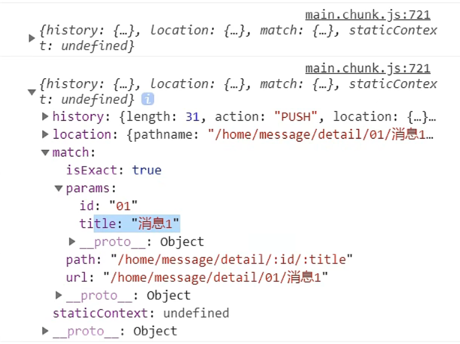
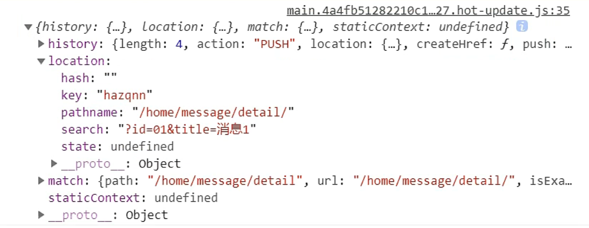
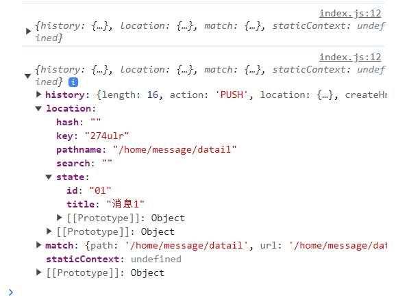

## 🚀  第1章：React应用

>基于React脚手架

### 1.1 使用create-react-app创建react应用

#### 1.1.1 React脚手架

* **脚手架定义**: 用于帮助程序员快速创建基于某一库的模板项目。
  - ✅ 包含所有必要配置 (如语法检查、jsx编译、devServer等)
  - ✅ 预装了所有相关依赖
  - ✅ 可直接展示简单效果
  
* **React脚手架库**: 提供了专门的脚手架工具——`create-react-app`。
* **技术架构**: 主要包括react + webpack + es6 + eslint。
* **项目特点**: 脚手架项目通常为模块化、组件化、工程化。

#### 1.1.2 创建项目并启动

1. **全局安装**: 
```bash
npm i -g create-react-app
```
2. **创建项目**:
```bash
create-react-app hello-react
```
1. **进入项目目录**:
```bash
cd hello-react
```
4. **启动项目**:
```bash
npm start
```

#### 1.1.1 React脚手架项目结构

* **`public`**: 静态资源文件夹
  - `favicon.icon`: 网站图标
  - `index.html`: 主页面
  - `logo*.png`: logo图片
  - `manifest.json`: 应用配置文件
  - `robots.txt`: 爬虫协议文件

* **`src`**: 源代码文件夹
  - `App.*`: App组件及其样式
  - `index.*`: 入口文件及其样式
  - `logo.svg`: logo SVG图像
  - …其他文件

#### 1.1.4 功能界面的组件化编码流程

1. **拆分组件**: 根据UI界面进行拆分
2. **实现静态组件**: 使用组件来实现静态效果
1. **实现动态组件**:
   * 动态显示初始化数据
     - 数据类型
     - 数据名称
     - 数据的存储位置
   * 交互: 通常从绑定事件监听开始

### 1.2 组件的组合使用-TodoList(经验总结)

*   **拆分组件与实现静态组件**:
    
    *   拆分成独立的组件，保持代码模块化。
    *   使用`className`代替传统的`class`。
    *   `style`属性的JSX写法。
*   **动态初始化列表**:
    
    *   数据应放在哪个组件的`state`？
        *   单独使用 → 自身的`state`。
        *   多个组件共用 → 共有的父组件的`state`（称为“状态提升”）。
*   **父子组件间的通信**:
    
    *   父 → 子：使用`props`传递数据。
    *   子 → 父：通过`props`，要求父组件传递一个回调函数给子组件。
*   **`defaultChecked` vs. `checked`**:
    
    *   `defaultChecked`: 非受控组件的初始设置。
    *   `checked`: 受控组件的值。
*   **`defaultValue` vs. `value`**:
    
    *   `defaultValue`: 非受控组件的初始值。
    *   `value`: 受控组件的当前值。
*   **状态管理位置**:
    
    *   状态应由拥有它的组件来管理，操作该状态的方法也应定义在此组件内。

## 🚀 第2章：React Ajax

### 🌟 2.1 理解

📌 **前置说明**:
- 📍 React 主要关注界面。
- 📍 需要ajax与后端交互获取JSON。
- 📍 在React中需引入第三方的ajax库。

📌 **常用ajax库**:
- 🔸 **jQuery**: 较重，非必需时避免使用。
- 🔸 **axios**: 轻量、推荐使用。

### 🌟 2.2 axios 使用

🔗 **文档**:
[axios官方文档](https://github.com/axios/axios)

📌 **相关API**:

🔸 **GET请求**:
```javascript
axios.get('/user?ID=12345')
  .then(response => console.log(response.data))
  .catch(error => console.log(error));

axios.get('/user', { params: { ID: 12345 } })
  .then(response => console.log(response))
  .catch(error => console.log(error));
```

🔸 **POST请求**:
```javascript
axios.post('/user', { firstName: 'Fred', lastName: 'Flintstone' })
  .then(response => console.log(response))
  .catch(error => console.log(error));
```

### 🌟 2.3 GitHub 用户搜索经验总结

#### 📌 设计状态

- 在设计状态时，应考虑全局性，尤其是网络请求。考虑如何处理请求失败或错误的情况。

  ```javascript
  state = {
    users: [],
    loading: false,
    error: null
  }
  ```

#### 📌 ES6 解构赋值

- ES6 提供了非常强大的解构赋值功能。

  ```javascript
  let obj = { a: { b: 1 } };
  const { a } = obj;  // 传统解构
  const { a: { b } } = obj;  // 连续解构
  const { a: { b: value } } = obj;  // 连续解构 + 重命名
  ```

#### 📌 消息订阅与发布

- 先订阅，再发布。它允许组件间的“隔空对话”。

  ```javascript
  // 组件A中
  componentDidMount() {
    this.token = PubSub.subscribe('eventName', (msg, data) => {
      this.setState({ data });
    });
  }

  componentWillUnmount() {
    PubSub.unsubscribe(this.token);
  }

  // 组件B中
  someFunction() {
    PubSub.publish('eventName', data);
  }
  ```

#### 📌 使用 fetch 发送请求

- 使用 fetch 可以使请求逻辑与组件分离，使代码更加清晰。
- fetch: 原生函数，不再使用XmlHttpRequest对象提交ajax请求
- 老版本浏览器可能不支持

  ```javascript
  async fetchData(keyWord) {
    try {
      const response = await fetch(`/api1/search/users2?q=${keyWord}`);
      const data = await response.json();
      this.setState({ users: data.items });
    } catch (error) {
      console.error('请求出错', error);
    }
  }
  ```

#### 📌 组件间通信

- **父 → 子**：使用 props 传递。

  ```javascript
  // 父组件
  <ChildComponent data={this.state.data} />

  // 子组件
  const { data } = this.props;
  ```

- **子 → 父**：通过回调函数。

  ```javascript
  // 父组件
  handleDataFromChild = (data) => {
    this.setState({ data });
  }
  <ChildComponent sendDataToParent={this.handleDataFromChild} />

  // 子组件
  this.props.sendDataToParent(data);
  ```

- **任意组件间通信**：使用 PubSubJS。

  ```bash
  npm i pubsub-js
  ```

  ```javascript
  import PubSub from 'pubsub-js'; //导入

  // ComponentA
  PubSub.publish('event', data);//订阅消息

  // ComponentB 
  PubSub.subscribe('event', (_, data) => { //发布消息
    this.setState({ data });
  });
  ```

[查看 PubSubJS 官方文档](https://github.com/mroderick/PubSubJS)

### 🌟 2.4 React 脚手架配置代理总结

#### 方法一：简易配置

1. **配置步骤**：在`package.json`中加入代理配置。
    ```json
    "proxy": "http://localhost:5000"
    ```

2. **说明**：
    - **优点**：
        - 配置简单。
        - 请求时无需添加前缀。
    - **缺点**：
        - 仅支持单一代理。
    - **工作机制**：
        - 使用此代理配置，如果在端口3000上的资源不存在，那么该请求会被转发到端口5000（前端资源匹配优先）。


#### 方法二：详细配置

1. **配置步骤**：
    - **Step 1**：在 `src` 目录下创建代理配置文件。
        ```
        src/setupProxy.js
        ```
    - **Step 2**：在 `setupProxy.js` 中配置具体的代理规则。
        ```js
        const { createProxyMiddleware } = require('http-proxy-middleware');

        module.exports = function(app) {
            app.use(
                createProxyMiddleware('/api1', {
                    target: 'http://localhost:5000',
                    changeOrigin: true,
                    pathRewrite: {'^/api1': ''}
                }),
                createProxyMiddleware('/api2', {
                    target: 'http://localhost:5001',
                    changeOrigin: true,
                    pathRewrite: {'^/api2': ''}
                })
            );
        }
        ```

2. **说明**：
    - **优点**：
        - 支持多个代理配置。
        - 提供灵活的控制，决定哪些请求应走代理。
    - **缺点**：
        - 配置稍微复杂。
        - 请求时必须加上特定的前缀。

## 🚀  第3章：React路由

### 3.1. 🧭 相关理解

#### 3.1.1. 📄 SPA (单页Web应用)

- **定义**：应用只有一个页面，所有功能在此页面内完成。
- **特点**：点击链接时，不触发完整页面刷新，仅更新局部内容。
- **数据加载**：数据通过Ajax异步获取并展示。

#### 3.1.2. 🛣️ 路由理解

- **定义**：路由是一个路径与功能的映射关系。
    - **Key**: 路径
    - **Value**: 函数或组件

- **后端路由** 🖥️:
    - **功能**: 用于处理客户端请求，返回数据或页面。
    - **例子**: `router.get(path, function(req, res))`

- **前端路由** 🌍:
    - **功能**: 根据URL展示对应的组件，不请求新页面。
    - **例子**: `<Route path="/test" component={Test}>`

### 3.2. 🛠️ react-router-dom相关API

#### 3.2.1. 🧱 内置组件

1. `<BrowserRouter>`
2. `<HashRouter>`
3. `<Route>`
4. `<Redirect>`
5. `<Link>`
6. `<NavLink>`
7. `<Switch>`

#### 3.2.2. 📜 其他

- **history对象** 🕰️:
    - Methods: `push`, `replace`, `go`, `goBack`, `goForward`

- **match对象** 🎯:
    - Details: `params`, `path`, `url`

- **withRouter函数** 🔄: 高阶组件，使非路由组件能接收路由组件的三个属性。

### 3.3. 🖇️ 路由基本使用

1. **组织结构**：区分导航区与展示区。
2. **导航链接**：使用`<Link to="/path">Demo</Link>`替代`<a>`标签。
3. **展示区**：使用`<Route path='/path' component={Demo}/>`来匹配路径。
4. **路由器包裹**：确保`<App>`外部有`<BrowserRouter>`或`<HashRouter>`包裹。

### 3.4. 🚧 路由组件与一般组件

1. **写法**:
    - 一般组件: `<Demo/>`
    - 路由组件: `<Route path="/demo" component={Demo}/>`

2. **位置**:
    - 一般组件: 在`components`文件夹中
    - 路由组件: 在`pages`文件夹中

3. **传递的props**:
    - 一般组件: 传递什么就接收什么
    - 路由组件: 默认接收三个属性：`history`, `location`, `match`

### 3.5. 🕹️ 路由组件的特性

#### 3.5.1. 📦 接收特定Props

路由组件会自动接收三个props:

- **history**:
    - `push(path)`: 导航至新路径
    - `replace(path)`: 替换当前路径
    - `go(n)`: 前进/后退n个页面
    - `goBack()`: 返回上一页
    - `goForward()`: 前进到下一页

- **location**:
    - `pathname`: 当前URL的路径
    - `search`: 查询参数字符串(如`?key=value`)
    - `state`: 与`push`或`replace`方法一起使用的状态

- **match**:
    - `params`: 路径参数（如`/user/:id`）
    - `path`: 用于匹配的路径模式
    - `url`: 实际匹配的URL部分

#### 3.5.2. 🔄 withRouter函数

如果你需要在一个非路由组件中访问路由相关的props（如`history`，`location`和`match`），你可以使用`withRouter`高阶组件。这会将这些props注入到你的组件中。

```javascript
import { withRouter } from 'react-router-dom';

function MyComponent(props) {
    // 使用 props.history, props.location, props.match
}

export default withRouter(MyComponent);
```

#### 3.5.3. 🎨 路由样式与活动类

使用`<NavLink>`来创建导航链接，它有一个特性：当链接的路径匹配当前的位置时，它可以自动应用"active"样式或类。这对于突出显示当前的活动链接很有用。

```javascript
<NavLink to="/home" activeClassName="active">Home</NavLink>
```

### 3.6. 🔐 路由守卫

在某些场景下，你可能想要确保用户在导航到某个路由之前满足一定的条件（如已登录）。这通常称为路由守卫。

一个简单的实现是使用React的条件渲染与`history`对象。例如，如果用户未登录，你可以重定向他们到登录页面。

```javascript
function PrivateRoute({ component: Component, ...rest }) {
    return (
        <Route
            {...rest}
            render={props =>
                isAuthenticated() ? (
                    <Component {...props} />
                ) : (
                    <Redirect to="/login" />
                )
            }
        />
    );
}
```

### 3.7. 📘 NavLink与封装NavLink

#### 3.7.1. 🚀 NavLink基础使用

`NavLink` 是 `react-router-dom` 中的一个特殊组件，它提供了与当前URL匹配时自动应用样式的功能。

🔍 **主要特点**:
- 当与当前路由匹配时，可以为链接自动添加一个"活跃"样式或类。
- 默认活跃类名为 `active`，但可以通过 `activeClassName` 属性来自定义。
- 标签体内容是一个特殊的标签属性
- 通过this.props.children可以获取标签体内容


🎨 **例子**:
```css
/* styles.css */
.active-link {
    color: red;
    font-weight: bold;
}
```
使用 `NavLink`:
```javascript
import { NavLink } from 'react-router-dom';
import './styles.css';

function Navigation() {
    return (
        <nav>
            <NavLink to="/home" activeClassName="active-link">Home</NavLink>
            <NavLink to="/about" activeClassName="active-link">About</NavLink>
        </nav>
    );
}
```

#### 3.7.2. 🎁 封装NavLink

封装 `NavLink` 可以让我们为所有的链接提供一致的界面和行为。

🛠️ **自定义NavLink类组件**:
```javascript
import React from 'react';
import { NavLink as OriginalNavLink } from 'react-router-dom';
import './styles.css';

class CustomNavLink extends React.Component {
    render() {
        return (
            <OriginalNavLink {...this.props} activeClassName="active-link">
                {this.props.children}
            </OriginalNavLink>
        );
    }
}

export default CustomNavLink;
```

🌟 **使用CustomNavLink**:
```javascript
import React from 'react';
import { BrowserRouter } from 'react-router-dom';
import CustomNavLink from './CustomNavLink';

class Navigation extends React.Component {
    render() {
        return (
            <BrowserRouter>
                <nav>
                    <CustomNavLink to="/home">Home</CustomNavLink>
                    <CustomNavLink to="/about">About</CustomNavLink>
                </nav>
            </BrowserRouter>
        );
    }
}

export default Navigation;
```

这样，`CustomNavLink` 提供了一个一致的界面和行为，使得代码更加整洁和一致。

### 3.8 🌠 Switch的使用

1. 通常情况下，path和component是一一对应的关系。
2. Switch可以提高路由匹配效率(单一匹配)。

先导入`Switch`,再将需要提高效率的组件用`<Switch><Switch/>`包裹起来

```html
      <Switch>
       <Route path="/about" component={About}/>
       <Route path="/home" component={Home}/>
      </Switch>
```

### 3.9. 🌌 解决多级路径刷新页面样式丢失的问题

1. `public/index.html` 中 引入样式时不写 `./` 写 `/` （常用）
2. `public/index.html` 中 引入样式时不写 `./` 写 `%PUBLIC_URL%` （常用）它指的是`public`文件下的文件，绝对路径。
3. 使用`HashRouter`路由

### 3.10. 🌜 路由的严格匹配与模糊匹配

1. 默认使用的是模糊匹配（简单记：【输入的路径】必须包含要【匹配的路径】，且顺序要一致）
2. 开启严格匹配：`<Route exact={true} path="/about" component={About}/>`
3. 严格匹配不要随便开启，需要再开，有些时候开启会导致无法继续匹配二级路由

### 3.11. 🌜 Redirect的使用

1. 一般写在所有路由注册的最下方，当所有路由都无法匹配时，跳转到Redirect指定的路由

2. 具体编码：

```html
      <Switch>
       <Route path="/about" component={About}/>
       <Route path="/home" component={Home}/>
       <Redirect to="/about"/>
      </Switch>
```

### 3.12 🌛 嵌套路由

1. 注册子路由时要写上父路由的path值
2. 路由的匹配是按照注册路由的顺序进行的

```js
import React, { Component } from 'react'
import {Route,Switch} from 'react-router-dom/cjs/react-router-dom'
import Mylink from '../Mylink'
import News from './News'
import Message from './Message'
export default class Home extends Component {
  render() {
    return (
      <div>
        <h2>这里是Home内容</h2>
        <ul className="nav nav-tabs">
              <li>
              <Mylink to="/home/news">news</Mylink>
              </li>
              <li>
              <Mylink to="message">message</Mylink>
              </li>
        </ul>
        {/* 注册路由 */}
        {/* <News></News>
        <Message></Message> */}
        <Switch>
        <Route path="/home/news" component={News}></Route>
        <Route path="/home/message" component={Message}></Route>
        </Switch>
      </div>
    )
  }
}
```

### 3.13 🌛 向路由组件传递参数

传递参数到路由组件的方法有三种：

**1.`params` 参数**

**路由链接 (携带参数)：**
```jsx
<li key={obj.id}>
    {/* 向路由传递parmas参数 */}
    <Link href='XXXXX' to={`/home/message/datail/${obj.id}/${obj.title}`}>title: {obj.title}</Link>
</li>
```

**注册路由 (声明接收)：**
```jsx
{/* 声明接收parmas参数 */}
<Route path="/home/message/datail/:id/:title" component={Datail}></Route>
```

**接收参数：**
```javascript
// 接收parmas参数
const {id,title}=this.props.match.params
```

*Message组件传递`parmas`和声明接收`parmas`参数*

```js
import React, { Component } from 'react'
import { Link ,Route} from 'react-router-dom/cjs/react-router-dom'
import Datail from './Datail'
export default class Message extends Component {
  state={
    MessArray:[
      {id:"01",title:"消息1"},
      {id:"02",title:"消息2"},
      {id:"03",title:"消息3"},
    ]
  }
  render() {
    const {MessArray} = this.state
    return (
      <div>
        <ul>
          {
            MessArray.map((obj)=>{
              return (
                <li key={obj.id}>
                  {/* 向路由传递parmas参数 */}
                  <Link href='XXXXX' to={`/home/message/datail/${obj.id}/${obj.title}`}>title: {obj.title}</Link>
                </li>
              )
            })
          }
        </ul>
        <hr></hr>
        {/* 声明接收parmas参数 */}
        <Route path="/home/message/datail/:id/:title" component={Datail}></Route>
      </div>
    )
  }
}

```

*Datail组件接受`parmas`参数*

`this.props`打印输出结果



```js
import React, { Component } from 'react'
const data = [
    {id: '01' ,content: '你好，中国'},
    {id: '02',content:'你好，尚硅谷'},
    {id: '03' ,content:'你好，未来的自己！！！'}
]
    
export default class Datail  extends Component {
  render() {
    console.log(this.props)
    // 接收parmas参数
    const {id,title}=this.props.match.params
    const findReact = data.find((obj)=>{
        return obj.id===id
    })
    return (
      <div>
        <ul>
            <li>id: {id}</li>
            <li>题目: {title}</li>
            <li>内容: {findReact.content}</li>
        </ul>
      </div>
    )
  }
}
```

**2.`search` 参数**

**路由链接 (携带参数)：**
```jsx
<Link to='/demo/test?name=tom&age=18'>详情</Link>
```

**注册路由 (无需声明，正常注册即可)：**
```jsx
<Route path="/demo/test" component={Test}/>
```

**接收参数：**
```javascript
this.props.location.search
```

*Message组件传递`search`和声明接收`search`参数*

```js
import React, { Component } from 'react'
import { Link ,Route} from 'react-router-dom/cjs/react-router-dom'
import Datail from './Datail'
export default class Message extends Component {
  state={
    MessArray:[
      {id:"01",title:"消息1"},
      {id:"02",title:"消息2"},
      {id:"03",title:"消息3"},
    ]
  }
  render() {
    const {MessArray} = this.state
    return (
      <div>
        <ul>
          {
            MessArray.map((obj)=>{
              return (
                <li key={obj.id}>
                  {/* 向路由传递search参数 */}
                  <Link href='XXXXX' to={`/home/message/datail/?id=${obj.id}&title=${obj.title}`}>title: {obj.title}</Link>
                </li>
              )
            })
          }
        </ul>
        <hr></hr>
        {/* search参数无需声明接收，正常注册路由即可 */}
        <Route path="/home/message/datail" component={Datail}></Route>
      </div>
    )
  }
}
```

*Datail组件接受`search`参数*

`this.props`打印输出结果



```js
import React, { Component } from 'react'
import qs from 'qs'
const data = [
    {id: '01' ,content: '你好，中国'},
    {id: '02',content:'你好，尚硅谷'},
    {id: '03' ,content:'你好，未来的自己！！！'}
]
    
export default class Datail  extends Component {
  render() {
    // 接收search参数
    console.log(this.props);
    const {search} = this.props.location
    const {id,title}=qs.parse(search.slice(1))
    const findReact = data.find((obj)=>{
        return obj.id===id
    })
    return (
      <div>
        <ul>
            <li>id: {id}</li>
            <li>题目: {title}</li>
            <li>内容: {findReact.content}</li>
        </ul>
      </div>
    )
  }
}
```


**备注：**
获取到的 `search` 是urlencoded编码字符串，需要借助 `qs` 解析。

当我们从URL中获取到的`search`参数是一个urlencoded编码的字符串，我们可以使用`qs`库来解析和格式化这些字符串。`qs`库中主要的两个方法是：

1. **`qs.parse()`**: 这个方法用于解析URL查询字符串（`search`参数）并将其转换为一个对象。

   **例子**:
   
   ```javascript
   import qs from 'qs';

   const search = "?name=tom&age=18";
   const parsed = qs.parse(search, { ignoreQueryPrefix: true });
   console.log(parsed);  // 输出: { name: 'tom', age: '18' }
   ```

   注意：`ignoreQueryPrefix`选项用于忽略查询字符串前面的`?`符号。

2. **`qs.stringify()`**: 这个方法用于将一个对象转换为URL查询字符串。

   **例子**:
   
   ```javascript
   import qs from 'qs';

   const obj = { name: 'tom', age: 18 };
   const stringified = qs.stringify(obj);
   console.log(stringified);  // 输出: "name=tom&age=18"
   ```

这两个方法非常有用，可以让你轻松地在URL查询字符串和JavaScript对象之间进行转换。

**3.`state` 参数**

**路由链接 (携带参数)：**
```jsx
<Link to={{pathname:'/demo/test',state:{name:'tom',age:18}}}>详情</Link>
```

**注册路由 (无需声明，正常注册即可)：**
```jsx
<Route path="/demo/test" component={Test}/>
```

**接收参数：**
```javascript
this.props.location.state
```

**备注：**
刷新也可以保留住参数。

*Message组件传递`state`和声明接收`state`参数*

```js
import React, { Component } from 'react'
import { Link ,Route} from 'react-router-dom/cjs/react-router-dom'
import Datail from './Datail'
export default class Message extends Component {
  state={
    MessArray:[
      {id:"01",title:"消息1"},
      {id:"02",title:"消息2"},
      {id:"03",title:"消息3"},
    ]
  }
  render() {
    const {MessArray} = this.state
    return (
      <div>
        <ul>
          {
            MessArray.map((obj)=>{
              return (
                <li key={obj.id}>
                  {/* 向路由传递state参数,需要将to写成对象的形式 */}
                  <Link href='xxx' to={{pathname:'/home/message/datail',state:{id:obj.id,title:obj.title}}}>title: {obj.title}</Link>
                </li>
              )
            })
          }
        </ul>
        <hr></hr>
        {/* state参数无需声明接收，正常注册路由即可 */}
        <Route path="/home/message/datail" component={Datail}></Route>
      </div>
    )
  }
}

```

*Datail组件接受`state`参数*

`this.props`打印输出结果



```js
import React, { Component } from 'react'
const data = [
    {id: '01' ,content: '你好，中国'},
    {id: '02',content:'你好，尚硅谷'},
    {id: '03' ,content:'你好，未来的自己！！！'}
]
    
export default class Datail  extends Component {
  render() {
    // 接收state参数
    console.log(this.props);
    //对state解构赋值
    const {id,title} = this.props.location.state || {}
    const findReact = data.find((obj)=>{
        return obj.id===id
    }) || {}
    return (
      <div>
        <ul>
            <li>id: {id}</li>
            <li>题目: {title}</li>
            <li>内容: {findReact.content}</li>
        </ul>
      </div>
    )
  }
}

```

### 3.14🌛 编程式路由导航

使用 `this.props.history` 对象上的 API 来操作路由跳转、前进和后退。

- **路由跳转：** 
  ```javascript
  this.props.history.push()
  ```

- **替换当前路由：** 
  ```javascript
  <!-- this.props.history.replace() -->
  <!-- 应用 -->
  <Link replace={true} href='xxx' to={{pathname:'/home/message/datail',state:{id:obj.id,title:obj.title}}}>title: {obj.title}</Link>
  ```


- **后退：** 
  ```javascript
  this.props.history.goBack()
  ```

- **前进：** 
  ```javascript
  this.props.history.goForward()
  ```

- **前进/后退到指定页面：** 
  ```javascript
  this.props.history.go()
  ```

**案例：**

```js
import React, { Component } from 'react'
import {Link,Route} from 'react-router-dom'
import Detail from './Detail'

export default class Message extends Component {
 state = {
  messageArr:[
   {id:'01',title:'消息1'},
   {id:'02',title:'消息2'},
   {id:'03',title:'消息3'},
  ]
 }

 replaceShow = (id,title)=>{
  //replace跳转+携带params参数
  //this.props.history.replace(`/home/message/detail/${id}/${title}`)

  //replace跳转+携带search参数
  // this.props.history.replace(`/home/message/detail?id=${id}&title=${title}`)

  //replace跳转+携带state参数
  this.props.history.replace(`/home/message/detail`,{id,title})
 }

 pushShow = (id,title)=>{
  //push跳转+携带params参数
  // this.props.history.push(`/home/message/detail/${id}/${title}`)

  //push跳转+携带search参数
  // this.props.history.push(`/home/message/detail?id=${id}&title=${title}`)

  //push跳转+携带state参数
  this.props.history.push(`/home/message/detail`,{id,title})
  
 }

 back = ()=>{
  this.props.history.goBack()
 }

 forward = ()=>{
  this.props.history.goForward()
 }

 go = ()=>{
  this.props.history.go(-2)
 }

 render() {
  const {messageArr} = this.state
  return (
   <div>
    <ul>
     {
      messageArr.map((msgObj)=>{
       return (
        <li key={msgObj.id}>

         {/* 向路由组件传递params参数 */}
         {/* <Link to={`/home/message/detail/${msgObj.id}/${msgObj.title}`}>{msgObj.title}</Link> */}

         {/* 向路由组件传递search参数 */}
         {/* <Link to={`/home/message/detail/?id=${msgObj.id}&title=${msgObj.title}`}>{msgObj.title}</Link> */}

         {/* 向路由组件传递state参数 */}
         <Link to={{pathname:'/home/message/detail',state:{id:msgObj.id,title:msgObj.title}}}>{msgObj.title}</Link>

         &nbsp;<button onClick={()=> this.pushShow(msgObj.id,msgObj.title)}>push查看 </button>
         &nbsp;<button onClick={()=> this.replaceShow(msgObj.id,msgObj.title)}>replace查看</button>
        </li>
       )
      })
      }
    </ul>
    <hr/>
    {/* 声明接收params参数 */}
    {/* <Route path="/home/message/detail/:id/:title" component={Detail}/> */}

    {/* search参数无需声明接收，正常注册路由即可 */}
    {/* <Route path="/home/message/detail" component={Detail}/> */}

    {/* state参数无需声明接收，正常注册路由即可 */}
    <Route path="/home/message/detail" component={Detail}/>

    <button onClick={this.back}>回退</button>&nbsp;
    <button onClick={this.forward}>前进</button>&nbsp;
    <button onClick={this.go}>go</button>

   </div>
  )
 }
}
```

### 3.15 🌛 withRouter的使用

1. withRouter可以加工一般组件，让一般组件具备路由组件所特有的API
2. withRouter的返回值是一个新组件

*案例：*

```js
import React, { Component } from 'react'
import {withRouter} from 'react-router-dom'

class Header extends Component {

 back = ()=>{
  this.props.history.goBack()
 }

 forward = ()=>{
  this.props.history.goForward()
 }

 go = ()=>{
  this.props.history.go(-2)
 }

 render() {
  console.log('Header组件收到的props是',this.props);
  return (
   <div className="page-header">
    <h2>React Router Demo</h2>
    <button onClick={this.back}>回退</button>&nbsp;
    <button onClick={this.forward}>前进</button>&nbsp;
    <button onClick={this.go}>go</button>
   </div>
  )
 }
}

export default withRouter(Header)
```

### 3.16 🌛 BrowserRouter与HashRouter的区别

**1.底层原理:**

- **BrowserRouter**: 使用H5的history API，不兼容IE9及以下版本。
- **HashRouter**: 使用URL的哈希值。

**2.路径表现形式:**

- **BrowserRouter**: 路径中没有#, 例如：`localhost:3000/demo/test`
- **HashRouter**: 路径包含#, 例如：`localhost:3000/#/demo/test`

**3.刷新对路由`state`参数的影响:**

- **BrowserRouter**: 没有任何影响，因为`state`保存在history对象中。
- **HashRouter**: 刷新后会导致路由`state`参数的丢失。

**备注:**
HashRouter可以用于解决一些路径错误相关的问题。


## 第四章 🚀 开源React UI组件库

**1. Material-UI (国外)**
   
- **官网:** [http://www.material-ui.com/#/](http://www.material-ui.com/#/)
- **GitHub:** [https://github.com/callemall/material-ui](https://github.com/callemall/material-ui)


**2. Ant Design (国内，蚂蚁金服出品)**

- **官网:** [https://ant.design/index-cn](https://ant.design/index-cn)
- **GitHub:** [https://github.com/ant-design/ant-design/](https://github.com/ant-design/ant-design/)

### 1. 🌛 antd UI库的基本使用

例如：`<button></button>`按钮的使用,需要`antd.css`


```js
import {Button}from 'antd';
import 'antd/dist/antd.css' //引入样式
```

### 2. 🌛 antd的按需引入+自定义主题

1. **安装依赖**:
```bash
npm i react-app-rewired customize-cra babel-plugin-import less less-loader
```

2. **修改`package.json`**:
```json
"scripts": {
  "start": "react-app-rewired start",
  "build": "react-app-rewired build",
  "test": "react-app-rewired test",
  "eject": "react-scripts eject"
}
```

3. **在根目录下创建`config-overrides.js`**:
```javascript
// 配置具体的修改规则
const { override, fixBabelImports, addLessLoader } = require('customize-cra');

module.exports = override(
 fixBabelImports('import', {
  libraryName: 'antd',
  libraryDirectory: 'es',
  style: true,
 }),
 addLessLoader({
  lessOptions: {
   javascriptEnabled: true,
   modifyVars: { '@primary-color': 'green' },
  }
 }),
);
```

4. **备注**:
不再需要在组件里手动引入样式，即 `import 'antd/dist/antd.css'` 应当被移除。