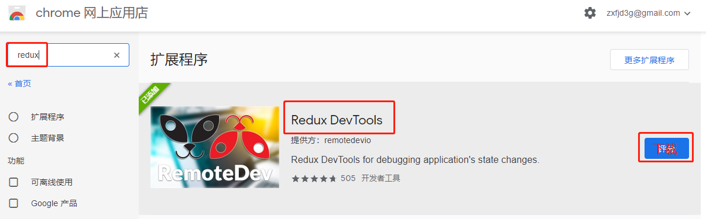
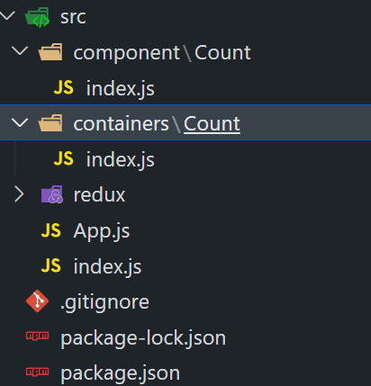
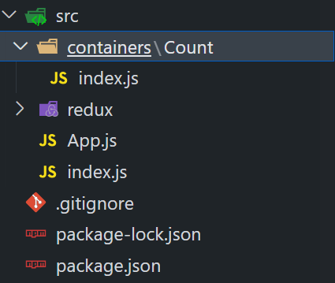
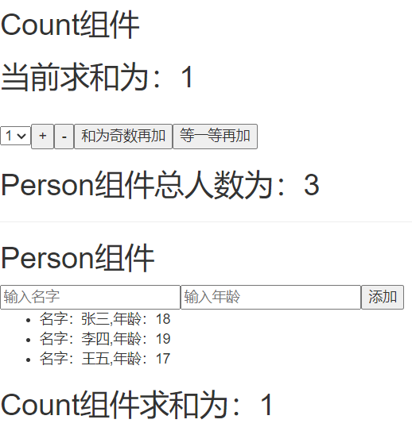

## 📌 1.Redux

### 🌟 1.1. Redux理解

---

#### 📚 1.1.1. 学习文档

1. **英文文档:** [Redux Official](https://redux.js.org/)
2. **中文文档:** [Redux 中文版](http://www.redux.org.cn/)
3. **GitHub:** [Redux GitHub](https://github.com/reactjs/redux)

---

#### 🧠 1.1.2. Redux是什么?

1. Redux是一个专门用于做状态管理的JavaScript库，不是React的插件。
2. 它可以与React、Angular、Vue等框架一同使用，但主要与React一起使用。
3. 主要作用: 集中式管理React应用中多个组件共享的状态。

---

#### 🤔 1.1.3. 何时需要使用Redux

1. 当某个组件的状态需要被其他组件访问或共享时。
2. 当一个组件需要更改另一个组件的状态时。
3. 原则: 能不使用就尽量不使用。当不使用会带来困难时，再考虑使用。

---

#### 🔄 1.1.4. Redux工作流程


---

### 🌟 1.2. Redux的三大核心概念

---

#### 📜 1.2.1. Action

1. 表示操作的对象。
2. 通常包含以下属性:
   - `type`: 唯一标识，是一个字符串。
   - `data`: 任意类型的数据属性。
   
**例:** `{ type: 'ADD_STUDENT', data: {name: 'tom', age: 18} }`

---

#### 🔧 1.2.2. Reducer

1. 用于初始化和处理状态的函数。
2. 是一个纯函数，根据当前的state和传入的action返回新的state。

---

#### 🏪 1.2.3. Store

1. 把state、action、和reducer联系起来的对象。
2. 可以通过以下方式得到它:
    ```javascript
    import { createStore } from 'redux';
    import reducer from './reducers';
    const store = createStore(reducer);
    ```
3. 它的功能:
   - `getState()`: 获取状态。
   - `dispatch(action)`: 分发action，触发reducer，产生新的state。
   - `subscribe(listener)`: 注册监听，当产生新的state时自动调用。

---

### 🌟 1.3. Redux的核心API

---

#### 🏗️ 1.3.1. `createStore()`

用于创建包含指定reducer的store对象。

---

#### 📦 1.3.2. Store对象

1. Redux库的核心对象。
2. 维护着state和reducer。
3. 主要方法:
   - `getState()`
   - `dispatch(action)`
   - `subscribe(listener)`


---

#### 🛠️ 1.3.3. `applyMiddleware()`

用于应用基于Redux的中间件。

---

#### 🤝 1.3.4. `combineReducers()`

用于合并多个reducer函数。

---

### 🌟 1.4. Redux异步编程

1.**理解**

+ `redux`默认是不能进行异步处理的, 
+ 某些时候应用中需要在`redux`中执行异步任务(`ajax`, 定时器)

2.使用异步中间件

```bash
npm install --save redux-thunk
```


## 📌 2.求和案例_redux精简版 

### 🚀 2.1. 初步设定 
- 🧹 移除`Count`组件的内部状态。

Count组件
```js
import React, { Component } from 'react';
import store from '../../redux/store';

export default class Count extends Component {

    // 在组件挂载时，监听store的状态变化(也可以写在index文件中如下)
    componentDidMount(){
        store.subscribe(()=>{
            this.setState({}); // 当store状态改变时, 使用setState触发组件重新渲染
        });
    }

    // 处理加法操作
    increment=()=>{
        const {value} = this.selectNumber;  // 获取选择的数值
        store.dispatch({type:'increment',data:value*1});  // 发起一个increment的action
    }

    // 处理减法操作
    decrement=()=>{
        const {value} = this.selectNumber;
        store.dispatch({type:'decrement',data:value*1});
    }

    // 如果当前计数为奇数，则处理加法操作
    increamjishu=()=>{
        const {value} = this.selectNumber;
        const count = store.getState();
        if (count % 2 !== 0) {
            store.dispatch({type:'decrement',data:value*1});
        }
    }

    // 延迟2秒后处理加法操作
    increamodd=()=>{
        setTimeout(()=>{
            const {value} = this.selectNumber;
            store.dispatch({type:'increment',data:value*1});
        }, 2000);
    }

    render() {
        return (
            <div>
                <h2>当前求和为：{store.getState()}</h2>
                <br />
                <select ref={c=>this.selectNumber=c}>
                    <option value="1">1</option>
                    <option value="2">2</option>
                    <option value="3">3</option>
                </select>
                <button onClick={this.increment}>+</button>
                <button onClick={this.decrement}>-</button> 
                <button onClick={this.increamjishu}>和为奇数再加</button> 
                <button onClick={this.increamodd}>等一等再加</button>
            </div>
        );
    }
}
```

*`index.js`监听store的状态变化*

```js
//引入react核心库
import React from 'react'
//引入ReactDOM
import ReactDOM from 'react-dom/client';
import { BrowserRouter} from 'react-router-dom/cjs/react-router-dom'
//引入App
import App from './App'
import store from './redux/store';
const root = ReactDOM.createRoot(document.getElementById('root'));

  root.render(
    <React.StrictMode>
      <BrowserRouter>
        <App />
      </BrowserRouter>
    </React.StrictMode>
  );

store.subscribe(()=>{
  root.render(
    <React.StrictMode>
      <BrowserRouter>
        <App />
      </BrowserRouter>
    </React.StrictMode>
  );
})
```

### 🏗 2.2. 结构搭建 
在`src`目录下创建:
```
- redux
    - store.js
    - count_reducer.js
```

### 📘 2.3. `store.js`配置: 
1. 📦 引入redux中的`createStore`函数，创建一个store。
2. 📡 `createStore`在调用时需要传入一个为其服务的reducer。
3. 🌍 记得暴露store对象。

*案例：* `createStore`已弃用采用这种方法引用

```js
/* 
	该文件专门用于暴露一个store对象，整个应用只有一个store对象
*/
//引入createStore，专门用于创建redux中最为核心的store对象
import { legacy_createStore as createStore} from 'redux'
//引入为Count组件服务的reducer
import countReducer from './count_reducer'
//暴露store
export default createStore(countReducer)
```

### 📖 2.4. `count_reducer.js`配置: 
1. 🌐 reducer本质上是一个函数，接收：`preState`, `action`，返回处理后的状态。
2. 🔧 reducer有两大任务：初始化状态、加工状态。
3. 🚀 当reducer被首次调用时，是由store自动触发的。传递的`preState`是`undefined`, 传递的`action`是: `{type:'@@REDUX/INIT_a.2.b.4}`。

*案例：*

```js
/* 
 1.该文件是用于创建一个为Count组件服务的reducer，reducer的本质就是一个函数
 2.reducer函数会接到两个参数，分别为：之前的状态(preState)，动作对象(action)
*/
const initState = 0 //初始化状态
export default function countReducer(preState=initState,action){
    console.log(preState);
    //从action对象中获取：type、data
    const {type,data} = action
    //根据type决定如何加工数据
    switch (type) {
    case 'increment': //如果是加
    return preState + data
    case 'decrement': //若果是减
    return preState - data
    default:
    return preState
 }
}
```

### 📣 2.5. 实时监测 📡
- 在`index.js`中监测store的状态变化，一旦发生改变，重新渲染`<App/>`。

📝 **备注**：redux只负责管理状态。至于状态的改变驱动着页面的展示，这需要我们手动实现。

## 📌 3.求和案例_redux完整版

*新增文件：*

1.count_action.js 专门用于创建action对象

```js
// 该文件专门为Count组件生成action对象
import { INCREMENT,DECREMENT} from './constant'
export const createIncrementAction = data => ({type:INCREMENT,data})
export const createDecrementAction = data => ({type:DECREMENT,data})
```

*Count组件调用*

```js
import React, { Component } from 'react';
import store from '../../redux/store';
// 从action creators中引入两个函数，这两个函数用于生成对应的action对象
import {createIncrementAction,createDecrementAction} from '../../redux/count_action';

export default class Count extends Component {

    // 当点击+按钮时触发
    increment=()=>{
        const {value} = this.selectNumber; // 从选择器中获取数值
        // 调用store的dispatch方法，分发一个增加类型的action，并传递增加的数值
        store.dispatch(createIncrementAction(value*1)); 
    }

    // 当点击-按钮时触发
    decrement=()=>{
        const {value} = this.selectNumber; // 从选择器中获取数值
        // 调用store的dispatch方法，分发一个减少类型的action，并传递减少的数值
        store.dispatch(createDecrementAction(value*1)); 
    }

    // 当点击'和为奇数再加'按钮时触发
    increamjishu=()=>{
        const {value} = this.selectNumber; 
        const count = store.getState();
        // 判断当前状态数值是否为奇数，如果是奇数则进行加法操作
        if (count % 2 !== 0) {
          store.dispatch(createIncrementAction(value*1));
        }
    }

    // 当点击'等一等再加'按钮时触发的异步操作
    increamodd=()=>{
        setTimeout(()=>{
            const {value} = this.selectNumber;
            // 延迟2秒后，进行加法操作
            store.dispatch(createIncrementAction(value*1));
        },2000) 
    }

    render() {
        return (
            <div>
                <h2>当前求和为：{store.getState()}</h2> {/* 显示当前的状态数值 */}
                {/* 下面是一个选择器，用于选择要增加或减少的数值 */}
                <select ref={c=>this.selectNumber=c}>
                    <option value="1">1</option>
                    <option value="2">2</option>
                    <option value="3">3</option>
                </select>
                {/* 下面是四个按钮，分别对应四种不同的操作 */}
                <button onClick={this.increment}>+</button>
                <button onClick={this.decrement}>-</button> 
                <button onClick={this.increamjishu}>和为奇数再加</button> 
                <button onClick={this.increamodd}>等一等再加</button>
            </div>
        );
    }
}

```

2.constant.js 放置容易写错的type值

```js
// 该模块是用于定义action对象中type类型的常量值，目的只有一个:便于管理的同时防止程序员单词写错
export const INCREMENT = 'increment'
export const DECREMENT = 'decrement'
```

**注意：**

哪里需要哪里引入,注意引入后的格式，如下：

```js
// 该文件专门为Count组件生成action对象
import { INCREMENT,DECREMENT} from './constant'
export const createIncrementAction = data => ({type:INCREMENT,data})
export const createDecrementAction = data => ({type:DECREMENT,data})
```

## 📌 4.求和案例_redux异步action版

1.明确：延迟的动作不想交给组件自身，想交给action

2.何时需要异步action：想要对状态进行操作，但是具体的数据靠异步任务返回。

3.具体编码：

+ yarn add redux-thunk，并配置在store中
+ 创建action的函数不再返回一般对象，而是一个函数，该函数中写异步任务。
+ 异步任务有结果后，分发一个同步的action去真正操作数据。

*在`store.js`中配置*
```js
/* 
	该文件专门用于暴露一个store对象，整个应用只有一个store对象
*/
//引入createStore，专门用于创建redux中最为核心的store对象
// applyMiddleware用于执行中间件
import { legacy_createStore as createStore,applyMiddleware} from 'redux'
// 引入redux-thunk中间件,用于支持异步action
import thunk from 'redux-thunk'
//引入为Count组件服务的reducer
import countReducer from './count_reducer'
//暴露store
export default createStore(countReducer,applyMiddleware(thunk))
```

*在`count_action.js`创建异步`action`*

```js
// 该文件专门为Count组件生成action对象
import { INCREMENT,DECREMENT} from './constant'
// 同步action，就是指action的值为Obiect类型的一般对象
export const createIncrementAction = data => ({type:INCREMENT,data})
export const createDecrementAction = data => ({type:DECREMENT,data})
// 异步action，就是指action的值为函数,异步action中一般都会调用同步action,
// 异步action不是必须要用的，也可以在组件中写定时器，实现异步action
export const  createIncrementAsyncAction = (data,time)=>{
    return (dispatch)=>{
        setTimeout(()=>{
            dispatch(createIncrementAction(data))
        },time)
    } 
}
```

*在`Count`组件中引用*

```js

import React, { Component } from 'react'
import store from '../../redux/store'
import {createIncrementAction,createDecrementAction,createIncrementAsyncAction} from '../../redux/count_action'
export default class Count extends Component {

    increment=()=>{
    const {value} = this.selectNumber
    store.dispatch(createIncrementAction(value*1))
    }
    decrement=()=>{
        const {value} = this.selectNumber
        store.dispatch(createDecrementAction(value*1))
    }
    increamjishu=()=>{
        const {value} = this.selectNumber
        const count = store.getState()
        if (count % 2 !== 0) {
          store.dispatch(createIncrementAction(value*1))
        }
    }
    increamodd=()=>{
        // setTimeout(()=>{
            const {value} = this.selectNumber
            store.dispatch(createIncrementAsyncAction(value*1,2000))
        // },2000)
    }
  render() {
    return (
      <div>
        <h2>当前求和为：{store.getState()}</h2><br></br>
        <select ref={c=>this.selectNumber=c}>
            <option value="1">1</option>
            <option value="2">2</option>
            <option value="3">3</option>
        </select>
        <button onClick={this.increment}>+</button>
        <button onClick={this.decrement}>-</button> 
        <button onClick={this.increamjishu}>和为奇数再加</button> 
        <button onClick={this.increamodd}>等一等再加</button>
      </div>
    )
  }
}
```

4.备注：异步action不是必须要写的，完全可以自己等待异步任务的结果了再去分发同步action。


## 📌 5.Recat-redux

### 原理图:

   

### 理解:

   - React-Redux 是一个用于简化 React 应用中使用 Redux 的插件库。

### React-Redux将所有组件分成两大类:

   - 🎨 UI组件:
     - 只负责呈现精美的用户界面，不包含业务逻辑。
     - 通过 `props` 接收数据（通常是数据和函数）。
     - 不使用任何 Redux 的 API。
     - 通常保存在 `components` 文件夹下。

   - 📦 容器组件:
     - 负责管理数据和业务逻辑，不负责UI的呈现。
     - 使用 Redux 的 API。
     - 通常保存在 `containers` 文件夹下，以确保项目结构的美观性。

### 相关API

1. **Provider 🏛️**:
   - Provider 组件允许您的整个React应用访问Redux的状态数据（state）。它是React-Redux的核心组件，通过它，所有子组件都能获得Redux的状态数据。
```js
<Provider store={store}>
  <App />
</Provider>
```
2. **connect 🔄**:
   - connect 是一个函数，用于将UI组件包装成容器组件。它是React-Redux的一个关键API，用于连接Redux的状态和操作到React组件。
```js
import { connect } from 'react-redux'
  connect(
    mapStateToprops,
    mapDispatchToProps
  )(Counter)
```
3. **mapStateToProps 🌐**:
   - mapStateToProps 是一个函数，用于将Redux的状态数据（state对象）映射到UI组件的props属性上。通过这个函数，您可以选择将Redux中的哪些数据传递给UI组件。
```js
const mapStateToprops = function (state) {
  return {
    value: state
  }
}
```
4. **mapDispatchToProps 🚀**:
   - mapDispatchToProps 是一个函数，用于将分发Redux actions的函数映射到UI组件的props属性上。通过这个函数，您可以定义哪些操作可以在UI组件中触发Redux actions。

这些API是React-Redux中非常重要的部分，它们有助于将React组件与Redux状态管理相结合，以创建强大的应用程序。

### 使用上redux调试工具

1.**安装chrome浏览器插件**
   
2.**下载工具依赖包**
```bash
npm install --save-dev redux-devtools-extension
```

### 纯函数和高阶函数

#### 纯函数

1.  **概念**：
    
    *   纯函数是一类特殊的函数，其特点是对于相同的输入（实参），必定会得到相同的输出（返回值）。
    *   纯函数不会产生副作用，不会改写参数数据，不会进行网络请求，不会与输入和输出设备交互，也不会调用不纯的方法，如`Date.now()`或`Math.random()`。
2.  **示例**：
    
    *   一个简单的纯函数示例是求和函数，给定相同的两个整数作为输入，总是返回相同的和，而且没有副作用。

#### 高阶函数

1.  **概念**：
    
    *   高阶函数是一类特殊的函数，其特点是要么接受函数作为参数，要么返回一个函数作为结果。
    *   高阶函数可以实现更加动态和可扩展的功能，使代码更加灵活和复用。
2.  **常见高阶函数**：
    
    *   定时器设置函数：`setTimeout`, `setInterval`等。
    *   数组方法：`forEach()`, `map()`, `filter()`, `reduce()`, `find()`, `bind()`等。
    *   Promise：`then()`, `catch()`, `finally()`等。
    *   React-Redux中的`connect`函数：用于连接React组件与Redux状态管理。
3.  **作用**：
    
    *   高阶函数可以用于实现更加动态和可扩展的功能。它们允许你将功能封装为函数，以便在不同的上下文中使用，提高代码的可维护性和可扩展性。

总之，纯函数是一类特殊的函数，它们具有固定的输入和输出，不会引起副作用。高阶函数是一种特殊的函数，可以接受或返回其他函数，用于增强代码的灵活性和可扩展性。它们都在编程中起着重要的作用，特别是在函数式编程和现代前端开发中。

## 📌 6.求和案例_react-redux基本使用

1.**明确两个概念：**
+ UI组件:不能使用任何`redux`的`api`，只负责页面的呈现、交互等。
+ 容器组件：负责和`redux`通信，将结果交给UI组件。

2.**如何创建一个容器组件————靠`react-redux` 的 `connect`函数**
+ `connect(mapStateToProps,mapDispatchToProps`)(UI组件)
+ `-mapStateToProps`:映射状态，返回值是一个对象
+ `-mapDispatchToProps`:映射操作状态的方法，返回值是一个对象

3.**备注**
+ 容器组件中的`store`是靠`props`传进去的，而不是在容器组件中直接引入
+ `mapDispatchToProps`，也可以是一个对象,当接收到的`mapDispatchToProps`是一个对象时,`action`自动调用`dispatch`

### 求和案例

创建`containers`文件夹的同时，创建Count容器

   

1.在App.js中引入Count容器
```js
import React, { Component } from 'react'
import Count from './containers/Count'
import store from './redux/store'
export default class App extends Component {
  render() {
    return (
      <div>
        {/* 给容器组件传递store */}
        <Count store={store}></Count>
      </div>
    )
  }
}
```

2.在`containers`使用connect()()创建并暴露一个Count的容器组件

```js
// 引入Count
import Count from "../../component/Count";
import {createIncrementAction,createDecrementAction,createIncrementAsyncAction} from '../../redux/count_action'
// 引入connect用于连接UI组件与redux
import { connect } from "react-redux";

// a函数返回的对象中的key就作为传递给UIT组件props的key,
//  value就作为传递给UT组件props的value----状态
function mapStateToProps(state){
    return {count:state}
}
// a函数返回的对象中的key就作为传递给UIT组件props的key,
//  value就作为传递给UT组件props的value----操作方法
function mapDispatchToProps(dispatch){
    return {
        jia:(data)=>{
            dispatch(createIncrementAction(data));
        },
        jian:(data)=>{
            dispatch(createDecrementAction(data))
        },
        jiaAsync:(data,time)=>{
            dispatch(createIncrementAsyncAction(data,time))
        }}
}
//使用connect()()创建并暴露一个Count的容器组件
export default connect(mapStateToProps,mapDispatchToProps)(Count)
```

**优化版本**

```js
// 引入Count
import Count from "../../component/Count";
import {createIncrementAction,createDecrementAction,createIncrementAsyncAction} from '../../redux/count_action'
// 引入connect用于连接UI组件与redux
import { connect } from "react-redux";

//  value就作为传递给UT组件props的value----状态
// mapStateToProps = state => ({count:state})
//  value就作为传递给UT组件props的value----操作方法
// mapDispatchToProps=dispatch=>
//     ({
//         jia:(data)=>{
//             dispatch(createIncrementAction(data));
//         },
//         jian:(data)=>{
//             dispatch(createDecrementAction(data))
//         },
//         jiaAsync:(data,time)=>{
//             dispatch(createIncrementAsyncAction(data,time))
//         }})
//使用connect()()创建并暴露一个Count的容器组件
export default connect(
    state => ({count:state}),
    // mapDispatchToProps的一般写法
    // dispatch=>
    // ({
    //     jia:data=>dispatch(createIncrementAction(data)),
    //     jian:data=>dispatch(createDecrementAction(data)),
    //     jiaAsync:(data,time)=>dispatch(createIncrementAsyncAction(data,time))
    //     })
    // mapDispatchToProps的简写
    {
        jia:createIncrementAction,
        jian:createDecrementAction,
        jiaAsync:createIncrementAsyncAction
    }
    )(Count)
```

3.在CountUI组件中通过`Props`读取并调用

```js

import React, { Component } from 'react'
export default class Count extends Component {

    increment=()=>{
    const {value} = this.selectNumber
    this.props.jia(value*1)
    }
    decrement=()=>{
        const {value} = this.selectNumber
        this.props.jian(value*1)
    }
    increamjishu=()=>{
        const {value} = this.selectNumber
        if (this.props.count %2 !==0) {
          this.props.jia(value*1)
        }
    }
    increamodd=()=>{
      const {value} = this.selectNumber
      this.props.jiaAsync(value*1,2000)
    }
    render() {
      // console.log("CountUI组件接收到的",this.props);
    return (
      <div>
        <h2>当前求和为：{this.props.count}</h2><br></br>
        <select ref={c=>this.selectNumber=c}>
            <option value="1">1</option>
            <option value="2">2</option>
            <option value="3">3</option>
        </select>
        <button onClick={this.increment}>+</button>
        <button onClick={this.decrement}>-</button> 
        <button onClick={this.increamjishu}>和为奇数再加</button> 
        <button onClick={this.increamodd}>等一等再加</button>
      </div>
    )
  }
}
```

### Provider的用法

`<Provider>` 是 React-Redux 中的一个核心组件，它的作用是用于包装整个 React 应用，以便所有组件都能够访问 Redux 的状态数据。

**具体作用包括：**

1. **传递 Redux Store**：`<Provider>` 接受一个 `store` 属性，通过这个属性，它将 Redux 的 store 传递给整个应用。这意味着所有通过 `<Provider>` 包装的组件都能够访问到 Redux 的 store。

2. **自动监听状态变化**：`<Provider>` 内部会自动监听 Redux store 的状态变化。当状态发生变化时，它会自动通知所有连接到 Redux store 的组件，以便它们可以更新界面以反映最新的状态。

3. **简化组件嵌套**：使用 `<Provider>` 可以避免将 Redux store 通过 props 一级一级手动传递给每个组件。这可以显著减少组件嵌套和简化代码。

4. **提供统一的状态管理**：`<Provider>` 使应用程序的状态管理变得一致和可预测。所有连接到 Redux store 的组件都共享相同的状态树，这有助于更好地组织和管理应用的状态。

总之，`<Provider>` 是 React-Redux 中的一个重要组件，它用于将 Redux store 注入整个应用，使状态管理更加方便和一致。这有助于构建可维护和可扩展的 React 应用程序。

```js
//引入react核心库
import React from 'react'
//引入ReactDOM
import ReactDOM from 'react-dom/client';
import { BrowserRouter} from 'react-router-dom/cjs/react-router-dom'
//引入App
import App from './App'
import store from './redux/store';
import { Provider } from 'react-redux';
const root = ReactDOM.createRoot(document.getElementById('root'));

  root.render(
    <React.StrictMode>
      <BrowserRouter>
        <Provider store={store}>
          <App />
        </Provider>
      </BrowserRouter>
    </React.StrictMode>
  );
// 监测redux中状态的改变，如redux的状态发生了改变，
// 那么重新渲染App组件,当使用react-redux时就不需要监测了
// store.subscribe(()=>{
//   root.render(
//     <React.StrictMode>
//       <BrowserRouter>
//         <App />
//       </BrowserRouter>
//     </React.StrictMode>
//   );
// })
```

## 📌 7.求和案例_react-redux优化

1. **容器组件和UI组件整合一个文件**:
   - 在`React-Redux`中，您可以将容器组件和UI组件整合到同一个文件中，以提高项目的组织和可维护性。

2. **无需自己给容器组件传递store**:
   - 通过包裹 `<App/>` 组件的 `<Provider store={store}>`，您无需手动传递`store`给容器组件，`React-Redux`会自动处理。

3. **不再需要手动检测Redux状态的变化**:
   - 使用`React-Redux`后，容器组件可以自动监听`Redux`状态的变化，无需手动检测。这大大简化了状态管理的工作。

4. **mapDispatchToProps 简化写法**:
   - 您可以将`mapDispatchToProps`简化为一个对象，而不必编写函数。这使代码更加简洁。

5. **与Redux打交道的步骤**:
   - 一个组件要与`Redux`进行交互，通常需要以下步骤：
     (1). 定义好UI组件，但不暴露它。
     (2). 引入 `connect` 函数生成一个容器组件并暴露它。写法如下：
         ```javascript
         connect(
           state => ({ key: value }), // 映射状态
           { key: xxxxxAction } // 映射操作状态的方法
         )(UI组件)
         ```
     (3). 在UI组件中，通过 `this.props.xxxxxxx` 读取和操作状态，然后重新排版组件。

**注意：**
>(1).所有变量名字要规范，尽量触发对象的简写形式。
>(2).reducers文件夹中，编写index.js专门用于汇总并暴露所有的reducer

通过这些步骤，您可以有效地将React组件与Redux状态管理集成在一起，以创建高效且易于维护的应用程序。

**整合求和案例的Count组件与Count容器**

   

```js
// 引入React
import React, { Component } from 'react'
import {createIncrementAction,createDecrementAction,createIncrementAsyncAction} from '../../redux/count_action'
// 引入connect用于连接UI组件与redux
import { connect } from "react-redux";
// CountUI组件
class Count extends Component {

    increment=()=>{
    const {value} = this.selectNumber
    this.props.jia(value*1)
    }
    decrement=()=>{
        const {value} = this.selectNumber
        this.props.jian(value*1)
    }
    increamjishu=()=>{
        const {value} = this.selectNumber
        if (this.props.count %2 !==0) {
          this.props.jia(value*1)
        }
    }
    increamodd=()=>{
      const {value} = this.selectNumber
      this.props.jiaAsync(value*1,2000)
    }
    render() {
      // console.log("CountUI组件接收到的",this.props);
    return (
      <div>
        <h2>当前求和为：{this.props.count}</h2><br></br>
        <select ref={c=>this.selectNumber=c}>
            <option value="1">1</option>
            <option value="2">2</option>
            <option value="3">3</option>
        </select>
        <button onClick={this.increment}>+</button>
        <button onClick={this.decrement}>-</button> 
        <button onClick={this.increamjishu}>和为奇数再加</button> 
        <button onClick={this.increamodd}>等一等再加</button>
      </div>
    )
  }
}

//使用connect()()创建并暴露一个Count的容器组件
export default connect(
    state => ({count:state}),
    {
        jia:createIncrementAction,
        jian:createDecrementAction,
        jiaAsync:createIncrementAsyncAction
    }
)(Count)

```

## 📌 8.求和案例react-redux数据共享



[Gitee地址](https://gitee.com/guo-chengtao1/Reactpractice/tree/master/10.%E6%95%B0%E6%8D%AE%E5%85%B1%E4%BA%AB%E7%89%88)

1.定义一个`Pserson`组件，和`Count`组件通过redux共享数据。
2.为`Person`组件编写：`reducer`、`action`，配置`constant`常量。
3.重点：`Person`的``reducer`和`Count`的`Reducer`要使用`combineReducers`进行合并，合并后的总状态是一个对象！！！
4.交给store的是总reducer，最后注意在组件中取出状态的时候，记得“取到位”。

## 📌 9.react-redux开发者工具的使用

1.**安装**

```js
npm i redux-devtools-extension
```

2.**store中进行配置**

```js
/* 
	该文件专门用于暴露一个store对象，整个应用只有一个store对象
*/
//引入createStore，专门用于创建redux中最为核心的store对象
// applyMiddleware用于执行中间件
import { legacy_createStore as createStore,applyMiddleware,combineReducers} from 'redux'
// 引入redux-thunk中间件,用于支持异步action
import thunk from 'redux-thunk'
//引入为Count组件服务的reducer
import countReducer from './reducer/count'
// 引入redux-devtools-extension
import {composeWithDevTools} from 'redux-devtools-extension'
//引入为Person组件服务的reducer
import personReducer from './reducer/person'
// 合并所有Reducer
const alLAction=combineReducers({count:countReducer,persons:personReducer})
//暴露store
export default createStore(alLAction,composeWithDevTools(applyMiddleware(thunk)))

```

## 📌 10.reac项目打包

1. 使用项目的打包命令：
```bash
npm run build
```

2. 部署打包后的文件 `build`，您有两种选择：

   2.1. 自己编写服务器（Node.js或Java）：

   - 您可以创建一个自定义的服务器来托管打包后的文件 `build`。
   - 这需要您编写相应的服务器端代码，以便浏览器可以访问您的应用程序。

   2.2. 使用 `serve` 库进行快速搭建服务器：

   - 安装 `serve` 库（如果未安装）：
   ```bash
   npm i serve -g
   ```

   - 在命令行中运行以下命令，以快速搭建服务器并托管打包后的文件 `build`：
   ```bash
   serve build
   ```

   这将在端口上启动一个简单的静态文件服务器，允许您通过浏览器访问您的应用程序。

这样，您可以选择自己编写服务器或使用 `serve` 库来部署您的打包文件。